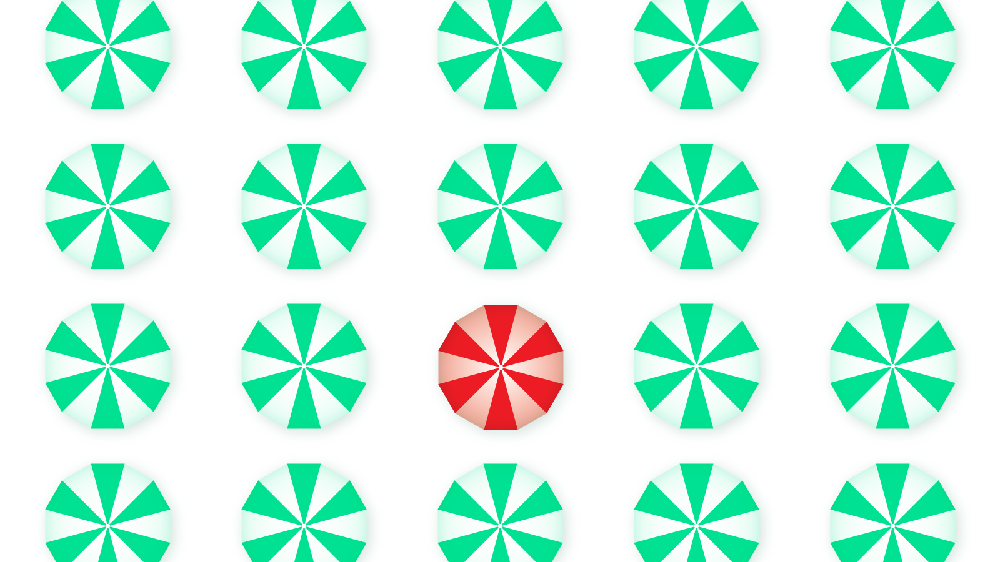
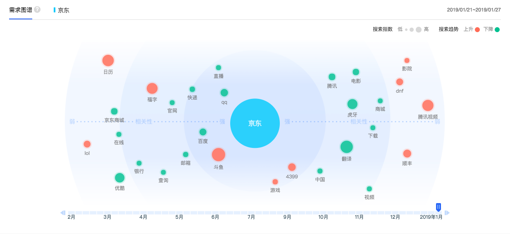
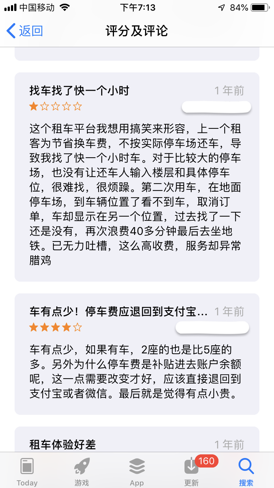
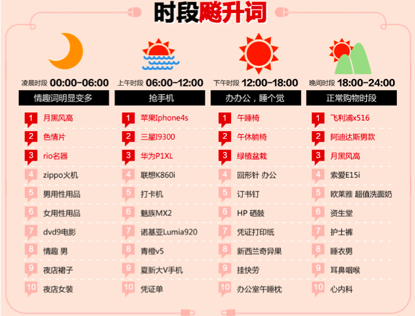
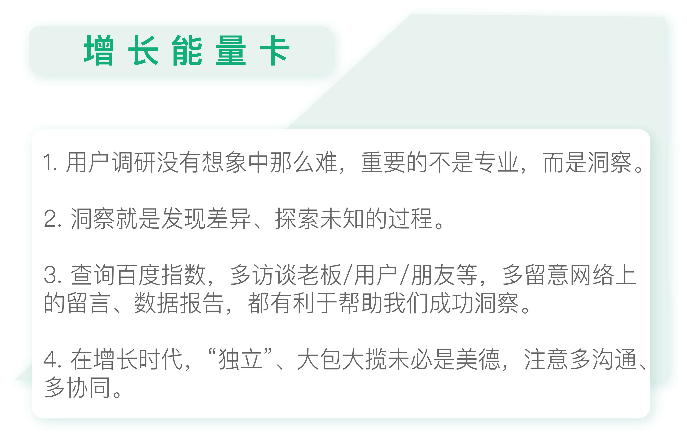

---
title: "08 | 不懂用户调研？那就对了！"
slug: "/product-manager/ai-pm/module2-insight-for-growth/01-user-research-basics"
description: "探讨用户调研的重要性和实用技巧，分享如何通过简单有效的方法获取有价值的用户洞察，帮助产品增长。"
keywords: ["用户调研", "增长策略", "市场洞察", "产品管理", "用户研究", "刘津"]
date: "2019-06-23"
---  
      
# 08 | 不懂用户调研？那就对了！
你好，我是刘津。

从今天开始，我们进入专栏的第二模块。前面我反复提到，做增长要先“通过差异性洞察找到增长的爆破点”，现在我们终于来到了这个部分。

差异性洞察离不开用户调研，所以今天我要跟你分享的主题就是用户调研。

说到用户调研，我发现一个奇怪的现象。就是在企业中，用户调研似乎是一个可有可无的事情，用户研究员也是一个很尴尬的存在。

为什么这件事这么重要，但却好像并没有被放在一个很重要的位置上呢？

我认为一方面是因为大家以为做用户研究需要很高的门槛，另一方面是最终的调研结果总是很难落地。成本高，又看不到什么成效，那自然就如同鸡肋了。

令人兴奋的是，经过这些年的观察，我发现，“专业”未必等同于“价值”。

传统的用户研究方法往往过于强调专业、面面俱到，而忽视了调研的目的，以及如何快速达到目的。动辄几个月的调研过程、厚厚的调研报告、缺乏业务洞察的结论，经常让需求方感到无从下手或只能简单参考。反倒是一些看似不专业的“野路子”，能够轻松落地，产生巨大价值。

## “野路子”也能创造巨大价值

这里，我就跟你探讨一下这些“野路子”，教你“四两拨千斤”的调研方式。

先给你举两个例子，你会发现用户调研其实并没有想象中那么难。有的时候，找人闲聊几句、看看行业数据就可能收获意想不到的发现。

<!-- [[[read_end]]] -->

史玉柱在他的自述里说过他的经历。

在脑白金还在试销的时候，他亲自带了几个人去公园实地调研。一些老头老太太在公园亭子里聊天，他就上去找他们搭话，问他们对脑白金是否了解。大部分人说，对脑白金有兴趣，但是没吃过。

他好奇地问：“为什么不吃呢？”结果老人们回答：“买不起。”史玉柱继续跟他们聊天，最终发现，老人们并不是不想吃，而是等着儿女给他们买。

调研回来后经过讨论，最终就有了那句让人记忆深刻的广告：“今年过年不收礼，收礼还收脑白金。”

分众传媒的老板江南春在《抢占心智》这本书里提到：

阿里巴巴、京东等电商平台的数据显示，中国绝大多数的电商流水产生于早上10点、下午3点和晚上9点这三个时段。通过这个时间数据，江南春发现中国人最核心的消费决策都发生在公寓楼和写字楼。

于是，他萌生了在公寓楼和写字楼做电梯广告媒体的想法，这在当时是一条全新的道路。在那之前，人们普遍认为用户是看到电视以及大街小巷的广告才做出决策的。

分众创立短短两年之后，就登陆了美国纳斯达克证券交易市场，成为第一家在美国上市的中国广告传媒公司。

通过这两个例子，我们可以发现，通过简单的方式或关键的行为，就可能洞察到巨大的机会成为未来的增长爆破点。反而是看似专业的调研过程和冗长的报告，价值未必明显。

## 从关注“专业”到关注“洞察”

讲到这里，你可能会说像史玉柱、江南春这样的大佬是非常少见的，大部分人很难迅速找到如有神助的切入点。作为“普通人”，应该从何入手呢？

在这个模块的文章里，我会介绍一种全新的调研思路，手把手地帮你做出可以落地的结果。和传统调研强调专业方法不同，新的思路强调“洞察”，即使你是0基础也不用担心。

为什么要强调洞察呢？

你看下面这幅图：在图中，你第一眼看到的是什么？是那把红色的雨伞，对不对？

传统调研报告就好像图中的绿色雨伞，内容充实却泛泛，让人的目光难以聚焦。而图中的红色雨伞虽然只有一把，却能牢牢吸引住我们的视线。“洞察”成功的结果就像是发现了一片前所未见的新大陆，激动人心。

比如史玉柱发现老人是脑白金的用户、却不是购买者，这可能跟他们之前预想的非常不同；江南春发现用户的购买决策发生在公寓楼和写字楼，这也和传统认知相违背。

所以，洞察其实就是发现差异、发现未知的过程。有的人通过直觉、经验、对行业的敏锐度洞察，比如[第一讲](https://time.geekbang.org/column/article/89601)中提到的doodle的例子；有的人通过有针对性的数据或访谈洞察，比如史玉柱、江南春。

今天我先教你几个简单的小技巧，大幅提升洞察成功率。

## 4个小诀窍帮你大幅提升洞察效率

### 1.通过百度指数分析

调研离不开数据分析，可是在实际工作中，作为一线的执行者，很多人是没有权限调动数据资源的。另外，在大部分规模不大的公司里，你面临的窘境很可能是没有足够的数据。这个时候，百度指数在一定程度上可以帮助我们解决很多问题。

通过百度指数这款产品，我们可以比较自己和竞品的数据，看看有没有明显的差异。

举个例子，比如你正在做少儿在线英语教育的产品，你想了解市面上这些同类产品之间有什么差异。

那么最简单的方法就是打开百度指数，在搜索框里先输入A产品名称，点击“开始探索”，然后在结果页面点击“添加对比”按钮，输入B产品名称，点击“确定”。

在“人群画像”一栏里，就可以看到两者在地域、年龄、性别上的差异。通过对比，你可能会发现A产品比B产品人群更加年轻化，男性比例也更多一些。

来源：百度指数

根据这一点，你就可以继续深挖下去，看是什么原因导致的。而这个原因很有可能就是该产品的核心竞争力。那么未来，你就可以放大这一点成为一个新的卖点或定位。以我自己的经验，“地域”“年龄”“性别”三项的差异已经足够看出很多问题了。

百度指数还有很多其他功能，你可以进一步挖掘。

比如随意输入一个产品名称，在“需求图谱”一栏里，就可以看到相关的搜索热词，凭此我们可以判断该产品用户还对什么感兴趣。这对挖掘用户喜好以及潜在的商务合作机会都有很大帮助。

来源：百度指数

当然，如果你有条件的话，建议还是用实际业务数据进行分析。

要注意的是，数据获得只是一方面，更重要的是数据背后的洞察——发现差异点，分析差异点，你才能有可能抓住增长爆破点。

### 2.分析用户留言及评论

在App Store里或安卓的应用市场、论坛、微博等很多地方都可以看到用户对你产品的评论。按照正常情况来说，大部分用户是不喜欢评价的，除非遇到让自己非常愤怒的事情。

有了这种糟糕的体验，他可能再也不想使用你的产品了。所以，我们对差评需要特别关注，它往往反应了用户认为非常重要且没有被满足的核心诉求。

### 3.访谈老板

很多朋友表示，自己是做B端产品的，在百度指数上搜不到什么信息，这种情况下你就可以考虑访谈老板。

很多人害怕接近老板，宁可自己乱猜也不敢去问，其实这是非常低效的。多跟老板聊聊天，借这个机会了解产品的目标、方向、核心资源及优势、用户等等，完全可以起到事半功倍的效果。

我自己一开始也不习惯问别人，认为独立思考、独立解决问题，不麻烦别人是一种美德。但后来我慢慢想通了，如果能在10分钟内解决问题，为什么要花上好几天呢，而且还不一定能解决。

在增长时代，我们一定要注重协作、注重信息的互通，而不是单兵作战。我特别欣赏一句话，那就是“**好的人脉关系都是互相麻烦出来的**”。

对于C端产品来说，可以多访谈身边符合条件的用户或朋友，在这个过程中你也会收获很多。

### 4.留意行业分析及用户行为报告

在网络上，你经常可以看到各种各样的行业报告，这些报告时常可以给人启发。

在百度上搜索“你所在的垂直行业+报告”，就可以查到很多。另外通过微博、行业相关的微信订阅号，也可以看到很多信息。

前面提到过，江南春通过阿里巴巴、京东等电商平台的数据，发现了中国人最核心的消费决策的发生地点。我再举个自己的例子，多年前，我在网易做电商时，看到京东发布的一份用户搜索报告，发现用户在不同时间段的心态及购物行为完全不同。

来源：2012京东数聚汇

基于这个观点，我们分析了网易电商几条主营产品线的广告在不同时间段的表现：发现电影票广告在周末和节假日点击转化效果明显、而彩票正相反。

于是，我们在周末加大力度投放电影票广告，取得了很好的效果。我们还在另一条产品线上尝试了分时段投放的策略，广告的总体转化率和产品销量都提升了2倍以上。

今天给你分享了4个小诀窍，都很简单，目的是为了树立你的信心，不要因为“不够专业”而气馁。诀窍很简单，但是真的能做好却并不简单。下一讲开始，我们探讨如何用简单实用的方式做一次完整的用户洞察。

## 思考题

你可以尝试用百度指数分析自己和竞品的差异点；也可以分析网络上的留言和数据报告；或者和老板聊聊天。看看在这个过程中，你能否得到不一样的收获？

欢迎把你的思考和疑问通过留言分享出来，与我和其他同学一起讨论。

如果你觉得有所收获，也欢迎把文章分享给你的朋友。