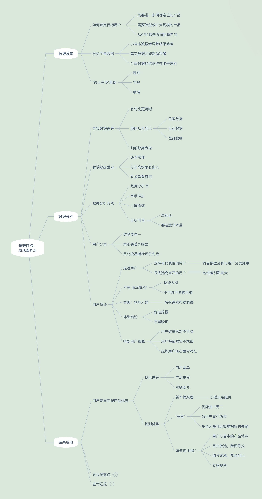
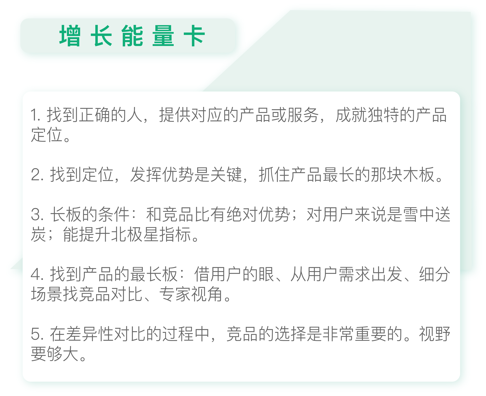

---
title: "15 | 挖掘产品优势，打破增长瓶颈"
slug: "/product-manager/ai-pm/module2-insight-for-growth/08-product-advantage"
description: "探讨如何通过产品优势发现增长机会，分析产品定位与用户需求的匹配度，为产品增长提供策略支持。"
keywords: ["产品优势", "产品定位", "用户需求", "增长策略", "产品管理", "市场分析"]
date: "2019-06-23"
---  
      
# 15 | 挖掘产品优势，打破增长瓶颈
你好，我是刘津。

在上一讲，我们了解了如何提炼目标用户群体的差异性，然而这只是漫漫长征第一步，接下来我们需要**在此基础上挖掘产品的定位，为后面找到增长的爆破点打下基础**。

## 用户差异与产品优势匹配

如果你还不了解“定位”，可以看看杰克·特劳特（Jack Trout）写的《定位》这本书，它主要讲的就是如何差异化地避开竞争对手的优势，找到一个市场空缺点，然后通过营销的手段把它根植到用户心中，成为这个领域的第一。

《抢占心智》这本书举了一个例子，说明“定位”的重要性。

在苹果一家独大的市场格局下，OPPO手机的差异性是“拍照很好的手机”，Vivo手机的差异性是“音乐手机”，金立手机是“超级续航手机”，小米手机是“性价比很高的手机”，而华为手机说自己是“商务手机”。

与之形成明显反差的是联想。联想手机经常说自己有三大优势和七大卖点，这其实相当于没有优势。虽然联想手机确实存在优势，但如果不能将其用精辟的语言表达出来，就无法像利剑那样直击消费者心智。

当然**每一种差异性定位，都对应着某个特定的群体**。有句古话叫“甲之蜜糖，乙之砒霜”，还有句话叫“人和人的区别比人和猪的区别都大”。

所以，做透某部分群体，了解他们的差异特征，再提供对应的差异化的产品，那么这个产品自然就不愁增长。

<!-- [[[read_end]]] -->

前些天有一家老牌电商公司找我咨询，说目前的产品增长遇到了很大的瓶颈。他们认为是“用户感知”这里出了问题，也就是说很多用户并不能理解这个产品是做什么的或者优势在哪里。

他们之前在页面上做了一些改进来帮助引导，但是效果并不好。细聊下来我发现：他们当前的目标用户人群和产品核心优势并不对等。这就好像把商务手机卖给学生，学生又怎么可能领会商务手机的卖点呢？

这就是我们之前要花这么多精力去**探索用户差异性的原因：找到正确的人，提供正确的产品或服务，才能成就正确的产品定位**。如果定位不清晰，仅靠创意营销、数据驱动、AB测试等“外功”，如同大海捞针，虽有作用，但注定步步维艰，胳膊毕竟拧不过大腿。

**增长的重中之重，便是正确的“定位”。**

如何找到定位？我们首先要学会发现产品的“最长板”。

## 如何找到产品的“最长板”？

如果有兴趣的话你可以在网上搜索“新木桶原理”：一个木桶能装多少水，其实取决于它的最长板有多长，而不是最短板有多短。

对于增长也是如此，只要你的长板够长，并且是用户急需的，那么他们完全可以忽略你其它的短板。[第四讲](https://time.geekbang.org/column/article/90337)有相关的例子，你可以再回顾一下。

产品的最长板应该满足以下几个条件：

**首先，和竞品相比具有独一无二的优势，且这个优势很难被挑战。**

**其次，对用户来说是雪中送炭而非锦上添花。**

**第三，对于提升北极星指标非常关键。**

想找到产品的最长板，我们可以通过多种方式。

1.借用户的眼睛直接找产品长板

不同的人看到的风景是不一样的，同理，不同的用户看到的也是不一样的。

之前你已经挖掘到了用户的差异性，那么这群具有差异特征的人群看到的产品必定也是不同的，他们更容易发现你的产品的特点，也正是产品的特点吸引了这部分特殊的群体。

记住，**这个特点未必是产品本身的特点，而是你的用户感知到的特点。**

因为产品本身怎么样不重要，重要的是你的用户怎么看它。就好像大家都认为沃尔沃的特点是够安全，而实际上沃尔沃的安全性并不一定比奔驰或者宝马更好，但那又怎么样呢？

以宜人贷为例，在线下访谈时，我们发现对于二线城市用户来说，宜人贷借款产品的额度远高于竞品。

所以，如果用户缺几千块，那他可以有很多选择，这个时候放款速度、利息等可能都会成为他考虑的依据；而如果他缺几万块的话，他就只能考虑宜人贷了。

额度是我们和竞品相比，最突出的优势。这个优势和我们的风控能力有关，而风控需要多年的积累，宜人贷做得比较早，因此这个优势很难被挑战。

另外，借款额度过万这点，对缺几万块钱的用户来说肯定是雪中送炭；而其它因素，比如放款速度、利息、平台背景、借款体验等都是锦上添花。

最后，额度高这个优势，和北极星指标“低成本高贷款余额”非常相关。

综上，我们把“额度高”这个优势作为宜人贷最长的那根木板。

2.从用户需求出发跨界寻找长板

我有个学员之前是做共享汽车的，他们的高层认为该品牌的优势是：车型较多、高端、车况较好。

很明显这个优势并不成立，它连长板的第一条“和竞品相比具有独一无二的优势，且这个优势很难被挑战”都不满足。

因为一想到出行用车，除了滴滴外我还会想到很多老牌的租车公司，比如神州、一嗨等，难道他们的车型不比共享汽车的更多、更高端吗？感觉这么看的话，共享汽车的这些优势并不打动人。我建议他从用户出行的角度找竞品并分析共享汽车的优势，而不是从同行业或自身功能这么局限的角度出发。

这位学员恍然大悟，说他们之前只盯着共享汽车品牌看，从来没有考虑过间接的竞品。按他们的话讲就是自己做短租不做长租，所以就没考虑看长租的竞品，但其实做长租是更容易盈利的，说不定这是一个可以探索的新方向。他还感慨，之前一直陷在产品现有功能角度拔不出来，这使他们一直感觉困难重重，尤其是拉新方面。

还是那句话：做增长视野很重要。做产品久了特别容易局限在某个角度出不来，如果**从用户的角度看需求，跳出产品现有的框架**，一切就可能迎刃而解。

3.细分场景后找到竞品寻找长板

我有个朋友是做网约车的，他说他们的品牌基本已经垄断市场了，所以没有竞品可以参考。

后来他围绕北极星指标，按照出行场景把用户分成“日常约车”和“商务出行”两类。之后他通过访谈用户，得到的产品长板是：高确定性。也就是说你用这个软件叫车接送机的话，大概率可以约到车。

然而实际上并非如此，在接送机领域相关的竞品很多，其它品牌是出了名的服务好、体验好，而且更容易叫到车。我问这个朋友，是否有跟相关竞品做对比，他说没有。后来经过讨论，我们一致认为他的产品的优势是更便宜，而不是更好的服务或更高的确定性。

因为现在巨头垄断，所以越来越多的产品都在发力细分领域。即便你的品牌占有率市场第一，在切到细分领域后也一样会遇到竞品，这个时候你依然需要对比。所以**在对比中发现差异，是我们不变的增长主旋律**。

上述例子告诉我们，**竞品的选择以及差异性对比都是非常重要的。**不同的参考坐标系会得出不同的结论，所以视野要足够大。这和前面我们讨论数据分析时，选择对比的参考坐标系很重要是同样的道理。

4.专家视角发现产品长板

在实际工作中，我们还有可能通过不同角色的视角发现异常情况，从而找到长板。比如我有个朋友说：他们公司的一位开发人员在头脑风暴会议中提出，每次发售理财产品的时候系统都会预警。这个现象引起了业务方的高度关注，他们经过研究，决定加大对理财产品的投入。

很多人问我研发人员怎么做增长，说日常只能去撕需求。其实你不一定要和其它角色正面厮杀，而是可以**从自己的优势出发，做别人难以做到的事情**。这和找产品优势其实是一个道理。

## 用户调研知识地图

根据今天的专栏内容，用户调研知识地图又添加了“落地”部分的新支点。

## 思考题

经过今天这一讲的学习，你能不能说出针对你独特的目标用户群体，你的产品最长板是什么？

欢迎把你的思考和疑问通过留言分享出来，与我和其他同学一起讨论。

如果你觉得有所收获，也欢迎把文章分享给你的朋友。