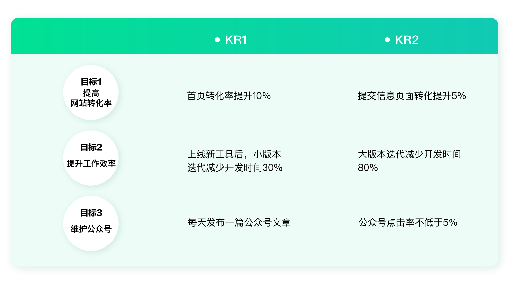
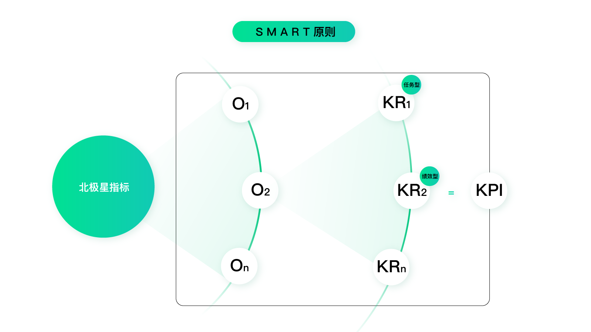
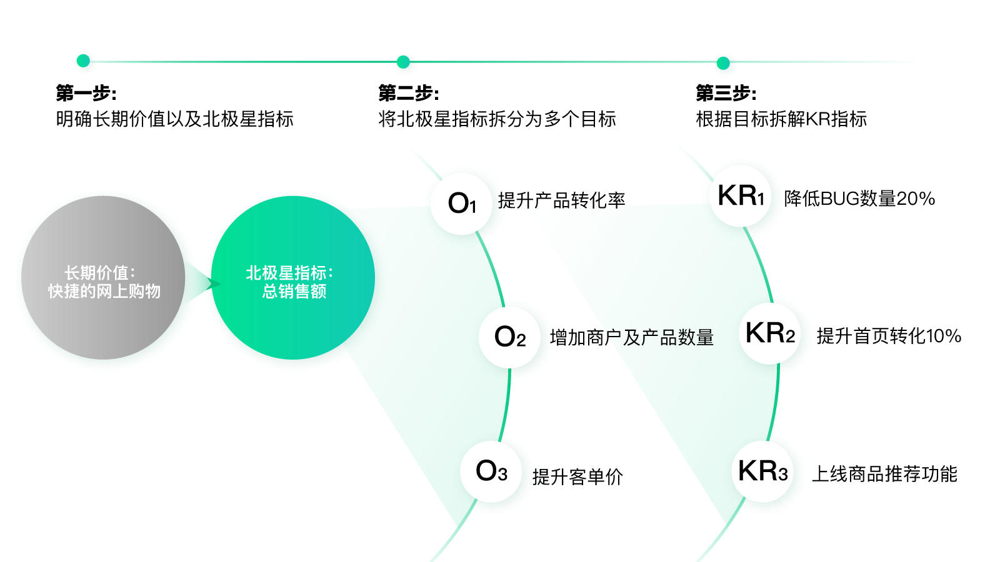
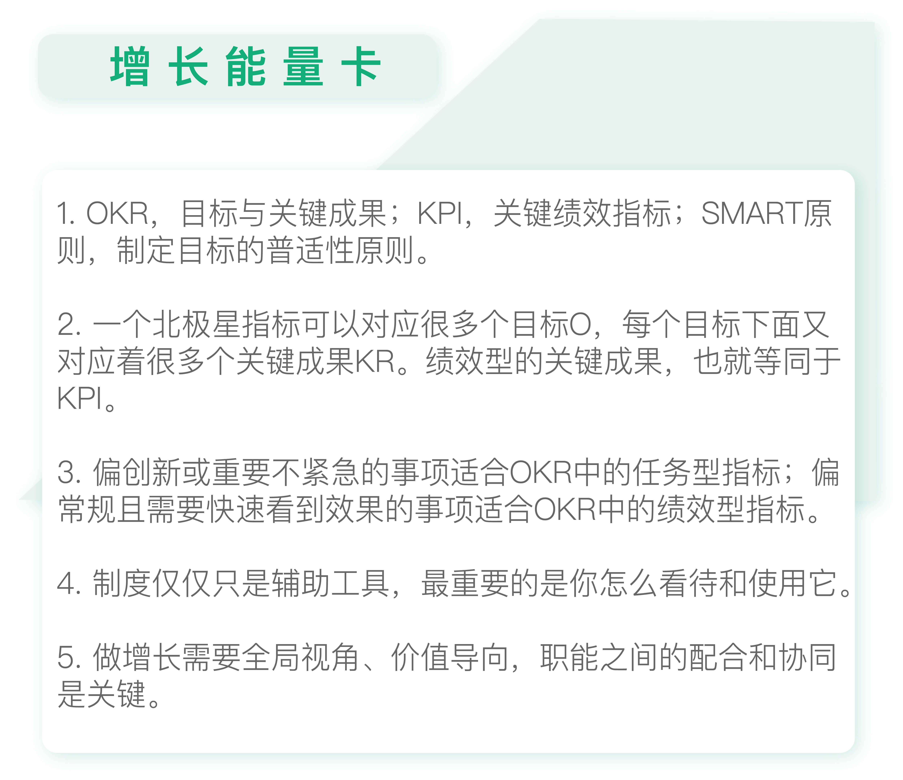

---
date: "2019-06-23"
---  
      
# 07 | OKR如何助力增长？
你好，我是刘津。

今天我要与你分享的主题是“OKR如何助力增长”。

听了前面的内容，你可能会有些迷惑？OKR、KPI、北极星指标、包括SMART原则，这几者的区别和联系是什么？接下来我们逐一分析。

## 各种指标体系的区别与联系

OKR（Objective and Key Results）即目标与关键成果法，是一套明确和跟踪目标及其完成情况的管理工具和方法。

OKR由英特尔公司发明，自2013年底由一些从硅谷回国创业的人传入国内，后来逐渐受到IT、互联网、高科技、海外投资人的追捧，开始流行起来。

KPI（Key Performance Indicator）即关键绩效指标，是一种较为传统的目标式量化管理指标。KPI是一种工具，可以把企业战略目标分解为一项一项可操作的工作目标，多年来广泛应用于各行各业。

看到字面上的含义，你可能更糊涂了，这两者看着差不多啊？其实，关于这两者，你可以这样理解：OKR包含了KPI的功能。

我们来看一个实际的使用OKR的例子。

在目标与关键成果法中，每个目标（O）后面都可以跟着数个关键成果（KR），我们可以把这些关键成果标记为KR1、KR2……

从图中可见，OKR中的关键成果（KR）可以分为绩效型和任务型。

<!-- [[[read_end]]] -->

比如“每天发布一篇公众号”，这是典型的任务型KR；公众号点击率不低于5\%，是典型的绩效型KR。而KPI和绩效型KR其实没有区别。

所以，OKR和KPI的区别就是：OKR包含的内容更全面，虽然两者同样都是可量化的，但OKR不要求全部用绩效的形式量化。

这其实是比较符合实际情况的，毕竟不是所有事项都能被绩效指标所量化。比如像设计、研发、人力、行政等工作，都非常的重要，但他们的工作很难用绩效指标来量化。

至于上一讲中提到的北极星指标，相当于更高级的总指挥官。它衡量的是公司整体的增长情况，一个北极星指标可以对应很多个目标（O），每个目标下面又对应着很多个关键成果（KR）。而其中有一部分绩效型的关键成果，就等同于KPI。具体关系请看下图。

聊完OKR与KPI的区别，我们再简单说说制定目标时会用到的SMART原则。

掌握好SMART原则可以帮助我们制定目标，这个“目标”包含了北极星指标、OKR、KPI等等。也就是说，SMART原则是一个关于制定目标的普适性原则，它包含了5点。

1.  具体（Specific）：比如，“提升客户体验”说的就过于笼统，如果改成“减少客户投诉，由3\%减至1\%”就具体了很多。

2.  可衡量（Measurable）：比如，“安排进一步的培训课程”就难以被衡量，如果改成“2019年3月前完成培训课程，团队成员出席率超过95\%，考试成绩超过80分”就能够衡量了。

3.  可实现（Attainable）：在宜人贷的时候老板对制定目标有很高的要求，必须是有挑战性的并且大概率可以实现，也就是那种你要努力踮踮脚才能够到的。所以在制定目标时最好能和领导、下属、相关同事进行沟通，避免制定出难以达成或缺乏挑战性的目标。

4.  相关性（Relevant）：比如公司的北极星指标是“提升总订单量”，那么你为所有人制定的目标都应该和“提升总订单量”这个目标有关，并且要与大家的本职工作相关联，否则就强人所难了。

5.  时限性（Time-bound）：目标要有时间限制，比如“2019年全年营收达到1000万”。

需要注意的是，北极星指标比较特殊，只要提出指标方向就可以。具体的时限和指标，需要在实际应用时分解并完善。

## OKR与KPI孰优孰劣？

现在你已经了解了OKR和KPI的概念，那么哪种更好呢？这是很多人关心并热烈讨论的问题。为了解答这个问题，我们有必要先回到[第二讲](https://time.geekbang.org/column/article/89624)中关于“创新和绩效指标冲突”的问题。

对于增长来说，创新和绩效都很重要：创新才能带来突破，才可能带来指数级增长，但创新投入大、有风险、也难以很快看到效果；关注绩效更容易维持稳定的增长，而且可以立刻看到成效，但长期来看难以创新，导致增长很快陷入瓶颈。

虽然我们的方法可以很好融合这两者的关系，但是如果没有合理的制度做保障，也很难落地。

比如，我们前面反复提到“通过差异性洞察找到增长爆破点”，可以看作是创新的基础。而在之后进行的数据驱动的实验，可以帮助我们稳定提升绩效。

但是假如公司只有KPI制度，要求所有的工作都要尽快看到绩效成果，那像“用户洞察”这种需要花费很多时间和精力的事情也许就只能搁置了，即使它非常重要。

所以为了平衡创新与绩效指标，保证增长，现在很多公司开始使用OKR来代替传统的KPI。OKR强调愿景和目标，这里面既包含了价值定位、目标，又包含了可以量化的任务型指标和绩效型指标，很好地平衡了创新和绩效之间的冲突。

相信看到这里，你一定已经很明确了。

在做一些偏创新、重要且不紧急的事项、难以短期看到成果但对未来发展非常重要的事情上，应该多考虑OKR中的任务型指标，慎用绩效型指标。

而在做一些偏常规、偏执行、重复性高、需要短期尽快看到效果的事项上，直接用OKR中的绩效型指标，也就是KPI更为合适。

## 如何制定OKR？

理解了OKR与KPI的应用场景后，我们一起来看看如何制定OKR？

举个例子，假设你现在的公司是一家电商公司，你应该如何通过OKR助力增长呢？你可以分三步走。

第一步，明确长期价值及北极星指标。比如，长期价值是“快捷的网上购物”，当前阶段的北极星指标是“总销售额”。

第二步，将北极星指标拆分为多个目标：O1、O2、O3……比如O1：提升产品转化率；O2：增加商户及商品数量；O3：提升客单价……

第三步，根据目标拆解KR指标。比如，就O1来说，可以拆解为KR1：降低bug数量20\%；KR2：提升首页转化10\%；KR3：上线商品推荐功能……

当然这只是个非常简单的示意，实际情况肯定会复杂很多，大家需要根据自己项目的情况去分解，并在指标上增加时限和其它具体说明。

看到这里，你可能会问：这些目标是怎么得出来的呢？指标具体应该怎么拆解呢？我在后面的文章里会详细讲解。这里，你要重点了解的是这一系列的整体思路。

## OKR如何助力增长？

OKR虽然有利于创新和增长，但并不是使用它就可以安枕无忧了。事实上，如果北极星指标或OKR用的不好，也同样会出现传统KPI导致的各种问题。

在[第5讲](https://time.geekbang.org/column/article/90802)中我已经提到过一些KPI的弊端，其实它还有很多众所周知的常见问题。

* 没有人对最终结果负责，每个人只对自己的部分负责；
* 人的主观能动性被压抑；
* 高度依赖管理者的指令；
* 为完成KPI导致作弊；
* ……

但如果你在使用北极星指标及OKR时，依然抱着大家应该各司其职、不能“越界”的传统心理，你会发现不管用什么方法及制度，结果都相差无几。所以，**制度仅仅只是一种辅助工具，最重要的是你怎么看待和使用它。**

比如，借款产品的风险团队为了降低坏账率，最简单的方法就是一刀切，直接提高借款门槛，降低总量。这样的话风险团队自己的KPI就完成了，但是业务方的KPI就会受到影响。

但是如果大家联合起来，共同目标是在保证业绩量不变的情况下降低风险，那么风险团队就需要多做一些测试。

假设，风险团队经过测试最终发现降低10\%的总量和降低20\%的总量时，风险表现情况一致，这样就可以帮业务方多争取10\%的业绩。

所以，**在运用北极星指标及OKR时，首先要确保大局观**。制定周全的北极星指标，在向下分解时倡导各部门的协同，而非从职能角度割裂它。

宜人贷在过去的两年里一直实行项目制，配合OKR取得了很好的成效。每个人都可以申请立项成为项目经理，然后找到合适的同事搭配，大家朝着共同的目标一起达成任务。这样就杜绝了不同职能间彼此不互通的问题，做到高效创新。

当然，这对领导层的组织协调有较高的要求。他们需要判断什么样的项目可以做，是否已经有其他人在做类似的事情，需要什么样的资源，是否对达成北极星指标有重要的作用等等。

当然，很多公司可能没有项目制，没有OKR，那是不是就不能做增长了呢？当然不是。

你仍然可以通过大局观、沟通协调能力，互惠互利地去团结你的“战友”做最有价值的事情。这样，增长离你还会远吗？

## 思考题

你会如何根据北极星指标制定目前你自己项目中的OKR呢，你需要和谁一起协同呢？

欢迎你在留言区写下你的想法或者提出自己在工作中遇到的问题，与我和其他同学一起讨论。

如果你觉得有所收获，也欢迎把文章分享给你的朋友。