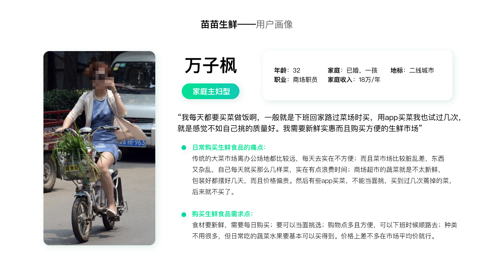
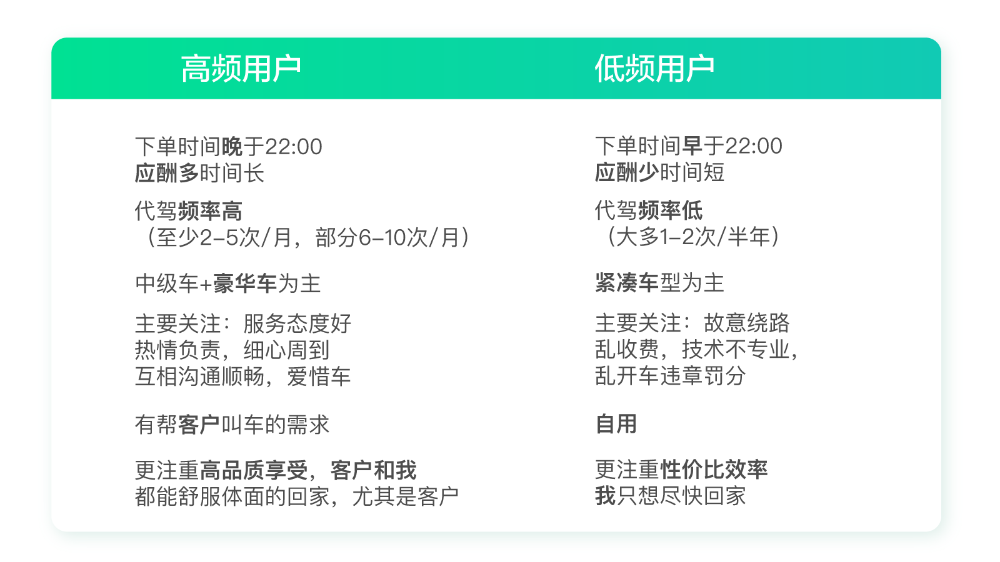
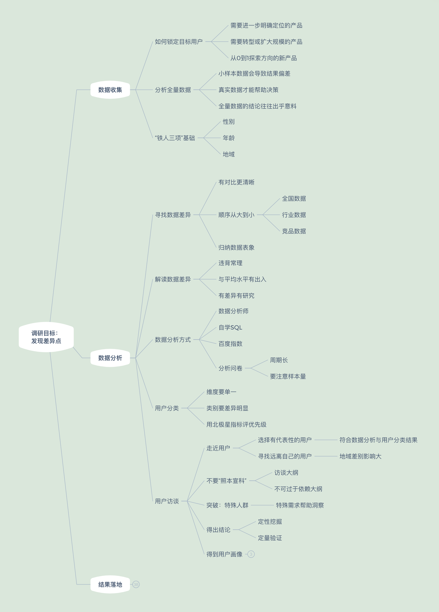

---
date: "2019-06-23"
---  
      
# 13 | 用户访谈：像侦探一样寻找破案线索（下）
你好，我是刘津。

在上一讲中，我介绍了如何选择受访用户，以及准备访谈大纲。今天我们来谈谈访谈时的要点以及事后如何总结。

## 关注特殊人群

我们在访谈的过程中，要特别关注“特殊人群”。真正的洞察往往出现在调研“特殊人群”的过程中。

什么是特殊人群呢？特殊人群的种类很多。

比如“高价值用户”，也就是最活跃、付费最多的那群“死忠粉”；“精明型用户”，也就是喜欢货比三家的人；“爱表达型用户”，说起话来滔滔不绝；“深入思考型用户”，有独立的思想对产品有深入的见解；性格及举动奇怪的人，比如狂热收藏者或特殊癖好者；老弱病残孕等等。

这些特殊类型的用户可以放大各种细微的情感及体验，帮助我们得到洞察。

举个特别简单的例子，我曾经参加过一个为期5天的线下活动。活动场地只有垫子没有靠背，一天下来腰酸背疼，但是也觉得可以忍受。

有一天有个孕妇自己带了个带靠背的垫子，但是除了主办方，谁也没多留意这个细节。之后再参加这个活动时，我们发现所有的垫子都被替换成了带折叠靠背的垫子，还增加了折叠小桌子。

那一期活动的口碑爆棚，大家赞不绝口，说太舒服了。这就是一个很典型的通过特殊人群带给我们洞察，并得到改进机会的例子。

再举个宜人贷的例子。

在宜人贷调研过程中，我们开始调研了好几位用户，虽然也有不少收获，但并没有特别激动人心的发现。直到我们遇到了一位用过十几款同类产品的用户。我问这些产品之间有什么区别，什么情况下用我们的产品，什么情况下用其它产品？用户的回答出乎意料：“当我需要借几千块时，我就用其它产品，当我需要借几万时，我就用宜人贷。”

<!-- [[[read_end]]] -->

这个回答让我惊喜万分，原来对于二线城市的用户来说，我们的产品借款额度远高于其它竞品，这是有绝对优势的。

而这一点我们以前都不知道，毕竟自己试用的话同类产品给的额度都差不太多，但是没想到对于二线城市用户来说有如此大的差异！

所以我想，在产品日益多元化、用户群体多元化的今天，坐在办公室里体验各种竞品差异的时代已经过去了，只有**亲自接触真实、有代表性的用户，才能有所发现。**

当然特殊人群比较难遇到。想要找到他们，一方面可以通过数据分析及问卷设置相关问题来筛选，另一方面，我们要有耐心且有一双善于发现的眼睛。

我有个学员跟我说：“我们这个部门是个特别严谨的部门，所以我拿不到用户的有效数据和资料，我就开始调研周围的朋友，朋友的朋友的朋友，终于发现了一个跟我们日常认知不一样的点。借着一次公司开科技大会的机会，我把我的发现讲了出来，引起了大家的高度重视，现在推动了整个产品的研发。”

所以不要再抱怨没有条件做数据分析或访谈了，只要有心，你就能克服一切困难！

后来我还有一个新的感悟，就是如果想在访谈中获取洞察，前面讲到的几点因素缺一不可。

比如宜人贷调研的成功，我认为有三点原因。

1.  我们选择了远离自己的城市武汉，接触到了和我们平时遇见的非常不一样的人，自然容易有不同的发现。
2.  没有严格遵循访谈大纲的问题，根据情况适当调整、巧妙追问。
3.  很幸运遇到了一位特殊的用户，并且留意到了他的特殊。

也就是说，一个成功的洞察是这几种因素共同起作用的结果，而非单一原因导致的。

## 先定性挖掘，再定量验证

需要特别注意的是，**访谈中得出的任何结论，都不可以作为最终定论**，因为这有可能只是个别现象，不代表它具有普适性。尤其是在“特殊人群”身上发现的洞察，就更需要谨慎验证。

比如在宜人贷调研中，我们发现很多用户为了贴补家用都在兼职创业。也就是说他们有一份稳定的工作，但是与此同时可能还是保险代理员，或者合伙开了家美发店，或者投资了家餐厅，又或者做一些兼职工作等等。

为了验证这个发现，我们投放了一次问卷，提供了多种职业类型选项，并允许用户多选。最终确实验证了大部分用户都是兼职创业人群。

反之，如果通过问卷分析，我们发现大部分用户并非兼职创业者，那就证明访谈得到的这个洞察只是个别现象，并不成立。

## 传统的用户画像为什么不好用？

访谈及定量验证完成后，我们需要按照不同的用户分类描述特征。传统的调研报告往往事无巨细，不仅包含各个字段的详细分析，还会生成用户画像，例如下图。

用户画像把访谈时的发现提炼并虚拟成一个人的形象，优点是帮助项目组成员了解用户，而不是像以前那样通过一堆冷冰冰的数字来想象用户。

但它的缺点也显而易见，其实还是之前说的那个老问题——不落地。

因为内容过多，导致看的人记不住、抓不住重点，难以形成深刻的印象，最后自然很难落地。这也和我们“发现差异点”的初衷相去甚远。

我有个做代驾产品的朋友，最近也遇到类似的问题。他们的代驾产品想主打高端人群方向，所以对高端人群做了深入的调研。

但是并没有得到什么特别的发现，结论非常普通，诸如：用户最关注的是安全，其次是专业、舒适、便捷，再其次是尊重、优越，最后是关爱。

你看了这些结论有感觉到“差异性”吗？很明显，没有。

朋友说他已经非常尽力了，这个项目做了好几个月，进行了各种专业的分析，但确实结果平平，没有什么惊喜。

这就是传统调研的通病，最后得出的总是这些“不痛不痒”的结论。那应该如何改善，找到令人眼前一亮的“差异性”呢？其实很简单，就是两个字：**对比**。**没有对比就不可能看出差异**。

## 对分类人群进行对比探寻差异

拿朋友这个案例来说，北极星指标是“提高运营收入”，运营收入=客单价\*下单量。可以从消费频次这个角度把用户分成高频用户和低频用户两类。

通过把两类用户进行对比，朋友马上有了重要的发现。

高频用户使用的主要原因是商业应酬，普遍在晚上十点以后下单；而低频用户使用的主要原因是朋友聚会，普遍在晚上十点以前下单。前者有帮客户叫车的需求，所以对服务、体验特别在意，对价格不敏感；后者主要是自己用，注重性价比和效率。

我们都知道中国人好面子，对商务人士来说更是如此：自己受点委屈没关系，如果客户不满意了，单子丢了那可是天大的事情，前面所有努力就都白费了。

你看，这么一对比，一下子从表面上的“安全”“专业”“关爱”这些平平的字眼上升到了**背后对人性的洞察**。所以，“洞察”一定不能停留在表面，而是要挖掘用户背后潜在的诉求和细微的心理活动。

有了这样的洞察，朋友对后面的优化有了明确的想法：之前为了体现“专业”和“关爱”，他考虑完善会员制度；但现在他决定把重点集中在“帮客户叫车”的新功能开发上。也就是说，不一样的洞察使他在决策质量上有了天壤之别。

我有个做了多年用户研究的朋友听过我的理念后，说最近突然领悟到：这就好像淘金一样，你不冲到最后一粒金就还是一堆沙，没用的。

我很喜欢这个比喻，的确，无论是做市场分析还是用户研究、数据分析，都是一样的，必须有淘金者的耐心和魄力，才能真正从沙子中淘到黄金。而不是像以往那样交了一摞分析报告就了事。

## 用户调研知识地图

根据今天的专栏内容，用户调研知识地图中补充了“分析”这部分中有关用户访谈的新支点。

## 思考题

列出北极星指标以及你的用户分类思路，根据访谈及定量验证结果，对比不同的用户类别挖掘差异点，注意要上升到对人性的思考。

欢迎把你的思考和疑问通过留言分享出来，与我和其他同学一起讨论。

如果你觉得有所收获，也欢迎把文章分享给你的朋友。