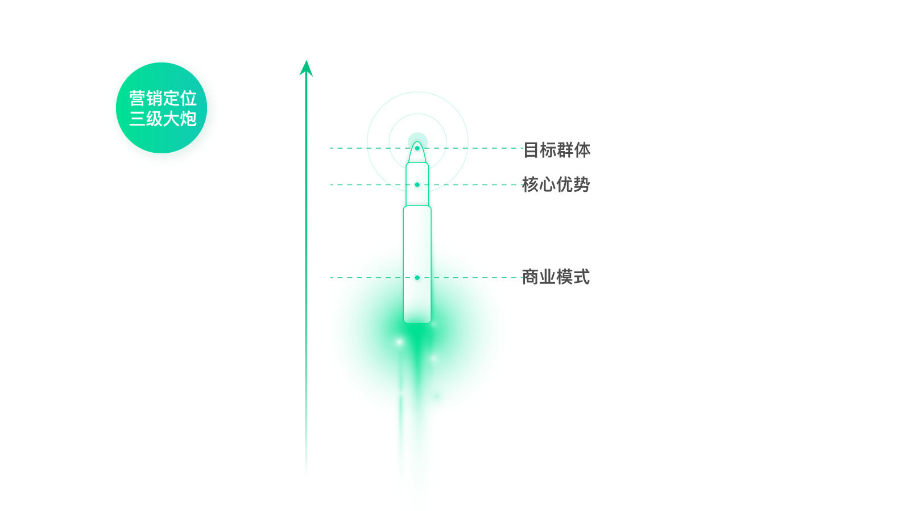
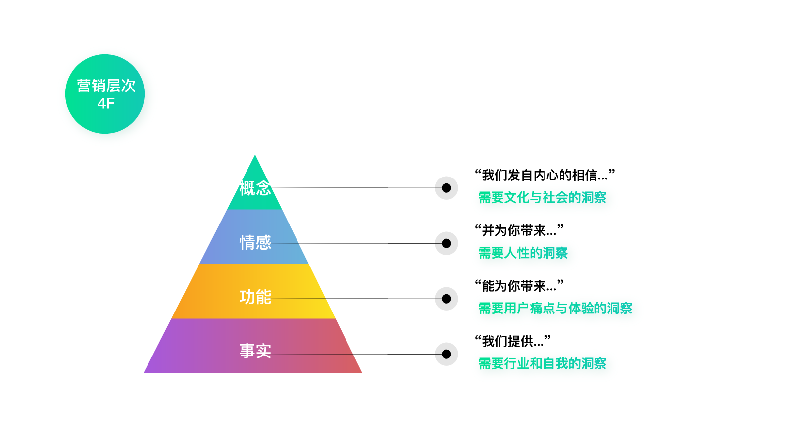
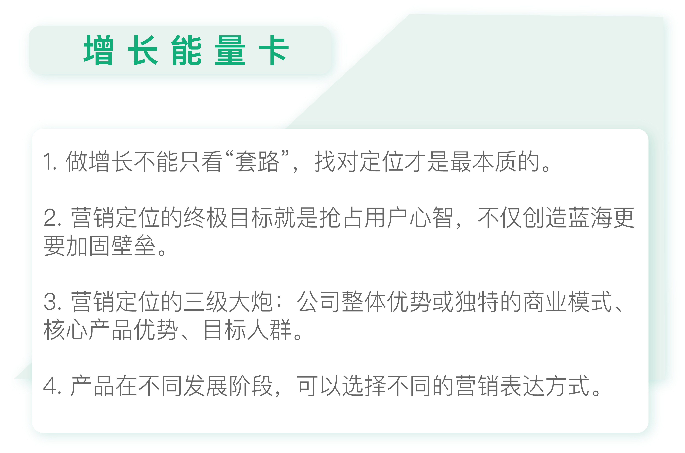

---
date: "2019-06-23"
---  
      
# 16 | 定位营销差异，抢占用户心智
你好，我是刘津。

在上一讲我们了解了如何找到产品的最长板，这就是定位的基础。

定位对于企业来说至关重要，它找到用户心智中暂时空白的领域切入进去，创造一片蓝海。

我发现很多拼命加班的公司业绩不一定很好；很多业绩好的公司，员工反而比较轻松。

因为增长的本质是“四两拨千斤”、是一种“巧劲儿”，第一个找到蓝海的人躺着也能赚钱。反之，你杀入一片红海，累到半死最后也是举步维艰。

所以，与其努力拼搏，不如找对方向，而这里的方向也就是在说定位。

## 营销定位的三级大炮

如何找到定位呢？

光有产品优势是不够的，还要结合公司综合实力踩中竞争对手的软肋，并把它宣传出去抢占用户心智。

**定位不仅能打造蓝海，更能够加固竞争壁垒**。

下面举几个例子。

### 超出产品范围看优势

> 我有个朋友做政企类的产品，他非常尴尬地说，他们唯一的优势是有政府关系背景，产品没优势；  
> 有个朋友在做教育类产品，他们在该细分领域已经是第一了，却认为和竞品比功能都差不多，没什么优势；  
> 还有个朋友做大众消费类产品，总说产品品质一般，也觉得自己没优势……

可真的是这样吗？

实际上，对政企类产品来说，有政府关系就是最大的优势；对教育类产品来说，目前已经排名第一就是最大的优势；对大众消费类产品来说，渠道广、容易购买是他们巨大的优势。

<!-- [[[read_end]]] -->

综合优势和上一讲提到的产品长板之间必然存在联系。

比如，前面提到的宜人贷对于二三线城市额度更高，是因为本身的风控能力强。这和公司成立早实力背景雄厚有关系。但在调研之前，如果只看功能和体验的话，确实会觉得没有什么优势。

所以在找优势这方面，**不仅要看产品本身的优势，更要看广义的竞争优势，也就是公司整体实力，并且找到两者之间的关联**。这样你才能确保找到的优势是优先级最高的核心优势。

### “碰瓷”对手凸显优势

另外，不同的人有不同的喜好和观点。

你的优点在某人看来可能是缺点，而你的缺点在另一个人眼里可能反而是优点。所以没有绝对的优点或者缺点，而是看你如何巧妙地利用。

比如，天猫的优点是商品多，价格便宜，这是平台模式天然的优势；但是相应地，产品品质和物流体验都不在自己的把控范围内，这又变成了它的劣势。

作为追赶者的京东，如果比拼商品数量和价格，那显然不是天猫的对手，因为这正是自营模式的缺陷。但相应地，自营模式保证了产品品质和快递速度。

因此京东在宣传上扬长避短，突出产品品质和送货速度，并在此基础上“踩”竞争对手的劣势。比如，“买点好的”“不走猫步”“别人叫你亲，不如质量精”等等，都是这个套路。

这样通过对比就进一步凸显了自己的优势。

再比如可口可乐是老牌产品，新的百事可乐该如何超越呢？

老牌产品的优势是经典、深入人心；但对应的缺点也很明显，就是不够新潮。所以百事可乐顺势用一句广告语“百事可乐，新一代的选择”成功占据市场，和可口可乐分庭抗礼。

所以在营销中，不要和竞争对手正面较量，而是拿自己的优势去对应它的软肋，笼络和它完全不同的一批新用户，抢占空缺市场。

综上我们可以看到，营销定位的基础有三点：

1.  公司整体优势或独特的商业模式；
2.  二是在此基础上发展出的核心产品优势；
3.  三是对应的目标群体。

如果你能找到这三者，逻辑也说的通，那你的营销定位模型就有了。

下图用炮弹的样子形象的描绘了这个模型。

比如宜人贷的营销定位三级大炮：炮身是行业领军企业、雄厚的风控实力；炮弹是额度高；炮弹最易击中的人群是二线城市用户。

事实上，很多老板或者高管比较清楚炮身，但是却搞错了炮弹或目标，因为他们平时一般不会接触到执行细节。而一线的工作人员虽然经常接触炮弹和目标，但由于对炮身了解的不够深入，可能选择了并不匹配的炮弹。

拿宜人贷来说，一开始老板期望面向的用户是一二线城市的白领，而通过长时间的运营，实际用户却和预期的有所偏离。

与此同时，一线的运营人员认为放款快和额度高、平台靠谱等都是我们的优势，摸不准哪个才是最长板的优势。在这种情况下去做营销，力量注定是分散的，难以产生最好的效果。

这就是我们前面需要花这么多时间和精力去做用户调研的原因，就是为了找到最合适的炮身、炮弹、目标组合，形成强有力的增长基础。

## 帮产品找到“最佳人设”

找到营销定位三级大炮，算是组装出了增长的底座。接下来我们需要在它的基础上盖上华丽的幕布，把它巧妙包装成讨巧的“人设”。

说起“人设”大家都不会陌生。

我听过一个朋友抱怨：为什么我的朋友圈点赞的人这么少？另一个朋友说：因为你没有“人设”。

的确，没有“人设”的人，别人是记不住你的。这对个人、对明星、对产品来说都是这样。

现在的当红明星，大多都有很固定的“人设”，比如“老干部”“吃货”“好爸爸”“少女感”等等。很多年纪大的人记不住明星的名字，但是只要一提起来就会说：“哦，我知道，是不是那个特别能吃还长不胖的姑娘？”

看，有了“人设”，是不是大家就更容易记住你了？这不就是营销的目的吗？

那么怎么帮自己的产品找到“最佳人设”呢？

一方面，我们需要结合产品核心优势与目标群体的关注点；另一方面，我们也需要了解产品目前处在什么样的发展阶段，用什么样的表达方式最合适。

可以参考下图的营销4F模型。

一般来说，当用户对一种产品模式还不够熟悉的时候，从“事实”角度去宣传比较好，比如“在线一对一英语教学”。

当用户对产品已经很熟悉，但是不知道你和竞品的差异时，从“功能”角度宣传比较好，比如“充电5分钟，通话2小时”。

当你的产品已经基本在市场上站稳脚跟，你可以从情感角度打动用户，比如“照亮你的美”。

当你的产品已经处于垄断地位，或是做企业内部宣传时，可以从概念的角度宣传，比如“用心引领”一类的宣传语。

拿宜人贷举例：

* 从事实角度看，我们的核心优势是可以提供用户更高的额度帮助他筹到足够的钱；
* 从功能角度看，我们更专业、更便捷；
* 从情感角度看，我们的用户在意家人、渴望自由、充满梦想；
* 从概念的角度看，所有这一切都是为了爱……

显而易见，就当前的阶段来看，从事实层面宣传是最合适的。

因为专业、便捷听起来不够有差异，让人记不住；情感角度宣传让人感觉太虚。而额度高听起来让人眼前一亮，既和北极星指标相关，又能够占领市场空缺位置，所以它是一个合适的宣传点。

## 用户调研知识地图

  
根据今天的专栏内容用户调研知识地图又添加了新支点。

## 思考题

你目前负责的产品的营销三级大炮是什么？你认为当前阶段最合适的宣传表达方式是什么呢？

欢迎把你的思考和疑问通过留言分享出来，与我和其他同学一起讨论。

如果你觉得有所收获，也欢迎把文章分享给你的朋友。