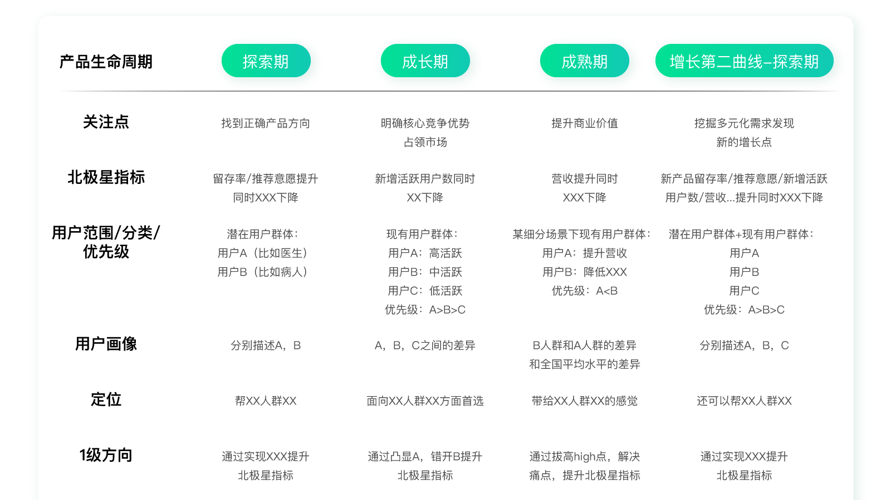
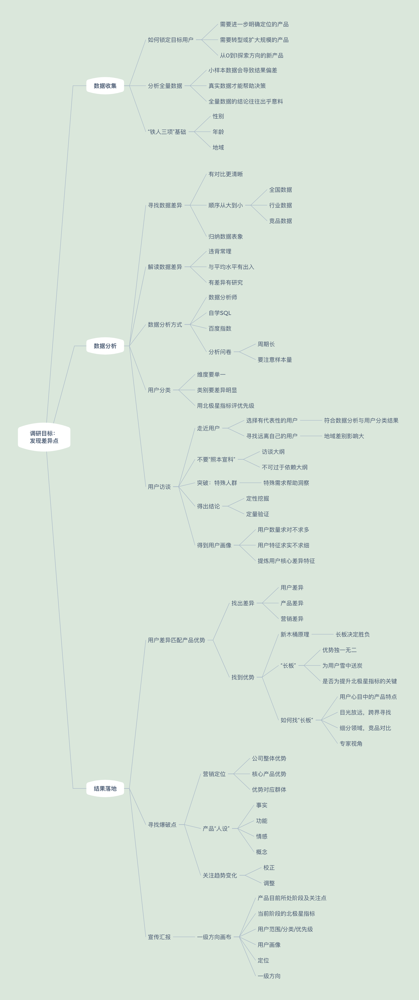
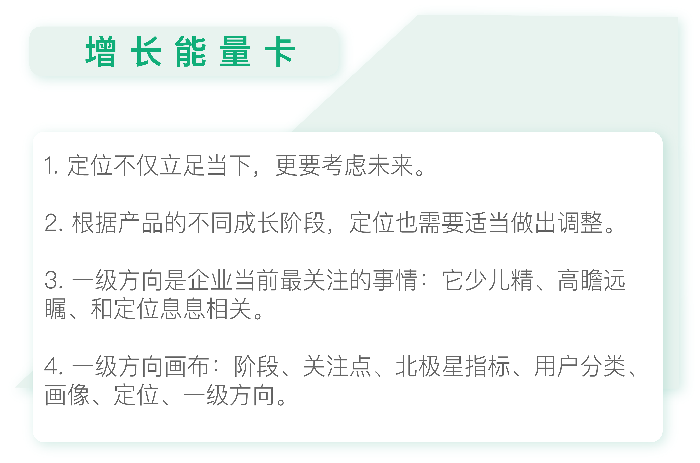

---
date: "2019-06-23"
---  
      
# 17 | 一级方向：找到增长爆破点
你好，我是刘津。

前面我们已经基本明确了营销定位，也就是大方向清楚了，那么对应的方针策略是什么呢？这就是我们今天要探讨的主题：找到“增长的爆破点”。

## 关注趋势，校正营销定位

但是先不要着急，我们再回头看看营销定位。

定位是一场持久战，一旦确定了某个营销方向，就最好不要轻易改变，否则可能前功尽弃。

我们现在耳熟能详的各种广告语，都是通过多年不断的重复，才能逐渐抢占用户心智。

这就要求定位不仅立足当下，更要考虑未来。而调研得到的往往都是目前的情况，我们还需要推断未来的市场变化趋势。

拿宜人贷来说，营销定位三级大炮中的前两级：公司综合实力和额度高的优势，不会很快发生变化，但是目标群体就很难说了。

调研中，我们发现目前用户普遍集中在二三线城市，那未来十年呢？就算不看未来，目前二三线城市用户虽然多，但是否已经接近饱和了呢？不管怎样，我们需要的是更有潜力增长的人群。

在[第10讲](https://time.geekbang.org/column/article/92899)中提到过：通过分析数据，我们发现，越是外地人口占比多的地区，用户越偏爱宜人贷产品。而一二线城市的外地人口占比远高过其它线城市。

所以，未来我们可以尝试聚焦一二线城市偏年轻、偏精英化的群体，也就是通过整体的人群上移，去寻求用户增长的蓝海空间。

为了验证我们的假设，宜人贷在一年一度的大型营销活动“梦想体验师”中首次尝试与天津交通广播这样的传统媒体跨界合作，面向当地有车一族进行宣传。同时，还和燕郊商贸市场进行了合作，专门面向小微创业者进行宣传。在宣传内容中，重点突出“额度高”以及活动利益“本息全免”。最终在当年整体行情并不好的情况下，活动的放款人数转化环比提升了50\%以上，成为行业内的经典营销案例。

<!-- [[[read_end]]] -->

当然这个假设是否真正成立，我们还需要在后续的营销活动中反复验证。

## 关注变化，灵活调整定位

需要注意的是，虽然传统的定位理论强调不要轻易改变，要持续不断地宣传同一个口号。但是互联网环境瞬息万变，即便我们考虑了未来的趋势，也不能保证可以做到长期不变。

所以，根据产品的成长阶段，定位有可能会做适当调整。尤其是在产品从0到1的探索阶段，方向可能会非常多变，这个时候最需要的是“灵活”，而不是“固定”。

所以在应用时也要注意实际情况，要让定位成为我们的利器，而不是障碍。

## 营销定位与一级方向

说完营销定位，我们再来看看一级方向。

**一级方向是企业当前最关注的，需要集中最大精力去做的事情。**很多人搞不清楚一级方向的概念，总是和二级假设混淆。这里简单说说它们的区别：

首先，一级方向不会很多，因为它代表了当前最重要的方向。

其次，一级方向要足够“大”。比如“公司从今年起要开始向互联网转型”“今年有四大变革”……诸如此类，听上去就很像一级方向。而像改进某个功能、优化页面这种类型的事项，绝对不会是一级方向。

第三，一级方向和定位息息相关。

下面我再给大家举几个一级方向的例子。

### 实例1

宜人贷的定位是：二线城市用户大额首选。对应的一级方向是：突出额度高。所以后续我们在所有的品牌宣传、营销活动、产品首页、借款流程……也就是但凡用户能接触到产品的地方，都突出强调额度高，转化效果均有了明显的提升。

### 实例2

在第1讲中我们提到的手机游戏公司Doodle，它的定位是：面向大众人群的容易下载的休闲小游戏。对应的一级方向是：游戏文件控制在5M以内。

### 实例3

在第8讲中提到的脑白金，它的定位是：面向老年人，但付款者是儿女的保健品。对应的一级方向是：宣传“送礼”。

### 实例4

现在非常流行的“小蓝杯”瑞幸咖啡，它的定位应该是面向职场白领的具有无限场景的大师级咖啡。

因为它洞察到职场人群对咖啡的品质、品味有较高的要求，但平时又很忙，没有时间总是泡在咖啡馆，更多是在平时工作、开会的时候喝。

所以，小蓝杯对应的一级方向是：场景由线下搬到职场；突出咖啡的高品质；裂变拉新……

虽然这里的一级方向有多个，但是它们都是围绕定位来的。很多人一说到增长就急着问裂变拉新怎么做，其实它只是增长的一种手段，而且未必适合所有的产品，还是要看具体的定位是怎样的。

就瑞幸咖啡来说，因为它强调无限场景而不是固定的店面，所以为了低成本获客，裂变拉新就变成了必要的手段。

我们在使用一种手段之前，一定要知道为什么要这么做，它是否合理等等，而不是机械地考虑怎样执行。

## 增长爆破点的梳理过程

现在我们把前面所有的关键信息整体梳理一下，做个系统的回顾。

当然整理的结果也非常适用于宣传和汇报，这是非常非常重要的。你做了再多的事情，如果无法让你的领导认可，无法让你周围的同事理解并支持，也是完全没有意义的。

我个人感觉，做事情和汇报，应该各占一半的比例才对。做产品营销也是如此，好的产品如果没有好的宣传，最终也很难成功，这是一样的道理。

为了让周围的人可以快速理解我们的思路，我们把重要的步骤和结论浓缩成一页纸，我把它称为“一级方向画布”。

一级方向画布主要包括：

1.  产品目前所处阶段及关注点（探索期/成长期/成熟期/新的探索期）；
2.  当前阶段的北极星指标；
3.  用户范围/分类/优先级（围绕北极星指标）；
4.  用户画像（用户差异性洞察，需要数据支撑）；
5.  定位（三级大炮）；
6.  一级方向（围绕定位最高级的事项）。

我用宜人贷的例子帮你串一遍：

1.  产品目前所处阶段及关注点：成长期到成熟期，关注发展速度及商业价值；
2.  当前阶段的北极星指标：低成本高贷款余额（包括业绩增幅）；
3.  用户范围/分类/优先级：用户范围为近3个月放款成功的用户；初始分类为小微企业主（带来业绩）、工薪人群（降低风险成本），工薪人群优先级高；后经过调研，发现只有一类兼职创业人群；
4.  用户画像：男性、25-35岁；二线城市多、兼职创业多、资金周转多（数据略）；
5.  定位：二线城市用户大额首选；
6.  一级方向：突出额度高。

这里提供一个简单的模版供你参考。

由于它不可能囊括所有产品的所有情况，所以里面的内容只是点到为止，没有办法直接套用或复用。

所以，在应用时切忌生搬硬套这个模板，一定要灵活运用、举一反三。

以用户为中心，通过差异性洞察得到增长爆破点的内容到这里就结束了。这部分是最难、最重要的，也是我增长体系中的独家内容，希望你可以反复多看几遍，多去体会。

有了这部分内容作为基础，你才能在后面通过类似增长黑客的手段以及可复用的方法，做到“持续地以最小成本创造最大价值”。

否则，你看再多的增长案例也只是拿到了一个个现成的壳子，使用时才发现根本套不到自己的实际情况上。

这就是只知其然，但不知其所以然。

## 用户调研知识地图

截至今天，用户调研知识地图的支点罗列完毕。在地图中列出的支点之外，你还有没有要补充的知识点呢？

## 思考题

请试着写出你目前负责产品的一级方向画布，注意逻辑要清晰、前后要连贯，看看是否对产品方向有了不一样的理解？

欢迎把你的思考和疑问通过留言分享出来，与我和其他同学一起讨论。

如果你觉得有所收获，也欢迎把文章分享给你的朋友。