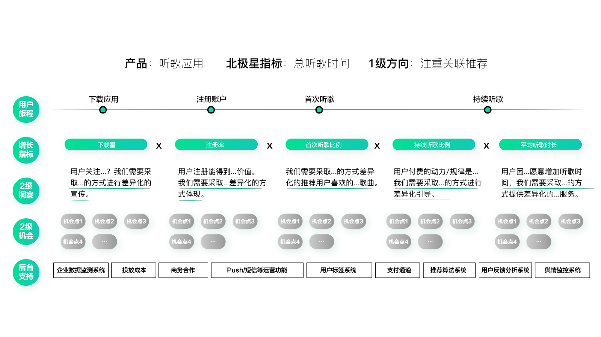
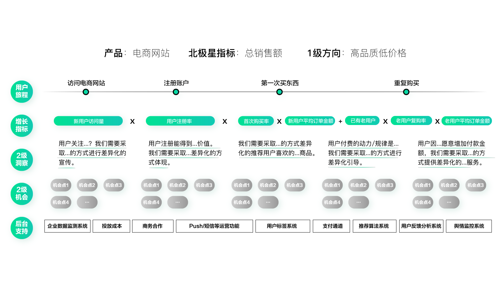
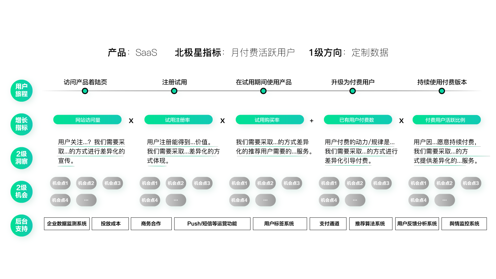
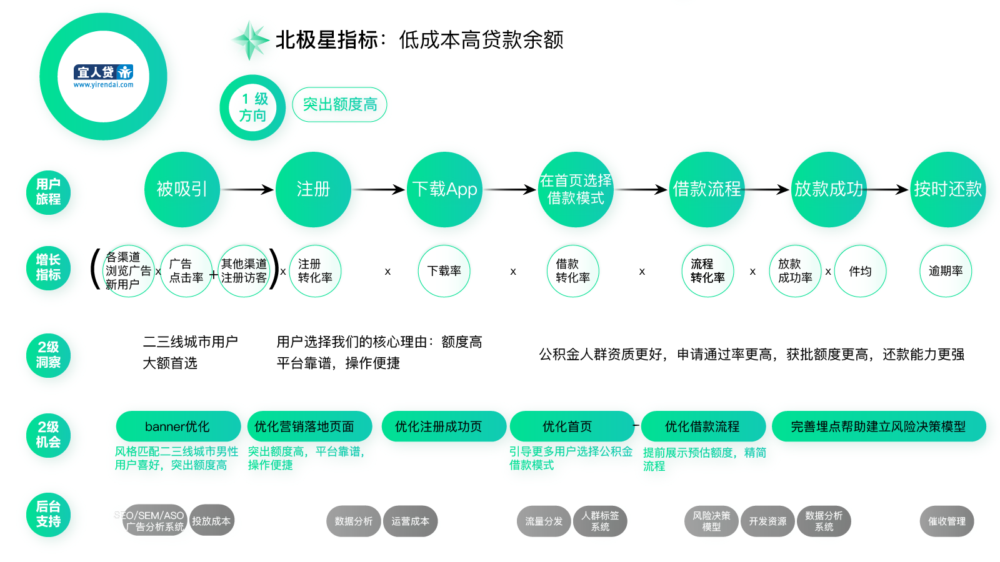
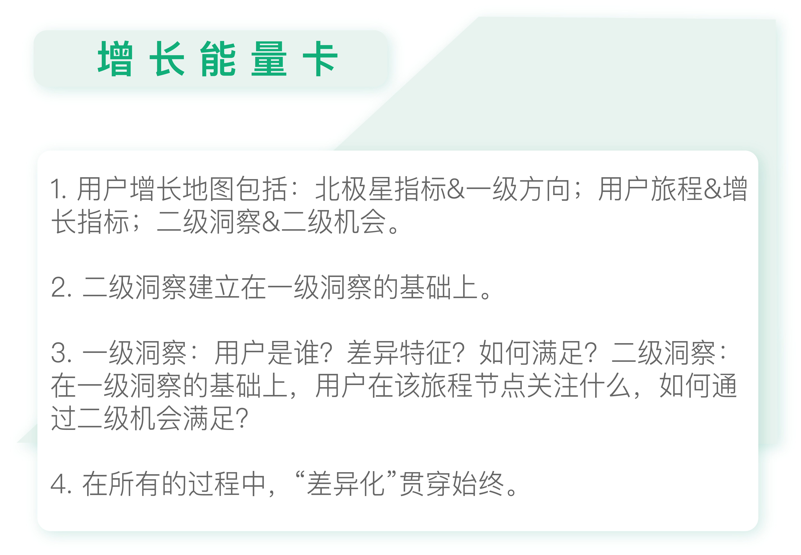

---
date: "2019-06-23"
---  
      
# 21 | 案例解析：定义关键增长指标
你好，我是刘津。

在上一讲，我们简单了解了用户增长地图的内容。而在这一讲，我会通过若干实例，手把手地带你定义关键增长指标。

## 案例1：音乐产品用户增长地图

我们来看一下第一个案例，这是一个音乐产品。

假设有一个听歌应用，当前阶段的北极星指标是“总听歌时间”，一级方向是：“注重关联推荐”。

那么它的用户旅程及对应的增长指标可以是：下载应用（下载量）→注册账户（注册率）→首次听歌（首次听歌比例）→持续听歌（持续听歌比例、平均听歌时长）。

如果不考虑用户流失情况，那么理想的总听歌时间=下载量×注册率×首次听歌比例×持续听歌比例×平均听歌时长。

这样，我们就可以把这几个指标定为二级关键增长指标，通过分别提升它们，来提升总的北极星指标。我们也可以通过这个公式来判断要优先提升哪个指标，提升到什么程度最有利于提升北极星指标。

当然，这是最最理想的情况，比如这里没有考虑成本、流失和其它细节问题，实际的情况要复杂很多。当然如果你不是专门负责运营及数据的同学，只是想了解工作重点和方向，那做到这一步也基本足够了。**注意要考虑产品具体情况，不要生搬硬套。**

接下来我们再看这款产品的**二级洞察**。

首先，我们先明确产品的一级洞察：**用户是谁？它的差异特征是什么？如何差异化****地****满足？**

<!-- [[[read_end]]] -->

假设该产品的用户是一群口味独特的小众人群，他们的差异特征是“喜欢比较小众的音乐”，但又找不到风格类似的。所以，我们需要通过强大的关联推荐能力，来找到他喜欢的同类型音乐。

以“下载应用”这个旅程节点为例，在此基础上的二级洞察是用户当前特别关注什么？如何差异化地满足？

假设在“下载应用”这个地方，目标用户特别关注在这个应用里能不能发现更多他喜欢的音乐。那么，我们可以通过醒目的相关宣传来满足用户的需求。

这样得出的相关二级机会可以是：优化应用市场宣传。而优化的内容以突出关联推荐能力为主。其他的节点也是以此类推。

## 案例2：电商产品用户增长地图

第二个案例是一款电商产品。

假设有一个电商产品，不考虑其它复杂因素，当前阶段的北极星指标是“总销售额”，一级方向是高品质低价格（自营品牌）。

这款产品的用户旅程及对应的增长指标可以是：访问电商网站（新用户访问量）→注册账户（注册率）→第一次买东西（首次购买率、新用户平均订单金额）→重复购买（已有老用户数、老用户复购率、老用户平均订单金额）。

如果想更精确地计算销量，这里我们可以把新老用户分开，计算公式是这样的：总销售额=新用户访问量×注册率\*首次购买率×新用户平均订单金额+已有老用户数×老用户复购率×老用户平均订单金额。

我们可以通过公式计算当前阶段的优先级，把新老用户分成两张用户增长地图处理。也可以先用一张图表示，后期执行细节时再分开。

假设在先不分开的情况下，我们来看**二级洞察。**

该产品的用户主要来自一二线城市、收入中等。用户差异特征是接触到的高品质商品很多，但是又消费不起。所以，这家电商通过自营品牌做到高品质、低价格，满足了这类人群想使用更好的产品的诉求。

以“第一次买东西”这个旅程节点为例，在“高品质低价格”的宣传下，用户对于首次购物会更加谨慎。比如：这家网站到底怎么样？品质是不是真的这么好？不满意能退货吗？……

为了提升用户的购买欲，我们可以通过突出“高品质、低价格”、展示大量用户评论、提供超长期的售后服务、对新用户提供额外福利等多种方式刺激用户购买。在这个过程中打消用户疑虑、建立好信任度。

我们可以看到，**整个过程都充满了“差异化”**：人群是有差异的、诉求是有差异的、产品定位是有差异的……

相应的，在每个旅程节点，用户的想法也是有差异的。因此，为了创造价值，对应的二级机会自然也是会有差异的。

## 案例3：B端产品用户增长地图

第三个案例是一款B端产品。

假设，有一个B端数据产品，不考虑其它复杂因素，当前阶段的北极星指标是“月付费活跃用户数”，一级方向是“定制数据”。

用户旅程及对应的增长指标可以是：访问产品着陆页（网站访问量）→注册试用（试用注册率）→在试用期间使用产品（试用购买率）→升级为付费用户（已有用户付费数）→持续使用付费版本（付费用户活跃比例）。

北极星指标月付费活跃用户数=网站访问量×试用注册率×试用购买率+已有用户付费数×付费用户活跃比例。你可以把这几个指标作为二级关键增长指标。

接下来我们再看有关它的**二级洞察。**

假设该产品的用户为平台商家，非常需要数据帮助他们做决策。但是现在能接触到的数据太少，满足不了需求。所以，该产品通过独家的定制数据能力去满足这类客户需要。

以“注册试用”这个旅程节点为例，在“定制数据”的大方向下，用户首次试用会有很多疑惑：到底怎么个定制化？能满足我的需求吗？有没有效果案例？具体怎么使用？怎么收费？……

为了打消客户在这个节点的疑虑，就需要在页面上突出注册试用能够获得的价值，以及对应的付出，使用户能够放心尝试。

## 案例4：金融产品用户增长地图

前面几个都是虚拟的例子，现在我们来看一个真实的案例。

宜人贷曾经（在当时的阶段）的北极星指标是“低成本高贷款余额”，一级方向是“突出额度高”。

用户旅程及对应的增长指标可以是：被吸引（各渠道浏览广告新用户×广告点击率+其它渠道注册访客）→注册（注册转化率）→下载App（下载率）→在首页选择借款模式（借款转化率）→借款流程（流程转化率）→放款成功（放款成功率×平均放款额）→按时还款（逾期率）。

因为新用户还款周期很长，如果不考虑再次借款的话，贷款余额=（各渠道浏览广告新用户×广告点击率+其它渠道注册访客）×注册转化率×下载率×借款转化率×流程转化率×放款成功率×平均放款额。

再看成本，假设不考虑运营成本、人力成本等，那么只要尽可能降低逾期率到合理范围即可。

综上，这些指标都可以作为二级关键增长指标。从这里你可以看到，在实际工作中接触到的增长指标可能会有很多，我们需要为这些指标排列优先级。这个在后面两讲中我会详细讲到。

接下来我们再看宜人贷的**二级洞察。**

宜人贷当时的用户主要是二三线城市的兼职创业者，对额度的要求比较高。因此，宜人贷具有额度高的优势可以很好地帮助到他们。

以“注册”这个旅程节点为例，在“突出额度高”的大方向下，用户就会想了：这个平台靠谱吗？自己能借的到吗？操作会不会很麻烦呢？……这些是在我们之前访谈的过程中发现的，当然如果你足够了解用户和业务，通过常识也可以判断。

围绕一级洞察和二级洞察，我们需要在注册页面上首先突出额度高，其次是平台靠谱、操作便捷等信息。这就是对应的二级机会。

## 思考题

请在上一讲思考题的基础上，继续完善你的用户增长地图。

欢迎把你的思考和疑问通过留言分享出来，与我和其他同学一起讨论。如果你觉得有所收获，也欢迎把文章分享给你的朋友。