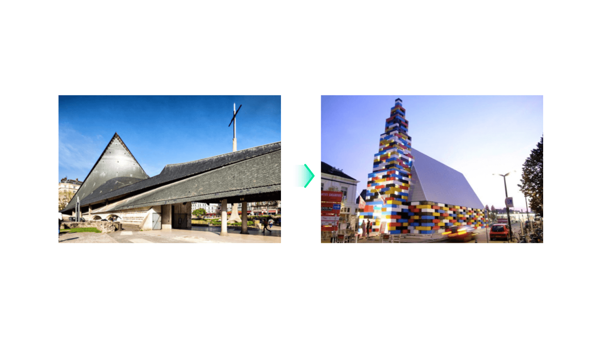
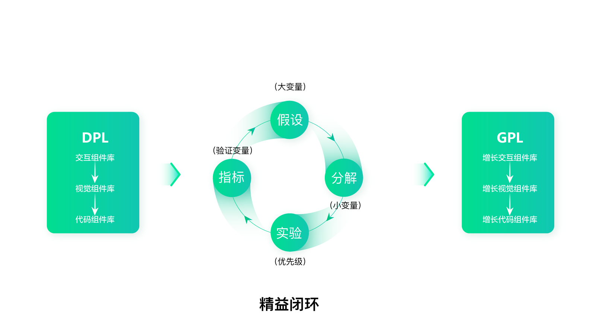
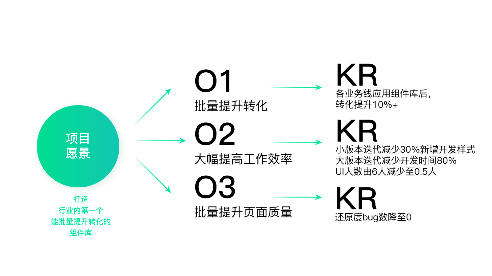
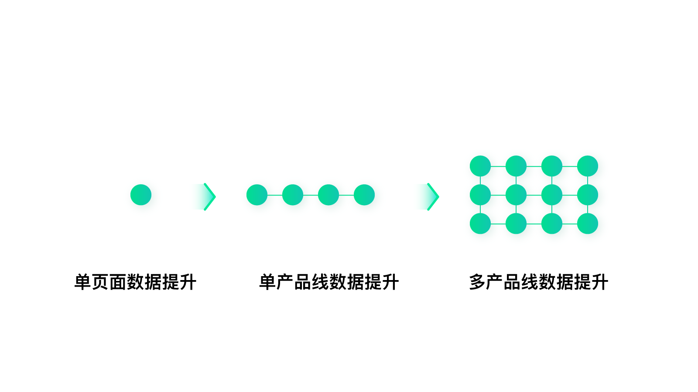
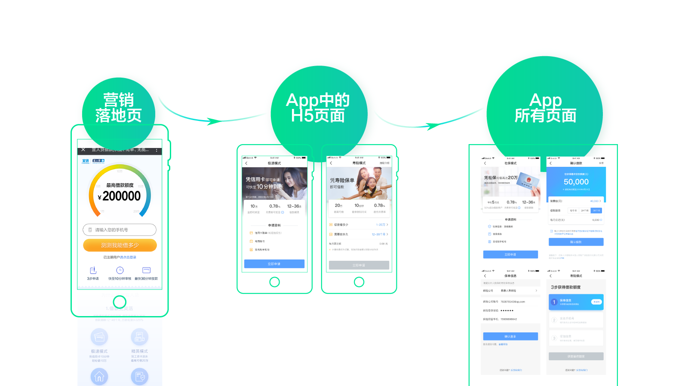
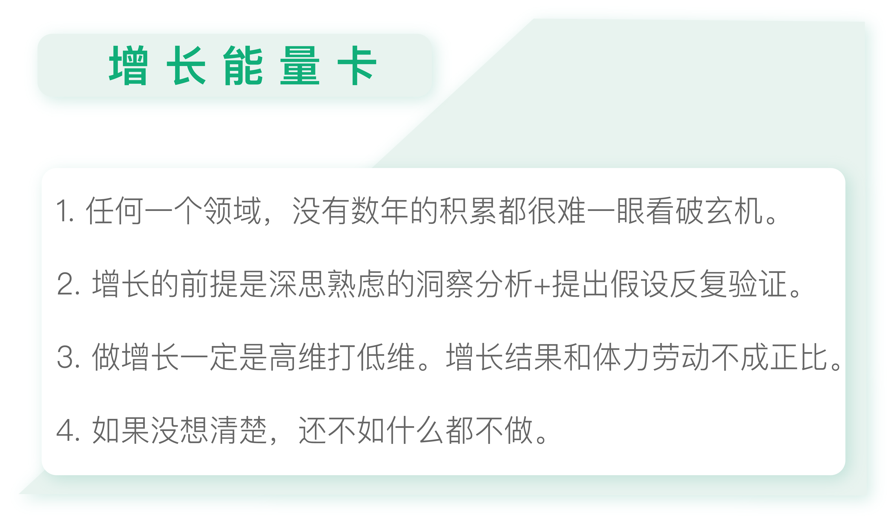

---
date: "2019-06-23"
---  
      
# 38 | 四级延续：增长组件库案例
你好，我是刘津。

今天我们来看一个实际的有关增长链的案例——增长组件库。

当然这个例子只是为了抛砖引玉，希望你可以根据自己的项目情况，结合自身技术，找到更多的智能增长方式。

## 什么是GPL增长组件库

通过上一讲的内容，我们已经知道，通过不断的测试，我们总结了一套设计规律。之后把规律复用到一些关键页面上，使得转化都有了显著的提高。

这个时候，我们自然希望所有的页面都能复用这套风格，然而这个工作量非常大，而且很难保证质量。因为每个设计师都有自己的风格，很难完全遵循某种特定的规律。

之前我就想当然地给团队成员展示了这种风格，我以为大家都能够意会，但是最后成员做出的结果五花八门。每个人对视觉的感觉和理解的细微差异使得最终的呈现结果都是不一样的，所以我只好打消了这个念头。

后来我想到了在阿里工作时接触到的DPL（Design Pattern Library）组件库。

简单地说，组件库就是一套详细的设计样式控件库，它把交互规范、视觉规范、前端代码融合到了一起。我们看到的每一个标准样式，背后都对应着现成的代码。那么在实现的时候，只要找到样式，对应的代码就可以直接使用了，非常方便。

和传统设计方式相比，它的好处是可以保证体验的一致性，减少人力成本，提升效率。我们不需要再一个一个页面逐一设计、制作，而是抽象、提炼出常见的控件，定义它们的使用标准和规范，根据需要随时“拼装”出不同的页面。

<!-- [[[read_end]]] -->

就好像这张图，以前要盖一个完整的楼，盖完一个才能再盖下一个，不同的人盖出来的很可能都不一样。现在我们有了现成的积木块，可以各种拆解复用，不仅方便快捷还保证了样式的统一性。

但是它的缺点也显而易见：与增长无关、耗时耗力、很难推动。

为了要推一套组件库，你需要提前抽象出所有必要的组件，并且要借着大改版的机会全部替换掉原来的样式，工作量不仅大，还很难推动。一般都是高级领导在征得业务老大的同意后，强行推动才行。如果设计团队话语权不够，推动力量不强，是很难做到的。毕竟业务方看中的是业绩，而组件库和改版更像是“面子工程”，很难带来什么实际的效益。

而且，业务线多且集中的地方才有推组件库的必要，所以我们很少在小公司里看到这种方式，这也是它的局限之处。

针对上述这些缺陷，我们决定结合增长规律和传统的DPL组件库，升级成全新的GPL（Growth Pattern Library）增长组件库。

## 与传统DPL组件库的区别

GPL和DPL是完全不同的，它们的不同体现在目标、实现方式和结果上。

首先，是目标不同：GPL以增长为导向，强调的是用最小成本带来最大价值。而DPL仅仅是提升工作效率、统一样式。

其次，是实现方式不同：GPL强调先在一个点进行实验，效果好再逐渐推动到线、再覆盖到面，用精益的思维逐步尝试，才能以小成本保证最终的批量增长。而传统DPL是一步到位，是一个浩大的工程。

最后，是结果不同：GPL可以用小成本带来批量增长；DPL推动成本很高，却并不能带来数据的批量增长。

其实就是我们之前一直在说的用户增长设计思维和传统产品设计思维的区别：一个强调以用户为中心，通过差异性洞察找到增长爆破点，用最小成本创造最大价值；一个强调专业、面面俱到。

GPL和DPL的差异也是如此，表面上看都是组件库，好像也没有什么区别，但背后是完全不同的思考逻辑。GPL的每一个组件设计都源于前期的深刻差异性洞察及后期的反复试验，而不是通过表面上“专业”的推导及“个人经验”得到的。

就好像同样都是手机，看上去也没什么区别。但是苹果手机背后是一个的生态系统，而Nokia就真的只是个手机。

之所以要讲这么多，是因为以前我在分享的过程中，我发现很多新手始终无法理解这其中的精髓，觉得它看上去和传统方式“差不多”，就认为这只是包装了一个概念，其实并非如此。

这就像很多外行人通过“速成班”学钢琴，几周时间就能弹出一支像样的曲子，引得众人喝彩。但是内行一看就知道是刚学的。**任何一个领域，没有数年的积累都很难一眼看破玄机。**

虽然专栏的名字叫《从0开始学增长》，但这里的0只是指零增长基础。如果没有若干年的工作经历，没有其它方面过硬的专业技能，可能也很难领悟。

## 通过OKR和项目制推行

说了这么多，现在我们言归正传，看看具体要如何着手进行GPL组件库的执行工作呢？由于我们有项目制，所以在征得领导的同意后，根据OKR的思路立了一个项目。

每个项目都需要有项目愿景，你可以理解为是项目的北极星指标。当时的领导层要求项目愿景要满足三个标准：创新、行业领先、对公司有价值。

基于此，我们最终定下的项目愿景是：打造行业内第一个能批量提升转化的组件库。围绕这个愿景，对应得到三个O（目标），分别是：批量提升转化、大幅提升工作效率、批量提升页面质量。

接下来，我们再细分KR指标。有了目标，我们现在要考虑如何执行。很显然，传统组件库那种“憋大招”的方式无法带来增长，增长的前提是深思熟虑的洞察分析+提出假设反复验证。因此，在推动方式上，我们采用了“精益”的思维。

首先，在营销落地页上反复测试，得到增长规律；然后再把这些规律复用到App中的若干H5页面上看效果，后来发现转化有了显著的提升；接下来我们向不同业务线的产品经理兜售这套方案，最终有一条业务量较小的新业务线愿意采用这套样式。

我们打算先以这条业务线为基础，提炼一套适用的组件库。这样，我们就不需要完成所有的组件规范，暂时只考虑这一条业务线就可以了。当然，也要适度考虑延展性，避免未来出现和其它业务线不兼容的情况。

该业务线上线组件库后，数据效果惊人，所有页面的转化都有了显著的提升。拿着这个成果，我们又去找了其它业务线的产品经理，受到了他们的认可，最终得以在不同业务线上去推动。

就这样，我们非常轻松的推动了组件库的落地，而不需要通过高级别领导的施压或“政治斗争”来完成。毕竟大家都是讲利益的，只要能共同推进业绩提升，没有人会拒绝能带来增长、提升效率的好点子。

组件库完成后，各业务线转化提升了10\%以上。之后再做大改版，只要替换库里的样式就可以了，不需要再重新开发，这样减少了原先80\%的开发工作量。日常的版本迭代也减少了30\%的工作量。设计质量以及统一性得到了彻底的解决。还原度问题降至0。原来需要5～6个设计师维持版本迭代，现在只需要0.5的人力维护组件库即可，剩下的人可以去做更有创意的事情。

即使不做组件库，只是统一并维护、执行这套增长设计规范，也能大幅降低设计人力成本，提升设计质量并带来增长。

但如果你的公司业务线不多，或者不同业务线面向的人群或场景不同，可能并不适用于做组件库，这就需要根据情况具体地评估了。

## 高维打低维才是王道

当然，这个例子只是抛砖引玉，目的是为了让你明白如何用更聪明、更省力的方式解决日常增长乃至管理的问题。

还记得我在第2讲提到的吗？问题不会在发生的那个层次解决，只有上升到更高的层面才能解决。这就是我们常说的“高维打低维”。

我之前也招过设计管理，结果人来了以后就开始盯着每个人的产出，不断地指导、改进，整理设计规范，最后弄得所有人都非常累，设计质量在短期内也没有明显的提升，界面体验和还原度问题依然非常严重。

而我却反其道行之，对设计规范不管不问。因为我认为没有得到验证的成果，是没有任何意义的。然后，我一直专注在营销落地页的测试上，不断总结适合的设计规律，时机合适了再不断延展复用到其它场景。

这波操作让很多资深的设计师理解不了，不明白我在干什么，以为我不务正业。等到各种增长结果如雨后春笋般涌出，他们依然不明就里，以为我们只是运气好，碰巧数据上去了。

所以，增长真的不是常规思维可以理解的。不是说你在那天天加班，表现的自己很专业、很忙碌，就是有价值有产出。这段时间我做增长的经验就是，**如果没有想清楚，还不如什么都不做呢。**做的事情越多，可能越是南辕北辙。

## 思考题

你有遇到过这样的情况吗，每个人都非常辛苦，项目还是很快失败了，你认为原因是什么？

欢迎把你的思考和疑问通过留言分享出来，与我和其他同学一起讨论。如果你觉得有所收获，也欢迎把文章分享给你的朋友。