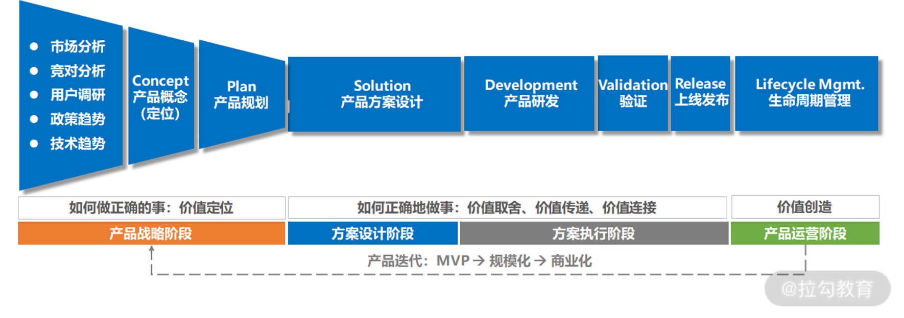
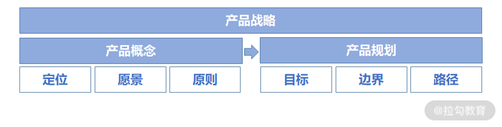
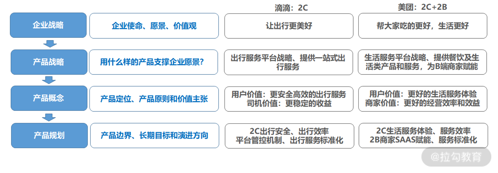
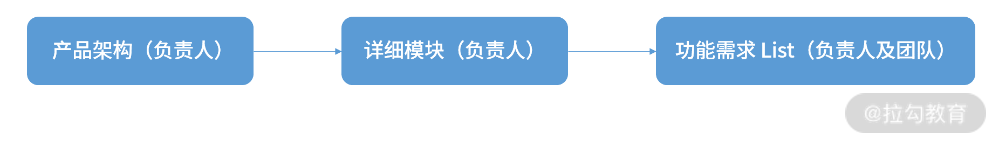
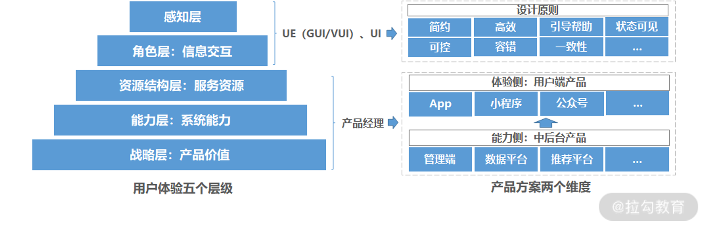
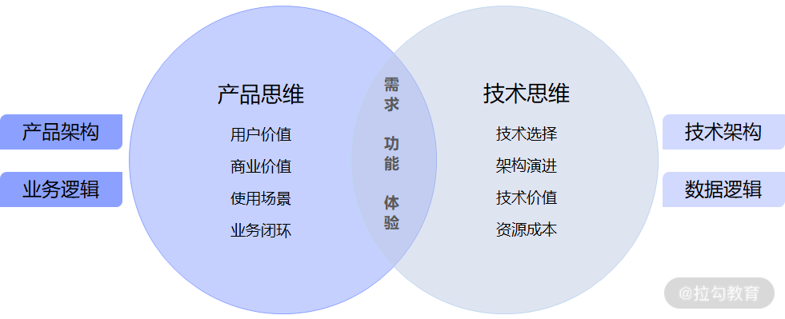
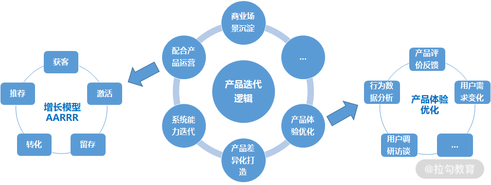
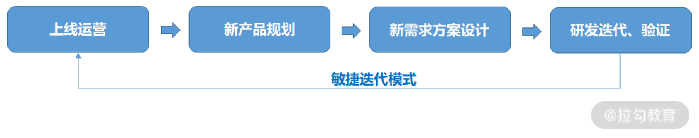

---
date: "2019-06-23"
---  
      
# 05 | 产品管理：如何进行产品全生命周期管理？
从这一讲开始，我们将进入模块二——实践篇的内容学习。在这个模块中，我将重点介绍大厂的产品管理方法论，**并手把手教你如何打造一款好产品**。

### 产品生命周期管理

下面我们先看一张如下所示的产品生命周期全景图，了解如何进行产品生命周期管理。

根据产品在生命周期所处的阶段，互联网企业将产品角色划分为**产品管理（也就是所谓的产品经理）**和**产品运营**两大类。

* **产品管理**：对产品及其功能的全生命周期管理，本质是为产品价值和用户体验负责；

* **产品运营**：对产品关联属性（用户、B端企业/商家、商品等）的有效管理，本质是提升用户/客户黏性和生命周期价值。

从上图可以看到，**一个完整的产品生命周期分为产品战略、方案设计、方案执行、产品运营这 4 个阶段，而产品管理的核心工作主要集中在前 2 个阶段。**

**由此可见，产品管理是一个持续性的动作。这就需要**产品经理在 4 个阶段中不断交替循环，持续打磨出精细化的产品，最终实现产品 MVP——>规模化——>商业化的跃迁。

那么，在这 4 个阶段中，产品管理的重点工作具体是什么呢？

#### 1\. 产品战略阶段（价值定位）

对于一家企业来说，选择何种产品战略至关重要。因为产品战略的合理性往往决定了企业的业务能否实现长期、可持续发展？企业能否构建差异化的核心竞争力？

事实上，产品战略源于企业战略，而企业战略由业务（2C、2B、平台型、解决方案型等）和商业（广告、会员、SAAS 付费、服务订阅等）这两种模式有机组成。因此，从本质上来说，产品战略也是一种方向选择，它将决定企业通过什么样的产品能力切入用户和市场？如何在市场和需求变化中寻找破局点？

针对不同的产品战略，企业所需要的产品能力也不尽相同，这就要求产品经理具备一定的前瞻性和灵活性，通过对行业、政策、技术趋势、竞争格局的有效判断，以此保证产品战略与企业战略同步。同时，还要求产品经理在升级企业战略过程中不断升级产品战略，最终通过产品战略**支撑企业长期愿景的实现**。

那么，在产品战略阶段，产品经理应该从哪些方面具体开展工作呢？

\*\*根据多年一线大厂的产品实战经验，我认为可以从产品概念和产品规划这两个层面入手，\*\*如下图所示：

* **产品概念：** 基于市场分析和用户调研实现产品定位、长期愿景、价值主张和产品原则（产品为谁提供哪类服务）。

* **产品规划：** 基于企业资源禀赋、能力优势定义产品的边界和核心能力，并明确产品目标、长期演进方向、短期实现路径（如何一步步实现产品愿景）。

这里，我拿美团和滴滴举例说明，如下图所示：

> **虽然滴滴与美团都是 O2O 业务，但是它们的使命和业务本质不一样，以至于产品战略和打法也不一样。**
> 
> > 滴滴的使命是“让出行更美好”，它旨在通过出行产品为用户提供高效、便捷的出行服务，为司机提供稳定的服务收益。而美团的使命是“帮大家吃得更好，生活更好”，它旨在通过生活服务产品为用户提供高效的服务体验。
> 
> 滴滴的业务本质是将用户与出行工具/司机建立连接，出行本质是安全和效率，因此它的产品战略需要紧紧围绕出行安全和效率演进。比如前期，滴滴通过司机准入、资质审核提高驾驶合法性，并通过语音监控和信用机制提升安全驾驶行为，同时还通过智能调度系统提升接单率实现供需匹配。后期，滴滴通过提供细分出行产品服务（豪华车、专车、共享单车等），同时围绕汽车金融、汽车车后市场服务、团购优选等延伸了新的产品服务矩阵。
> 
> 美团的业务本质是建立用户与线下生活服务的连接，生活服务本质是体验，因此它的产品战略需要紧紧围绕生活服务体验演进。比如前期，美团通过优化 2C 产品服务体验，实现了线上线下服务体验的一致性和完整性，并通过智能调度提升即时配送效率、到家服务体验。后期，美团围绕酒店、电影票、娱乐、社区团购、出行延伸了产品服务矩阵和2B 产品能力，并通过 SaaS 工具赋能商家，全方位提升了商家的经营管理能力和标准化服务能力，进而提升了用户到店服务体验。

从案例中不难发现，产品战略需要紧紧围绕产品核心价值的构建而展开，以此支撑企业的长期愿景。同时，它还会随着企业战略的变化而发生相应变化，这就**特别考验产品经理对事物本质深度思考的能力，比如业务的本质、用户价值的本质、竞争的本质……**

因此，在产品战略阶段，产品经理务必进行体系化思考，切不可跳过产品战略直接产出方案，不然打造出来的产品将缺乏系统性和整体性，也无法向用户进行统一的价值传递。

> **特殊说明：** 产品战略作为产品生命周期的一个重要阶段，常常决定我们能否做正确的事。**因此，我将在 06 讲中结合大厂实战案例详细介绍产品战略的思考和实现路径。**

#### 2\. 方案设计阶段（价值取舍）

产品战略通常由产品负责人负责完成，而方案设计阶段更多是由各个方向的产品经理共同协作。

在方案设计之前，首先我们需要将产品架构拆解成更细颗粒度的详细模块图，然后产品团队通过核心用户场景定义评估各模块的调用关系及优先级，进而形成产品功能需求 List，如下流程所示：

**当然，产品架构并不是凭空而来，一定要始于业务架构，终于技术架构。其中，** 业务架构是产品架构的源头，代表业务关键要素及其关联关系，产品架构代表核心产品模块及其能力之间的协作关系，技术架构则是实现产品能力的一个重要支撑。

而产品方案的设计来源于一个个真实的用户体验流程，这就要求产品经理针对不同的用户需求，形成详细的需求文档和产品原型设计。不过，在打造智能音箱、智能机器人等产品的过程中，因为需要硬件 ID 设计师及软件 UI/UE 的同时参与，所以**产品经理还需要向设计师们清晰地传达产品战略、能力和体验要点，具体流程如下所示：**

> **功能需求 List ——>子模块 PRD （产品经理）——>产品原型 （产品经理）——>工业设计（硬件 ID 设计师）——>交互原型（软件 UE 设计师） ——>视觉原型（软件 UI 设计师）**

因此，**从本质上来说，产品方案设计阶段也是一个价值取舍的过程，要求产品经理兼顾产品体验和系统能力，并使用最少的资源实现最优产品体验，以此形成独特的产品竞争力。** 因为一名产品经理如果光打磨用户体验而缺乏系统能力支撑，很难形成长期竞争优势，而光有系统能力缺乏体验打磨，也很难占领用户心智。

> 比如苹果手机，“取”的是能力和体验，“舍”的是资源和成本，体验侧——团队进行了上百遍的工业设计（硬件）和产品原型（软件）修改，能力侧——使用了优质的芯片、摄像头及触摸屏供应商。正是因为苹果不断迭代 iOS 系统能力，才打造出了苹果手机的极致产品体验。

**其中，产品体验是用户触点，系统能力是支撑体验的核心壁垒。**

> 以某款短视频产品为例，它的产品体验来源于短视频内容创作路径、信息流交互方式，而系统能力来源于内容创意库积累和推荐引擎。
> 
> 如果这款短视频产品想实现产品体验与系统能力的同步迭代，产品团队之间必须紧密协作（用户端产品参与功能体验优化、策略产品参与推荐引擎、内容创意策略引擎设计、数据产品参与底层数据能力构建、后端产品完成相关管理平台建设），以此实现精准的个性化内容推荐，从而为用户带来极致产品体验。

为方便你理解产品方案设计要点，我将用户体验的 5 个层级和产品方案的 2 个维度进行了一一对应，如下图所示：

#### 3\. 方案执行阶段（价值传递和连接）

在方案执行阶段，产品经理的主要合作对象是研发、算法及测试工程师，核心工作是进行产品价值传递（将产品方案设计初心真实、有效地传递给合作团队）和连接，并跟进方案执行进度和质量。

在互联网领域，关于产品和研发工程师的调侃段子非常多，因为这两个角色经常在工作中出现意见分歧，这是由于两者的思维认知不一致。\*\*产品经理是产品思维，更关注用户价值和使用场景；而研发工程师是技术思维，更关注技术可行性和技术价值。\*\*不过，从本质上来说，这两个角色都是在为产品需求、功能和体验服务。

产品经理如果意识到这一点，首先会**想办法让对方快速理解研发任务与产品价值的关系，并通过工作意义驱动方案执行；其次，建立合理的产品架构与技术架构、数据逻辑与业务逻辑的匹配关系（如下图所示）；最后，与研发工程师形成合力，顺利推动方案执行，如下图所示：**

**同时，在产品上线前，产品经理还需要基于用户场景的产品验证。这点至关重要，因为测试人员更多是从功能和系统的视角发现问题，而不是从用户视角，这就要求产品经理遍历用户使用场景把好最后一道关卡。**

#### 4\. 产品运营阶段（价值创造）

如果我们把产品比作孩子，上线就好比孩子出生，而持续进行产品运营和产品迭代就好比将孩子养育成才。

在产品运营阶段，运营经理需要根据增长模型持续完成运营策略的优化，而产品经理则需要通过市场需求变化及数据分析结果持续优化产品策略。也就是说，这个阶段并不意味着产品经理工作的结束。相反，产品经理还需要积极配合运营活动，并持续迭代优化产品，如下图所示：

**产品和运营作为业务发展的左膀右臂，需要两者紧密配合才能持续形成产品竞争力。**

**而在产品运营阶段，产品形态如果不同，产品和运营的打法侧重也会有所不同**，比如社交、内容类产品更重产品设计而轻运营，而电商、服务类产品（如 O2O 打车、本地生鲜）更重运营而轻产品设计。

天下武功、唯快不破，移动互联网产品大多采用微服务架构和持续集成的方式进行敏捷迭代，如下图所示：

在敏捷迭代的过程中，**产品上线运营是产品需求新的起点，通过不断收集用户和市场的持续反馈形成了新产品规划、新需求方案设计，并循环往复，进而形成了完整的新版研发迭代闭环**，至此一个产品的全生命周期管理过程就构建完成了。

### 产品管理的核心：打造产品壁垒

在产品全生命周期打造的过程中，产品管理的核心是构建产品壁垒。而在产品同质化严重的今天，企业应该如何构建产品壁垒呢？

**我认为资源、稀缺资质、关键技术产品专利、系统能力、用户体验，甚至内容资源都可以作为产品壁垒**。比如在线教育平台，是否具备优质内容资源成了衡量用户黏性的一个重要指标；再比如抖音的内容创作、千人千面的内容推荐体验也成了用户持续依赖的核心壁垒。

**除此之外，模式创新也是一个重要的产品壁垒**。因为移动互联网早已不是增量之争，而是存量之争，所以产品竞争力往往还来源于新洞察和新创意。也就是说产品之所以能让用户持续依赖，绝不是沿用前人的创意进行功能堆积，而是通过在特定场景下采用创新模式触动用户的某个痛点，并持续提供新颖度和新鲜感，进而形成坚不可摧的产品壁垒。

其中，拼多多的崛起就是一个很好的案例。

> 在电商巨头当道的今天，拼多多依然能杀出一条血路，这是因为拼多多洞察了下沉用户群体对打折商品的需求。
> 
> 现如今，拼团模式并不新鲜，而拼多多通过拼团+游戏化的创意组合模式，让用户在享受低价商品的同时，还能持续保持使用新鲜度，最终使得用户对产品产生了强依赖。
> 
> 当然，拼多多的成功还离不开环境的影响。当时正是因为淘宝放弃了低端供应链和商家，才催生了拼多多下沉供应端的优势，而下沉市场手机终端用户的崛起也大大降低了流量获客成本。天时地利人和，这才使得拼多多创造了活跃用户超 7 亿、营收规模高达 100 多亿的商业奇迹。

因此，在产品生命周期管理的过程中，产品经理需要最大限度地发挥自我创造力和产品创意，进而助力企业逐步打造产品壁垒，并形成强大的产品竞争力。

### 新时代产品管理的核心要点

随着产业智能时代的到来，产品管理的复杂度逐步提升，具体体现在以下 3 个方面。

* **更复杂的场景化设计：** 随着人类的消费升级，单一功能型的产品已经很难满足新一代主流消费群体的需求，这就需要产品经理具备强大的同理心和逻辑推理能力，真正从复杂的用户场景视角切入产品功能迭代，同步构建产品体验和系统能力。

* **更复杂的价值判断和决策：** 随着科技和经济的发展，不确定因素的增加，需要平衡的价值要素更加多元，这需要产品经理具备广泛的知识领域和更深度的思考力实现精准决策。

* **更复杂的项目团队协同：** 随着产业智能时代业务复杂度的提升，团队之间就越需要做到思想、步调统一，从而实现高效协同，精准传递产品价值定位。比如我过去负责的无人驾驶商业化产品，涉及 20 多个团队，此时产品经理的领导力尤为关键。

因此，产品经理只有深刻理解新时代产品特性和产品管理核心要点，才能在不确定的时代中构建确定性的竞争力，并持续在职场中发挥价值，实现自我。

### 小结与预告

这一讲我们介绍了产品管理的 4 个阶段，并介绍了如何围绕这 4 个阶段展开产品管理工作（价值定位、价值取舍、价值连接和传递、价值创造）。

这里我提个问题：你所负责的产品的价值主张和产品壁垒是什么？在产品管理的四个阶段，你最擅长哪个？哪个阶段困难最大？为什么？欢迎你在留言区互动。

06 讲我们将聚焦产品战略阶段，谈一谈如何进行产品的边界定义。

另外，如果你觉得本专栏有价值，欢迎分享给有需要的朋友。