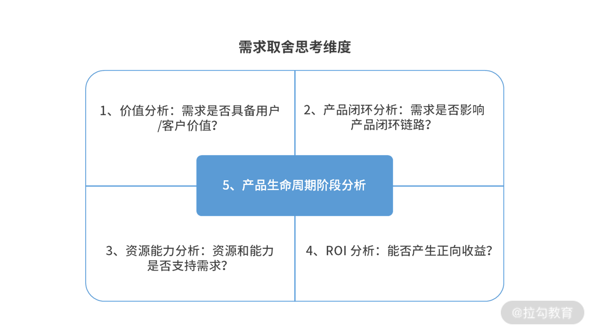
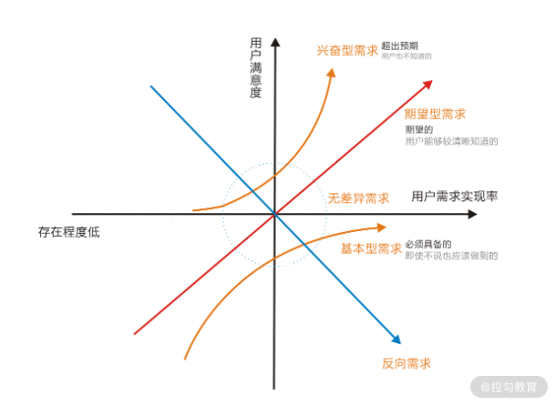
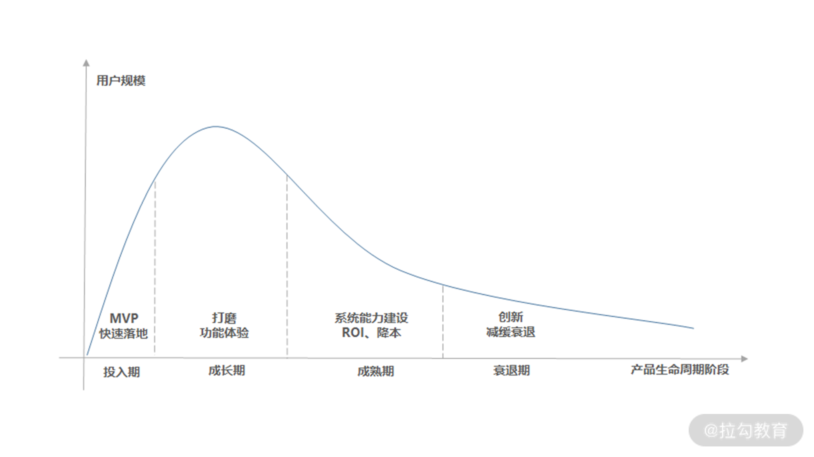
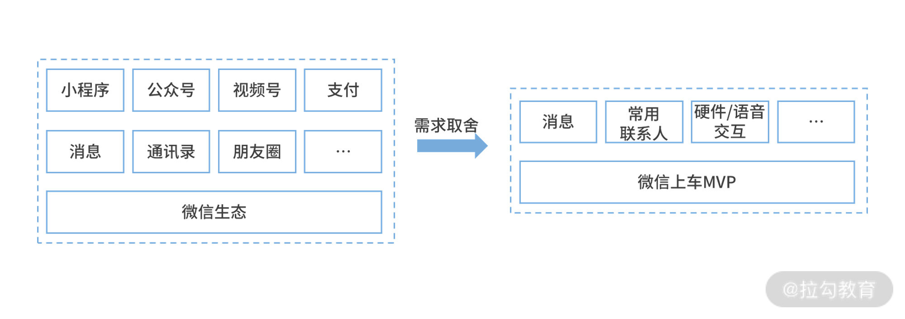

---
date: "2019-06-23"
---  
      
# 07 | 需求取舍：一线大厂如何平衡需求价值与资源能力？
这一讲我们开始聊聊产品落地时的一个核心话题：需求取舍下的功能选择。对于大多数企业而言，如何在有限的资源下创造更多的价值是他们最关心的问题；而解决这个问题的关键，在于产品团队是否合理进行产品需求取舍。

首先，我们通过一张图来看看 B 端产品和 C 端产品需求的本质区别。

**Ｃ 端产品需求的本质是体验至上**，且具备随机性、偶然性、偏动态和个性化。那如何更好地洞察需求的本质呢？这就要求产品经理具备一定的微观体感，在变化的用户需求中找到不变的要素。

> 比如电商产品的需求的本质是多、快、好、省：商品品类足够丰富、及时送达、性价比高、能帮用户省钱，正是因为京东、拼多多抓住了这点，才能在电商领域开辟一片新天地。

**B 端产品需求的本质是能力至上**，即通过线上化系统帮助企业解决经营和管理问题，从而提升业务效率，需求相对常态化、标准化。

> 比如智能客服系统的产品架构和底层 AI 能力（如自然语言识别与处理、画像、知识图谱等）相对标准化，不同行业的差异化主要来源于客服知识库和机器人应答策略的定制。

这就要求产品经理深度理解行业的规律和特性，并将分散的需求进一步抽象整合为行业通用的标准化产品能力，只有这样才能抓住 B 端需求的本质。

因此我们可以得出：需求是产品价值的重要载体，需求的本质就是满足用户/客户的价值。

### HOW：如何进行需求取舍？

我们应该如何合理地取舍需求呢？**这就要求产品经理必须具备需求价值判断能力，知道该放弃什么？该坚持什么？核心目标是什么？这是高阶产品经理的必备能力，也是产品经理们拉开差距的关键。**

一方面，产品经理需要将有限的资源和精力紧紧围绕“具备价值的产品功能”而展开，给产品做减法，将资源利用率最大化，最终击穿用户价值。

另一方面，当产品的长期价值和短期利益产生冲突，产品经理需要将需求进行抽离（从长期视角分析需求的必要性）和下沉（跳进需求洞察更多细节）。只有这样，我们才能更好地平衡产品的长期和短期需求价值，从而握住产品迭代节奏。

那具体该如何操作呢？根据需求实现目标的不同，我们将产品需求划分为功能型需求、体验型需求、运营型需求、技术型需求、策略型需求、数据型需求这 5 类。如下图所示，针对这几种需求，我梳理了一套相对通用的需求取舍逻辑：

下面，我们将从这五个方面逐一进行分析。

### 价值分析：需求是否具备用户价值？

接到任何一个需求时，产品经理首先需要做的是深入思考需求的价值点。根据需求实现后与用户/客户满意度的关系，需求价值分析工具 KANO 模型将用户/客户需求进行划分。

* 基本型需求：产品必备的基本功能。

* 期望型需求：用户内心非常期待的功能。

* 兴奋性需求：超出用户预期的功能、给用户带来惊喜的功能。

* 无差异型需求：有没有，用户都无所谓的功能。

* 反向需求：如果有，用户会很反感的功能。

因此，产品经理进行需求价值分析时，首先需要将所有需求按照 KANO 模型分类，再遵循以下原则进行需求优先级排序和取舍。

> 排序原则：优先考虑基本型需求的设计开发；再将更多资源精力，聚焦在期望型需求和兴奋型需求的设计开发；其次通过用户洞察，尽可能减少无差异型需求的植入；最后，坚决杜绝反向需求的输入。

这里需要特殊说明一点：产品方案设计时，遵循大道至简的原则固然重要，但我们不能因为过度追求简约而舍弃基础功能，否则容易走向另一个极端。

> 比如位于纽约苹果专卖店的电梯就是一个典型的案例，因为该电梯的设计极简到没有上下按钮，只显示电梯楼层，所以每一层都会停下来。这就无意中“剥夺”了使用者对电梯的基本控制力，从而带来极大的困扰。

因此，在需求取舍的过程中，我们还需要基于用户价值进行权衡。

当然，对 B2C 类型的产品进行需求价值分析时，除了使用通用的工具，**还可以通过深入分析业务痛点，直达需求本质。**

#### 【案例 1 美团 SaaS 中的需求预测功能】

比如餐饮业中，很多商家因为不清楚热销菜品的变化，也就很难决定原材料的采购规模，最终造成了大量原材料成本的浪费。同时，因为无法供应热销菜品，使得餐饮收益大大受损。

而美团为商家提供的 SaaS 工具中的**精准需求预测功能**，就很好地切入了 B 端客户痛点，帮助餐饮商家按照需求量进行合理的供应端备货品类推荐，进而降低商家成本，提升商家收益和用户满意度。

从上述案例不难发现，通过对业务本质深层次的分析，我们也能找到需求的核心价值，最终形成最有价值的产品功能。

### 产品闭环分析：需求是否影响产品闭环链路

产品闭环，即通过完整的产品功能设计，形成用户体验闭环。

产品闭环的前提是用户场景和体验蓝图设计，因此需要产品经理基于特定用户场景，设计出相应的用户功能路径、用户触点及用户目标。而产品是否达成闭环，取决于用户能否通过功能路径达成最终目标。

#### 【案例 2 腾讯智能维保服务】

设计腾讯智能维保服务产品时，该产品需求的取舍过程与产品闭环强相关。智能维保服务的核心是通过用户出行数据、车辆驾驶数据来精准预判车辆损耗情况，进而给用户提供维修或保养服务提示。

此时，该产品仅仅能提供车况提示，并不能与线下维保服务产生关联。因为没有形成完整的用户路径，也就不能真正解决用户的痛点。

于是，我们对该产品的服务全链路进行了全新设计：维保模型预测——>维保服务提示——>维保服务预约——>线上支付——>服务评价反馈。此时，维保服务预约环节与线下 4S 店和售后商家系统实现了完美对接，这才真正保障了产品服务闭环。

#### 【案例 3 电商缺乏退换货功能】

下面我们再拿一个电商产品举例。我们知道电商产品闭环包含：搜索/推荐——>浏览 ——>收藏/加购/购买——>支付——>收货/退换货——>完单这几个环节。

比如某内容电商产品在上线之初，因内容新颖吸引了大量的尝鲜用户。收到商品后，用户想要换货/退货，此时因为缺少了操作入口和流程引导功能（未形成产品闭环），使得很多用户纷纷流失。

而唯品会和京东的产品设计不仅提供免费上门取货/换货服务，对于信用好的买家还支持及时退款服务。这种产品设计将电商产品闭环做到了极致，有效降低用户决策成本，给用户带来很好的购物体验，进而形成更强的用户黏性。

由此可见，产品功能不在多而在精，给用户提供单一服务闭环好过提供海量的断点服务。**这就要求产品经理在需求取舍过程中，务必遵循产品闭环（MVP）原则：在单一服务场景下实现全功能最小单元闭环。**

### 资源能力分析：能力和资源是否支持需求？

**一个再优秀的产品 idea，如果缺少相应的企业资源和能力进行匹配，很难达成产品目标。**

#### 【案例 4 腾讯智能汽车整体解决方案】

比如在腾讯负责智能汽车整体解决方案时，因为腾讯缺少硬件及车辆相关研发资源能力，所以我们把主要精力聚焦在移动端软件和云服务产品设计上，而车载硬件交由擅长硬件领域的第三方合作伙伴完成，而车辆及相关功能设计则交由整车厂完成。

我们通过内外部资源能力整合，在借助外部力量的同时，充分发挥腾讯自身的 AI 能力和应用服务优势，最终才能打造完整的智能产品系统。

因此在需求取舍的过程中，产品经理既要学会向内看，对内部资源和能力进行分析，做到“量力而行”；也要学会向外看，善于借助外部力量达成最终产品目标。

### ROI 分析：能否产生正向收益？

在需求取舍过程中，不论是用户型产品还是企业级中后台型产品，进行 ROI（投入产出比）分析非常关键。

* 针对用户型产品，我们需要评估“用户可接受价格”与“产品实际研发成本”。以平衡车为例，早期综合研发成本高达 10 万元，产品经理通过不断进行需求取舍迭代产品（更换硬件零部件、优化策略提升平衡车稳定性和安全性），最终将成本控制在了千元以内，进而实现了产品商业化。

* 对运营活动类的需求取舍时，我们需要进一步思考：活动是否具备业务通用性（特定业务临时性活动还是普适业务高频活动）？能否支撑长期用户价值？最终能否带来用户增长和业务收益？此时，产品经理需要与运营团队紧密协作，才能让一切资源向产品价值聚力。

* 对中后台类型的产品而言，短期内都是在打基础，很难看到效果。这就要求产品经理从更长期的视角看待投入产出比，更多关注产品迭代给业务指标带来的影响。

#### 【案例 5 滴滴智能调度系统优化】

比如过去对滴滴智能调度系统进行优化时，我们的核心目标是**实现供需匹配**。

首先，我们通过乘客位置、区域订单密度预测、乘客需求峰谷变化，并基于单个用户历史出行数据进行实时需求建模；然后基于网格供给司机密度、司机信用、位置、履约历史、评价等数据进行实时供给建模；最终实现了供需两侧模型的精准匹配，大大提升了业务效率和用户体验。

在策略型的需求取舍过程中，最重要的是找到一个**关联业务目标**来评估策略效果，进而才能保证产品策略与业务目标一致。比如我们通过用户接单率（单位周期用户订单被正常服务的比例）和车均单（每辆车每天完单数）进行智能调度效果评估，进而完成了更合理的调度策略取舍。

### 产品生命周期阶段分析

产品的需求取舍，还需要考虑产品所处的生命周期阶段。产品阶段不同，需求取舍的侧重点也有所不同。

* 在产品投入早期，企业更关注如何在资源有限的情况下，快速实现产品落地，在以一定的用户黏性占领新业务；

* 在产品成长期，企业更注重产品功能和体验打磨，以获得更大的用户规模和业务体量；

* 在产品成熟期，企业则更注重系统能力建设及产品差异化，以获得更强的产品壁垒和业务盈收；

* 在产品衰退期，企业更关注产品创新并寻求第二曲线，以延缓产品衰退周期，获得新的业务增长点。

#### 【案例 6 从移动端到车载场景，微信的“上车”心经】

微信已经成为移动端的一款生态型产品，而它在车机系统的产品生命周期阶段却处于投入期。下面我们就聊聊，当时我们是如何给微信产品瘦身，将其打造为车载场景下的第一款 MVP（最简化可实行产品）社交产品的。

一切产品的思考原点都要回归于用户价值，基于“边开车边社交”的使用场景，最终我们提炼出了产品价值的关键词：安全、隐私、高效。

* **安全**：所有功能设计，以保证驾车安全性为第一优先级。

* **隐私**：在半开放的车内环境下，充分保护用户隐私。

* **高效**：在用户注意力被驾驶占用的前提下，通过更好的交互体验设计保证沟通效率。

基于最小单元功能闭环逻辑，我们进行了大量的功能裁剪，最终只保留了一些基础社交功能，这包括登录/退出、主动/被动收发消息、语音通话/挂断、文本/语音消息播报、最近联系人列表、选择联系人等。

同时与车辆硬件充分结合，保证智能系统的整体性和用户交互的便捷性。

* 增加了仪表盘消息提示、方控独立微信按键等功能，让沟通更**高效**便捷；

* 通过**隐私**登录设计（根据是否隐私空间选择登录触发机制）、主驾单声道 TTS 播报等功能，充分保护了用户隐私；

* 通过提前车速判断、等红灯消息简报等功能保证了驾驶的**安全**。

正因为我们分析了产品所处阶段，从而找到了车载微信需求取舍的逻辑，并将产品 MVP 快速落地，以实现最小单元功能闭环。最终再通过数据驱动，不断论证需求取舍逻辑，进而实现产品价值闭环。

### 小结与预告

这一讲我们介绍了需求取舍的五个要素：需求价值分析、产品闭环分析、资源能力分析、投入产出比分析、产品生命周期阶段分析。

根据业务特性和所处阶段的不同，这五个要素的思考重点也略有差异。因此，产品经理需要从综合视角对需求价值进行取舍，让产品价值最大化。

这里我提一个问题：你是如何进行需求价值取舍的？哪个要素是你使用得最多的要素？除此之外，你还有哪些方法？欢迎你在留言区与我互动、交流。

新时代产品体系复杂度增加，下一讲我们就深入谈谈新时代产品方案的设计重点，并结合腾讯的案例，聊聊如何同步构建场景体验和产品能力。

另外，如果你觉得本专栏有价值，欢迎分享给更多好友哦。