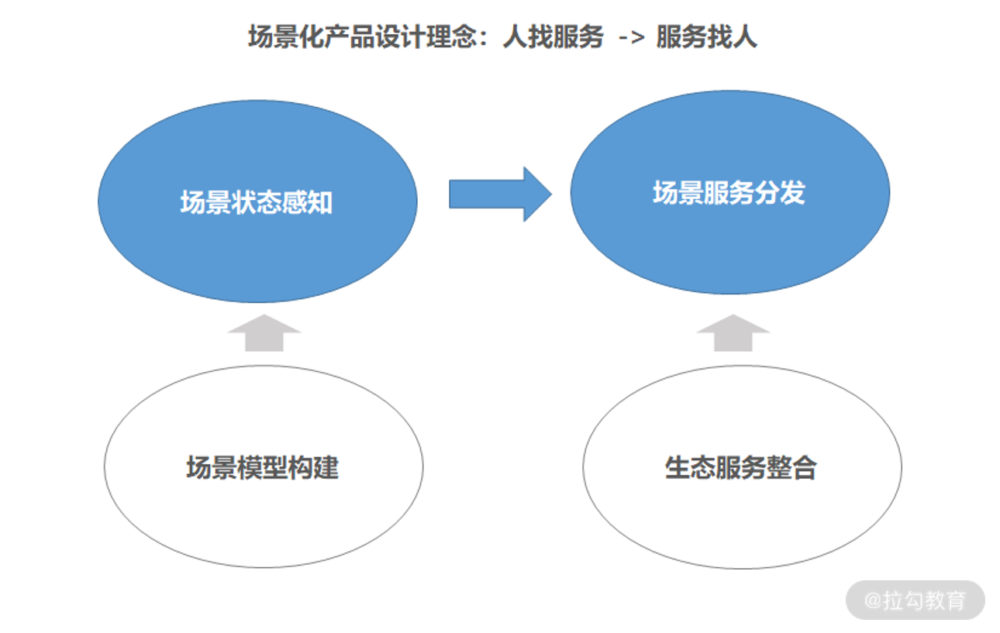

---
date: "2019-06-23"
---  
      
# 08 | 场景设计：腾讯如何通过场景化产品设计实现服务找人？
这一讲我们来聊一个新时代产品经理不得不思考的话题：如何通过场景化产品设计，将“人”与“服务”连接。

在移动互联网早期，企业主要靠获客补贴获取更多的用户流量。而随着移动互联网的发展，流量优势已不复存在，此时产品竞争力更多通过大数据挖掘实现流量价值，进而为用户提供深层次的增值服务。

现如今，移动场景下的用户服务覆盖度日趋饱和，产品竞争力主要取决于如何理解用户、如何通过 AI 能力为用户提供更独特的精细化服务，进而打造场景化的服务体验。

**可以说，互联网的产品竞争力已从“流量之争”“数据之争”过渡到“场景之争”。**

人类文明已从工业时代发展到信息时代（信息时代又分为 PC 互联网时代、移动互联网时代和产业互联网时代）。此时互联网企业如果想创造价值，核心是通过选择不同的应用产品为用户提供碎片化的消费和娱乐**场景**。

* 比如社交、游戏、电商、内容为首的移动端产品，它们主要通过沉浸式体验长时间占领用户注意力，被称为“入口场景”；

* 而类似微信支付、支付宝为首的移动端产品，它们主要通过移动支付形式满足用户的多元化交易需求，被称为“支付场景”。

### 产品的本质：通过场景连接人与服务

由此可见，互联网产品的本质是**通过场景连接人与服务**，并通过提供场景化的服务满足用户价值。

* “场”指的是空间和时间；

* “景”指的是用户使用产品时的情景；

* “场景”则指的是在一定的时间和空间内，通过与产品交互让用户产生情绪。

**那么，场景与体验、商业有什么关系呢？**

随着用户需求的细分，移动端的使用场景也在逐步细分，精细化设计产品的场景就显得尤为重要。

* 比如细分使用导航的需求，我们可以为用户提供步行、骑行、驾车、上下班、跑步、火车、旅游等场景下更精细、准确的导航服务；

* 再比如细分听音乐的需求，我们可以为用户提供学习、运动、用餐、庆祝、开车等场景下更精准、独特的音乐视听内容。

从中我们看出，精细化设计产品的场景不仅能满足更多的用户细分需求，还能大幅提升用户体验，使用户持续对产品产生依赖，进而创造更大的商业价值。

### 用户体验与产品能力要素

现如今，随着用户需求的升级、科技的创新与发展，产品体系的复杂度也在不断增加，**用户体验**的打造更依赖于**基于用户场景的产品能力构建**。

> 比如盒马的 30 分钟送达服务，离不开基于精准需求预测的智能仓储管理及基于供需匹配的智能人效管理能力；再比如抖音千人千面的短视频内容产品体验，离不开基于精准实时画像的智能推荐能力。

因此，新时代产品竞争力的核心是通过场景化产品设计同步打造用户体验和产品能力，这也是产品经理要面对的一个重要课题。接下来我们先来了解下用户体验和产品能力的关键要素。

#### 1\. 用户体验要素：峰值、终值、忍耐底线

在《产品思维 30 讲》中梁宁老师提到，用户体验的核心在于用户在不同场景下的忍耐底线，即峰值和终值。比如用户打开移动端 App 的忍耐底线是 3\~5s，一旦超过忍耐底线，就会出现大量用户流失。而很多产品服务之所以能让用户持续依赖，是因为提供了超出预期的体验高峰和结束情境，比如宜家的会员咖啡、出口区域的低价热狗和甜筒等就是典型的例子。

> 诺贝尔得主、心理学家丹尼尔.卡尼曼提出了峰终定律——指人类大脑对体验的记忆主要由体验高峰时期的感受、体验结束时的感受这两个因素决定。

也就是说用户体验最终激发的是用户情绪，那如何让用户产生愉悦感呢？

这就要求产品经理在产品设计时始终围绕产品功能如何满足用户而展开，并通过分析用户与产品的交互行为，更精准地识别用户情绪，进而更好地判断产品功能的优劣，最终优化出更细致的体验。比如通过分析用户未付费、退出 App 和差评等行为，我们就可以判断用户的“焦虑和不爽”，分析用户长时间活跃、产生付费和好评等行为，就可以判定用户的“愉悦和被满足”。

#### 2\. 产品能力要素：AI 和数据应用能力、连接能力、场景能力

对企业而言，产品能力才是一个真正可长期沉淀的壁垒。产品能力作为用户体验的一个底层支撑，决定了用户体验的差异。

那么，随着科技的发展，新时代对产品能力提出了哪些新要求呢？我们先看一个具体案例。

电商产品的体验差异主要在于商品触达效率、精准性、线上交易效率、商品质量和配送及时性。

一般来说，一个完整的电商场景服务分为商品触达——>线上交易——>线下收货这三个阶段。

而这三个阶段非常依赖如下图所示的几个产品能力，比如商品触达阶段的搜索推荐能力、线上交易阶段的系统能力和金融支付能力、收货阶段的供应链品控和物流能力等。

从图中我们不难发现，搜索推荐能力需要依赖大量的 AI 和数据应用，如精准的用户画像、兴趣偏好挖掘等，而畅通的交易链路需要依赖支付渠道、供应端商品和物流之间的连接，由此才能将电商业务的人、货、场进行更好地匹配，进而满足用户全链条的电商场景服务。

**因此移动产品能力的核心要素是如下三点。**

* **AI 和数据应用能力**：指将数字世界和物理世界的充分融合应用，通过 AI 技术形成智能预测和智能决策。

* **连接能力**：指通过产业关键要素和生态服务资源连接（如电商要素：用户、商品、资金、物流等）促进服务高效流转。

* **场景能力**：指通过数据和连接能力形成用户细分场景精细化服务能力，最终形成用户体验闭环。

到这里用户体验和产品能力的关键要素就讲完了，下面我们重点聊聊如何通过场景化产品设计同步打造用户体验和产品能力。

### 场景化产品设计思路

场景化产品设计是同步构建**产品能力**和**用户体验**的底层逻辑，通过将 AI 和数据应用能力、生态资源进行连接，进而驱动场景能力的提升，最终形成用户体验与商业闭环。因此，如今的商业竞争归根结底是**围绕用户体验而展开的场景化战争**。

那么我们应该如何做好场景化产品设计呢？核心思路是从用户的实际使用场景出发，通过整合产品功能和服务资源（摒弃大量功能的堆积），从而在恰当的时机为用户呈现出精准、简洁的交互产品。

其中，AI 和数据应用能力是场景化产品设计的重点。因为通过大数据预测和精准推送个性化服务，不仅可以帮助我们更精准地判断用户的细分场景，还可以提升用户服务的触达体验，进而更好地实现商业转化。

那如何更好地将 AI 和数据应用于实际工作中呢？这就要求产品经理在产品设计时，多利用场景化思维重新思考以下 3 个问题：

* **是否围绕用户搭建了产品的核心使用场景？**

* **是否连接了能够满足场景需求的生态服务？**

* **这些服务如何通过场景化连接创造新价值？**

场景化产品设计作为新时代产品设计的底层逻辑，也是新时代产品能持续创造用户价值的根本。通过细分用户场景设计，不仅可以驱动整体产品体系的迭代，还可以通过数据和 AI 能力为用户提供更精准的场景化服务。

接下来，我们将基于腾讯智能汽车产品核心变革案例，具体谈谈如何通过汽车场景化设计思路同步构建产品能力和用户体验。

### 场景化产品设计实践

过去，产品设计主要考虑垂直应用领域的功能维度迭代，这就导致了同一场景下的用户体验相对割裂，整体服务性不强。比如我们在使用智能手机终端时，想完成所有的需求动作需要在一天内来回切换十几个 App。

而车机系统与手机系统相比，用户的注意力更分散，对效率和体验的要求更高。正是在场景化产品设计思路的指导下，最终我们重组了汽车产品体系架构，把场景服务引擎作为底层驱动（数据基建支撑场景引擎），并通过场景串联上层生态应用服务，最终形成了一个以数据为驱动的场景化生态服务逻辑，如下图所示。

正是通过 **“场景模型构建——>场景状态感知**——>**生态服务能力整合——>场景服务分发”这四步**，最终我们实现了智能汽车场景化产品设计，下面我们详细看看具体实现过程。

#### 1\. 场景模型构建——>场景状态感知

尽管人工智能技术（计算机视觉、自然语言处理、大数据预测等）已经在车领域有了不少应用，如 ADAS、L4 级无人驾驶、AR 导航、语音车控等。但技术仅是个必要条件，不是充分条件。

**我们更要思考如何从用户价值出发、通过场景来串联这些产品能力，通过 AI 能力提升场景服务体验。**

* 比如，上班通勤场景更注重出行效率，如何基于交通大数据给用户规划最优出行轨迹、帮助用户快速抵达终点是关键；

* 再比如，长途自驾场景更注重出行安全和体验，如何通过出行大环境（天气、温度）和驾驶状况给用户提供安全驾驶策略，通过车内互动娱乐及线下服务连接给用户提供更愉悦的出行服务是关键。

因此场景化产品设计的第一步是场景状态感知，也就是完成场景模型构建。

通过探索用户出行场景，我们将场景关联要素拆分为了这五个维度。

* 出行目的：用户出行目的，比如通勤、购物、约会、车站接送、自驾游等；

* 出行大环境：出行环境状况，比如时间、天气、温度、路况、车况等；

* 驾驶状况：用户驾驶过程状态变化，比如疲劳、停车、堵车等；

* 成员状况：车内成员角色，比如老人、小孩、单人、多人等；

* 情绪状况：车内成员情绪变化，比如焦虑、愉悦、悲伤、兴奋等。

将这五个维度的关联要素作为基础输入因子后，最终我们构建出了一套用户出行**场景模型**，如下图所示：

而场景模型的构建和场景状态的识别需要依赖大量的基础数据，比如车辆传感器数据（起熄火、档位、摄像头、车内设备等）、用户行为数据（车机交互数据）、云端交通信息数据（天气、时间、交通路况等）、实时地理位置数据（经纬度、LBS 服务）、生物识别数据（人脸、声纹）数据等。

通过多元化的基础数据融合、治理和应用，我们能够实时进行用户细分**场景的状态感知**，进而给用户提供更精准的服务。

#### 2.生态资源整合——>场景服务分发

场景化产品设计的第二步是场景服务分发，而场景服务分发的前提是已经完成大量的生态服务资源整合。**服务分发，即基于用户场景的需求预测为用户提供精准的场景式服务。**

* 在堵车场景下，预测到用户将出现焦虑、烦躁不安的情况，便主动为用户播放舒缓音乐、智能切换导航路径；

* 在疲劳场景下，预测到用户将存在驾驶安全隐患，主动触发疲劳驾驶提示。

* 在旅游场景下，预测到用户关心景点天气、信息、周边配套，主动播报旅游目的地天气，并提示用户一键购买景点门票，同时主动推荐景点附近的口碑餐馆等。

基于**用户场景识别**的精准服务分发是提升用户体验的关键，核心依赖企业生态服务资源整合能力；以及基于**用户行为反馈**的服务策略优化能力，最终实现服务找人。

为了实现更好地实现用车场景的服务分发策略，我们将服务分为**以人为中心**的服务和**以车为中心**的服务这两大类，如下图所示：

* **车相关服务**：更多聚焦在智能驾驶和安全策略，以保证用户能第一时间感知车辆驾驶状况，进而采取相应的驾驶动作，最大限度地确保用户的出行安全。

* **导航出行服务**：围绕场景化导航服务（通勤路线、旅游路线等）和出行途中可能产生的出行服务（如加油、洗车、停车服务等），以保证用户享受一站式出行服务，高效抵达目的地。

* **车后服务**：围绕车辆生命周期管理，通过车辆数据进行精准智能服务预测，并与线下车服务生态打通形成用户服务闭环，以确保车后服务的透明性和服务质量。

* **社交娱乐服务**：类似手机智能终端，会围绕用车场景核心需求将大量功能进行裁剪（如 07 讲微信上车案例），交互形态也从用户主动触发转为系统触发，以确保用户出行过程的舒适度和愉悦感。

* **线下生活服务**：基于出行场景识别及地理位置信息，帮助用户形成更多的线下服务连接，比如提前为用户预订电影票、预约餐厅，推荐用户领取附近的商超优惠劵等线下服务，主动触发用户与周边线下商业生态的连接。

* **探索型智能服务**：依托计算机视觉、自然语言处理、多模态交互等技术手段，通过语音游戏、情景互动、车家互联等服务形态形成 AI 能力和生态能力的叠加效应，最大化提升用户场景体验。

未来汽车或将成为一个智能移动终端，同时随着 L4 级别无人驾驶的普及，用车场景将充满另一种想象空间，比如一个私密的约会空间、移动办公空间、家庭娱乐互动空间……

因此，不论是系统级产品还是应用级产品都非常适用于场景化产品设计，这就要求产品经理多进行场景化思考逻辑。因为它不仅能帮助我们更合理地规划产品，还能帮助更好地把握功能迭代节奏，进而打造出更有竞争力的产品。

### 总结与预告

这一讲我们介绍了**场景化产品设计思路**是构建产品能力和用户体验的底层逻辑，也是新时代产品形成差异化竞争力的关键。

这里我提个问题：你所负责的产品有哪些不错的用户体验呢？又依赖什么样的产品能力支撑？你是如何进行场景化产品设计的？欢迎你在留言区与我互动、交流。

09 讲我们将通过实际案例分享百度如何通过数据驱动产品、运营和商业闭环迭代。

另外，如果你觉得本专栏有价值，欢迎分享给更多好友。