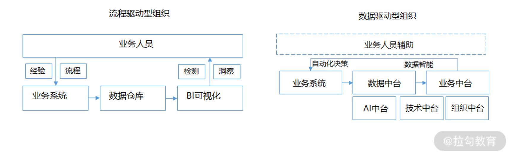
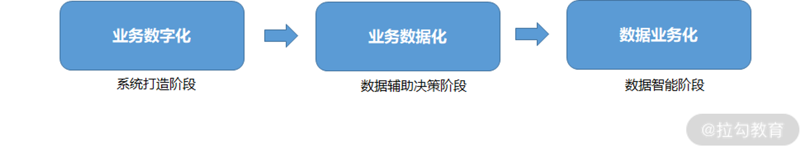
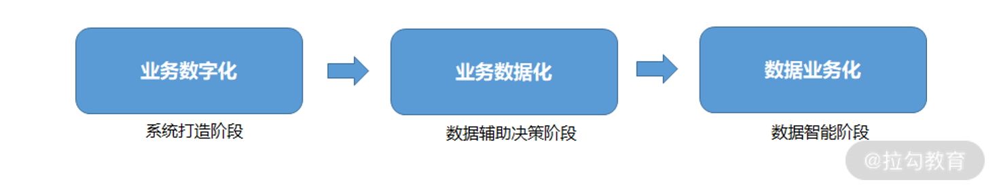
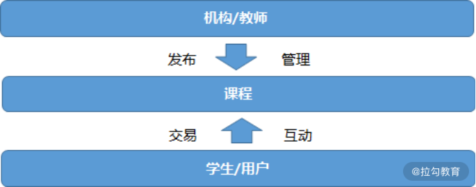
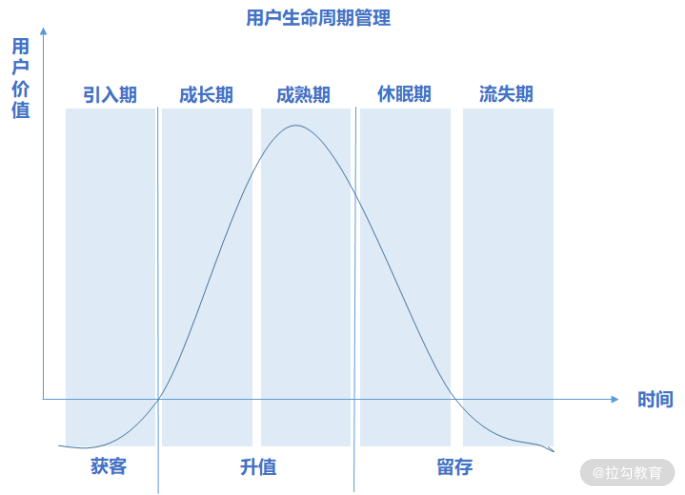
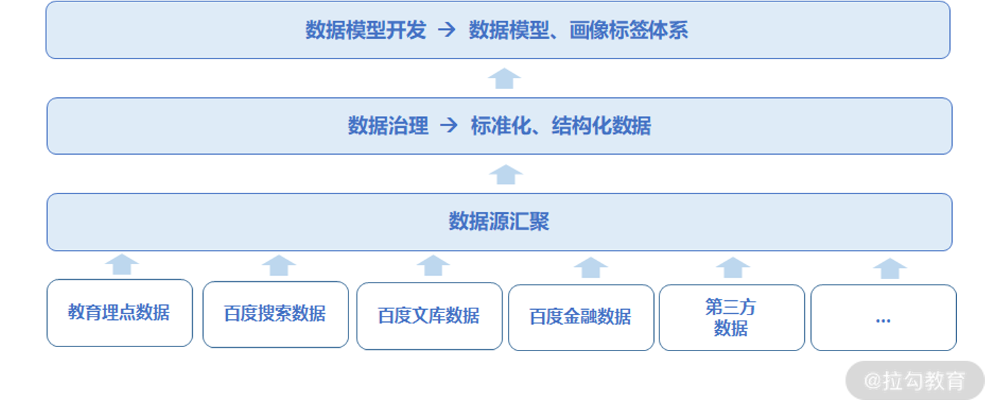
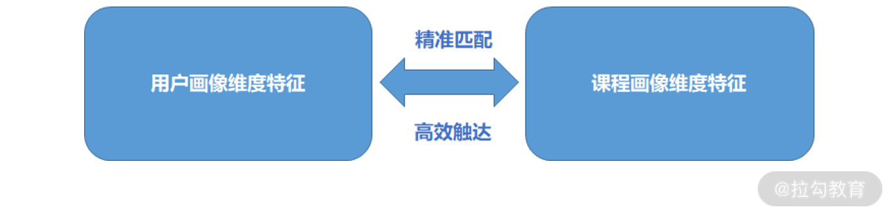

---
date: "2019-06-23"
---  
      
# 09 | 产品闭环：百度如何通过数据驱动产品、运营、商业迭代闭环？
08 讲我们通过将新时代场景化产品设计理念与实际案例结合，帮助你更好地理解产品打造的核心思路。

这一讲我们将谈谈如何通过数据驱动产品、运营和商业闭环。

### 如何理解数据驱动？

数据驱动、数字化转型、数据智能几乎成了产业时代人人挂在嘴边的咒语，投资人判断一个企业是否具备长期潜力，甚至会把企业的数据驱动模式及数据价值应用作为重要的衡量指标。

为什么会出现这样的状况呢？核心是因为科技的进步催生了商业环境快速迭代，企业成长速度和死亡速度都在指数级提升，因此数据驱动型组织成了新时代企业构建商业竞争力的基础。

与数据驱动型组织对应的是传统的流程驱动型组织，我们先来了解这两类组织之间的核心差异。

* **流程驱动型组织：** 指企业经营管理完全由既定的流程驱动的组织形态。在这种组织中，数据只是副产物，它更多用于监测业务进展和洞察规律，而决策链条完全由业务人员完成，这种人工决策的方式不仅会导致业务流程僵化，还难以满足快速发展的商业环境。

* **数据驱动型组织：** 指通过数据智能驱动业务自动化决策的组织形态。在这种组织中，数据成了业务系统的核心单元，通过数据智能和业务标准化组件形成数据中台和业务中台，形成业务自动化决策链路。这种机器智能决策、人工辅助的方式能让企业快速响应市场和用户需求变化，从而形成更大的商业价值。

由此可见，流程驱动型组织相对固化，企业创新力薄弱；而数据驱动型组织相对灵活，能通过数据价值应用和数据驱动业务决策实现产品闭环。

### 如何形成数据驱动型组织？

正因为数据驱动型组织对于商业竞争的价值巨大，所以不论传统企业还是互联网企业，都在加快数字化、智能化转型的步伐。

那么，企业应该如何做才能一步步实现数据驱动型组织呢？

一般来说需要经历**业务数字化——>业务数据化（流程驱动）——> 数据业务化（数据驱动）这三个阶段。**

* **业务数字化：** 通过打造系统工具将企业业务经营管理和产品服务线上化，最终实现全链路业务流程数字化。

* **业务数据化：** 通过多元化数据融合、治理和分析，形成结构化、可视化的业务结果，帮助企业管理者及专业人员进行经营管理和专业决策。常见的业务数据化工具如经营分析系统、用户行为分析系统。

* **数据业务化：** 通过数据价值应用产生数据智能，并与业务系统贯通实现业务自动化决策，比如字节的智能推荐系统、美团的智能调度系统、携程的智能定价系统。

**数据驱动的本质是企业通过建立一套数据充分融合汇聚的机制来产生较大的数据应用价值，并通过数据智能实现业务决策自动化，进而提升业务效率和用户体验。**

数据与业务的关系就好比水与人类的关系，相互依赖、不可分割。也就是说数据与水一样都属于不可或缺的资源，也需要像水一样实时流动起来才能不断发挥价值。

因此，加强大数据技术理解和提升数据应用能力，思考如何通过数据驱动产品、运营和商业闭环是新时代产品经理的必修课。

### 百度在线教育产品实践

这里我们举一个百度教育业务的案例进行说明，虽然百度最终未能在教育领域深耕，而是选择 All In AIl。不过，在协助传统教育机构转型过程中，我认为百度基于数据驱动的产品思路依然值得借鉴。

在几年前，教育行业主要由线下机构主导，且大多数中小型线下教育机构遇到业务增长瓶颈。进入后疫情时代，在线教育行业可谓一片蓝海，相比线下机构而言，线上教育平台占绝对主导优势。

正是在这样一个行业契机下，百度切入了垂类职场教育领域，为中小教育机构实现数字化转型进行赋能。那么，百度如何通过数据驱动的思路一步步构建产品体系呢？

通过数据驱动教育产品的迭代同样需要经历业务数字化、业务数据化、数据业务化这三个阶段，如下图所示：

在业务数字化阶段，百度更多侧重系统能力的打造，通过 BC 两侧产品形成完整的线上化交易链路。在业务数据化阶段，百度更多侧重数据分析能力的打造，通过分析结果辅助我们进行产品迭代和运营决策。在数据业务化阶段，百度则更多侧重大数据应用，从而为业务赋能，最终形成智能决策。

下面我们具体聊聊这三个侧重阶段的具体实现思路。

#### 1\. 系统打造阶段

这个阶段的关键工作在于业务核心要素拆解，并通过要素之间的关联关系设计产品功能，比如教育业务的核心要素有课程、教师和学生，而关联关系是教师进行如何制作课程、如何进行课程管理、学生如何与课程产生交易和互动。

通过围绕 B 端打造课程制作、发布及管理工具，围绕 C 端打造视频课程聚合平台，最终我们形成了完整的业务流程线上化，如下图所示：

#### 2\. 数据辅助决策阶段

平台基础功能相对完善，且用户和课程都积累到一定规模时，产品便进入了数据辅助决策阶段。在这个阶段，关键工作是通过数据分析（即透过现象）挖掘问题本质，最终指导我们同步进行产品优化及运营决策。

**（1）产品优化**

通过数据分析能帮助我们更有针对性地优化产品，比如通过相关性分析判断用户活跃度的关键产品元素，以此来优化相应产品功能提升用户活跃；再比如基于多维度下钻分析方法（按照渠道、日期、流程下钻），我们就找到具体产品问题的根源，进而针对性优化产品；再比如围绕用户核心路径的转化漏斗，我们可以针对性地对异常跳出点采取优化措施等。

**转化漏斗分析驱动产品优化**

在线教育产品的用户核心路径：**类目点击/搜索/推荐——>课程列表展示——>内容详情展示——>视频试看——>购买——>付费。**

* **案例 1**

上线之初，我们发现用户在内容详情页的跳出率高达 70\%。进一步访谈后，我们发现主要是因为大多数机构/老师缺乏课程内容线上化经验，导致了用户进入详情页后获取的价值信息有限，因此缺乏试看动力。

后期，通过课程内容包装指南、课程详情模板标准化引导，最终我们帮助机构/老师大幅提升了课程包装能力。由于产品体验大幅提升，所以内容详情页的跳出率立马下降了 30\%。

* **案例 2**

我们发现只有 30\% 的用户完成了课程试看内容，且大部分用户在 5\~10s 左右便退出试看页面或退出 App，而被完整试看的内容占比不到 5\%，就更别提试看之后的购买转化了。

针对这两类课程内容（被完整试看与未被完整试看）做完调研后，我们发现大多数试看课程的时间在 10\~15 分钟之间，并且大部分课程前 2 分钟的内容都没有实际价值，也就难怪用户没有耐心看完，而是选择退出 App。

后期，我针对这个问题进行了相关优化：

1.  首先，我们将试看内容缩短至 5 分钟以内，以免用户失去耐心；

2.  其次，我们通过给机构/教师提供视频剪辑工具来增加精彩内容呈现，以确保 5 分钟的试看包含最优价值和信息含量的课程特色。

通过这些产品优化举措，最终整个试看视频的完成率从 30\% 提升至 80\%，购买转化率也因此提升了 10 个百分点。

* **案例 3**

再比如我们发现 85\% 进入购买页面的用户最终都未能产生付费，而这个现象的本质来源于两个方面：一方面是用户对平台的信任度和对课程价值的认可度不高，另一方面是课程产品化的形式偏线下模式，每个课程的客单价高达上千元，互联网用户很难快速针对高客单价商品产生购买决策。

要想解决这个问题，我们就需要从用户交互和课程拆分这两个维度入手。

1.  首先，我们在购买页增加了退款规则的交互引导，以此消除用户的厌恶、损失心理。

2.  其次，我们在课程详情页高亮付费用户数，以此营造群体学习氛围，增加用户对内容质量的信心。

3.  除此之外，我们还通过引导机构/教师将高客单价课程拆分为细颗粒度的内容知识点，以保证课程客单价在互联网付费用户可接受范围之内（200 以内）。

通过以上三个产品优化举措，最终用户付费转化率得到了很大的提升（15\%\~50\%）。

以上可见，**数据分析能帮助我们透过现象看到本质，并将关键资源投入在最重要的产品优化方向，以此形成用户价值闭环。**

**（2）运营决策**

除了产品优化，数据分析在产品运营过程中同样扮演着重要角色。比如通过**指标体系构建**，我们能更好地进行运营效果评估，进而形成运营策略迭代；再比如基于**用户行为数据分析**，我们能更好地评估不同渠道的用户价值，进而更好地开展渠道推广策略；再比如**通过用户生命周期预测和用户价值分层**，我们能针对不同类型用户进行更精细化的运营策略等。

* **指标体系驱动运营决策**

在业务初期，我们将 C 端北极星指标定义为 DAU（日活跃用户：独立访客打开 App 且有试看行为定义为活跃），B 端定义为注册机构数和课程数（即与平台签约的合作机构数和通过内容审核的课程数）。通过这两个核心指标我们实现了运营策略的相应匹配，最终促进了 BC 双边增长。

在业务发展阶段，活跃用户数相对稳定，我们则更聚焦于付费用户转化，因此 C 端北极星指标定义为付费用户占比（即付费用户数/总试看用户），B 端北极星指标则定义为优质机构占比（即优质机构数（课程>100）/总注册机构数），以及优质课程占比（即优质课程数（购买人次>1000）/总课程数）。通过这三个核心指标的定义，我们实现了运营策略迭代，而且同步促进了优质机构数/课程数的增长，以及付费用户的转化，最终达成了业务营收。

* **用户生命周期驱动运营决策**

用户生命周期是驱动运营决策的关键要素，核心是通过 RFM 模型和用户所处生命周期阶段来定义用户价值，以此采取差异化运营手段。

1.  对引入期的新用户，我们主要是增加热门课程曝光，并给予高性价比活动优惠，以形成更好的用户活跃和转化；

2.  对成长期和成熟期的付费用户，我们则进行更深入的用户价值挖掘，比如通过用户行为偏好挖掘用户潜在需求，进行相应的课程活动曝光，以形成用户最终增值转化；

3.  对休眠期及流失期用户，我们则更多采取召回策略，比如通过大额抵扣券、0 元直播课程等形式唤醒用户。

以上可见，**指标体系能帮助我们更好地统一目标，并将资源投入在最重要的业务方向上。而用户生命周期管理能帮助我们更好地进行用户分层，实现更精准的运营策略分发，以此形成业务价值闭环。**

#### 3\. 数据智能阶段

当核心产品功能完成了精细化打磨，用户和课程规模都实现指数级增长，产品便进入了数据智能阶段。此时，我们就需要通过数据融合、治理和应用达成业务自动化决策。

**（1）数据治理**

这个过程，我们主要是通过第三方数据、百度搜索、文库、视频、金融等数据与在线教育数据融合，并通过数据清洗、治理和开发形成结构化的数据模型及标签体系。

在数据治理过程中，能帮助我们更好进行用户画像沉淀，进而为数据应用打下数据基础。比如通过用户搜索行为和文库浏览数据可以获取更多课程内容关键词，进一步明确用户课程偏好；通过百度金融及第三方征信数据可以获取更多用户资产及购买能力信息，进而帮助我们更好地设置课程价位。

**（2）数据应用**

数据分析主要是基于数据现象\*\*“猜测”**问题本质，进而通过局部产品优化提升体验；而数据应用则主要通过大数据挖掘**“预测”\*\*用户潜在需求，进而通过全局产品优化提升体验；抑或通过数据智能手段将某一个业务环节自动化，进而提升业务效率。

* **个性化推荐**

用户想要产生一个职业课程的购买决策，核心考量维度包括：内容方向、匹配职位、内容等级（入门/进阶/专家）、讲师资质、课程质量、课程价位等，也就是说用户需要花巨大的精力浏览和获取关键信息，最终才能产生购买决策。

为了进一步缩短路径以提升付费转化率，我们通过用户行为数据建模不断探索用户意图，并通过精准匹配课程特征与用户特征，从而为用户推荐精准的个性化课程内容。

  
与此同时，通过“物以类聚、人以群分”的底层逻辑，我们向相似度高的用户推荐同类偏好课程，并将相关度高的课程推荐给同类用户，基于协同过滤算法进行推荐引擎优化。

此外，通过前端用户交互行为反馈，我们不断优化、迭代推荐策略，最终实现用户点击率提升了30\%、付费转化率提升了 15\%。

由此可见，**在产品迭代过程中，数据应用能赋予我们先知能力和预测能力，并帮助我们更好地理解用户意图，进而通过更好的产品功能体验达成用户价值闭环。**

* **数据化运营**

前面我们提到基于数据分析的运营决策，核心需要运营人员作为主导参与运营策略优化，而数据化运营的区别在于，通过构建一套完整的数据化运营体系，我们可以减少运营人员工作量，从而达成自动化运营效果。

比如给哪些用户发什么样红包最能产生效果就可以通过数据化运营手段实现。首先，我们针对不同用户群体进行价格敏感度模型预测（用户购买行为、优惠券使用行为、平台贡献、资产能力等等），然后我们针对不同价格敏感度用户实施对应红包发放策略。

当然数据化运营策略非常宽泛，比如还包括基于用户兴趣偏好画像进行运营活动策略分发、基于用户身份画像进行主题运营策略分发（如针对职场新人-入门课程）、基于用户价值画像进行定制化运营策略分发（如平台年度贡献值>5000 为高价值用户）等。

数据化运营的本质是通过数据智能更好地识别用户画像，进而针对不同用户群体产生自动化运营策略分发，提升业务效率的同时带来更好的商业转化。

**因此，数据应用与产品优化、运营决策同等重要**。**新时代产品能否形成长期竞争力，核心要看数据价值应用程度，我们唯有最大化应用数据价值，才可能达成用户、业务和商业价值闭环。**

### 小结与预告

这一讲我们介绍了如何通过数据驱动产品、运营和商业闭环。10 讲我们将聊聊腾讯如何打造具备创新力的组织机制。

这里我提个问题：业务数字化、业务数据化、数据业务化这三个阶段，你所负责的产品属于哪个阶段？你如何理解数据驱动产品迭代闭环？欢迎你在留言区互动。

如果你觉得课程有价值，欢迎分享给有需要的朋友。