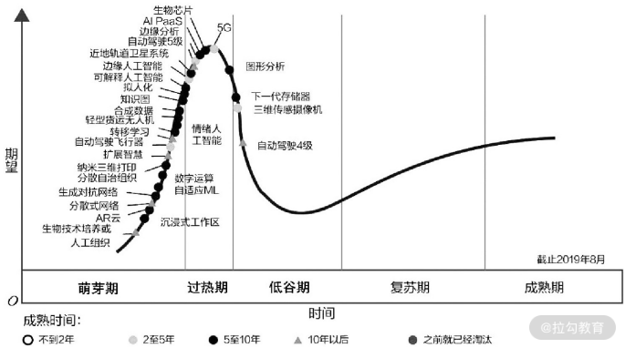
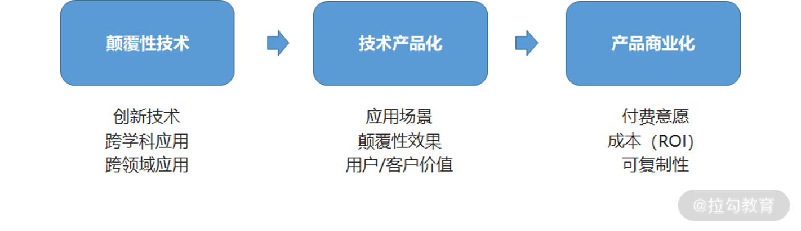
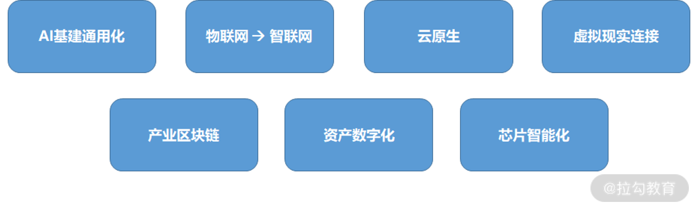

---
date: "2019-06-23"
---  
      
# 11 | 技术边界：到底该怎么理解技术采用生命周期与市场周期？
从今天开始我们正式进入第三模块升维篇的讲解。该模块将从技术、产品、商业、组织等角度全方位剖析打造产品壁垒的核心要点，助你成为产品高手。

这一讲我们先对技术边界（技术成熟度曲线、技术采用生命周期）进行解读，理清技术与产品、商业的关系。在互联网领域，技术被赋予了更具象的定义。

* 操作系统，早期定义为 Windows，如今在移动端定义为 Andriod、iOS；

* 大数据开发技术，早期定义为数据仓库建设，如今定义为数据中台、数据资产和数据服务；

* 人工智能技术框架，早期定义为机器学习，如今定义为深度学习、联邦学习；

* 网络连接，早期定义为局域网、互联网，如今定义为移动 4G、5G、物联网等。

也就是说，产品经理如果想跟上时代发展的步伐，构建自身的独特性和竞争力。就必须理解技术发展趋势和技术边界，然后通过对技术能力的组合应用形成产品创新，从而创造长期价值。

  
接下来，我们详细了解一下与技术边界相关的两个重要模型 **“技术成熟度曲线”和“技术采用生命周期”。**

### 技术成熟度曲线

技术成熟度曲线诞生于硅谷，也称为“光环曲线”或“炒作周期”，它是一种非常有效的评估工具，能帮助企业评估创新科技的可见度（媒体曝光度）和技术成熟度演变趋势。

为了方便理解这部分内容，这里我引用了 Gartner 发布的 2019 年技术成熟度曲线图。

任何一项新的技术随着时间的推移都会呈现出某种规律性变化，而在这个过程中，通常需要经历萌芽期、过热期、低谷期、复苏期和成熟期这五个阶段。

当然，一项新技术最终能否跨越低谷走向成熟，本质上需要我们看它能否在特定应用场景下产生实际价值。

* 比如无人驾驶技术在早期的时候受到资本的过度追捧，如今已经逐步回归理性。最终大部分无人驾驶技术型公司之所以能成长为头部企业，无一例外是在实际场景中找到了无人驾驶技术的应用价值，如最后一公里物流配送、无人扫地车、售货车、港口/矿区作业车的应用等。

* 再比如区块链技术，因为其去中心化和互信能力等优势，所以备受媒体和创新者的追捧。可在早期，由于缺乏实际应用价值而快速形成技术泡沫，直到经过行业的认真对待和人们的理性思考后，区块链技术才在金融、大健康及电商等场景逐步应用，也因此走向了平稳的发展期。

接下来我们谈谈技术采用生命周期。

### 技术采用生命周期

实际上，任何一项新技术在推向市场时，都会经历萌芽期、过热期、低谷期、复苏期、成熟期这五个不同阶段。与应用场景同等重要的是我们需要了解所要面对的用户群体。而在这五个阶段中，要服务用户群体会有所不同，这里我放了一张技术采用生命周期图方便你更好地理解。

#### 第一阶段：面对创新者

因为创新者通常对科技有着狂热的追求，且非常愿意下血本（比如通过各种线下渠道、论坛等方式）体验新技术或新产品，所以你无须去触达他们。这部分人群只占整个市场的 2.5 \%。

#### 第二阶段：面对早期采用者

早期采用者更多是科技板块博主，即所谓的意见领袖（KOL），他们非常愿意尝试新鲜产品，并包容早期的产品技术缺陷，也愿意在早期时为产品做大量免费宣传和主动推广。不过，因为这部分人群只占整个市场的 13.5\%，所以也无法作为创新产品的主流用户来对待。

#### 第三阶段：面对早期大众

随着技术越来越成熟、场景应用越来越广泛，便出现了主流消费群体——早期大众。产品顺利进入早期大众视野的前提，是技术与场景的匹配度已经被充分验证，且该技术的场景应用体验已经具备革命性的变化，这也是创新技术能否创造用户价值和商业价值的一个临界点。一般来说，早期大众会占整个市场的 34\% 以上。

#### 第四阶段：面对晚期大众

晚期大众不同于早期大众，它们对产品配套及周边的包容度较低，选择通常较保守。拿目前尚且处于早期大众阶段的新能源汽车市场来说，只有电动车的续航里程达到预期，且周边配套（比如充电桩）数量足够多、分布足够广时，他们才会选择接纳新技术。一般来说，晚期大众大约占整个市场的 34\% 以上。

#### 第五阶段：面对落伍者

落伍者一般固执己见，很难接受新事物。

* 比如很多老人就很难接受移动支付，因为他们觉得现金如果没有握在自己手里，便对资金缺乏掌控感和安全感。

* 再比如早期微信刚上线的时候，就有一小部分男生非常排斥女性使用。因为陌生人社交早于微信，所以他们对微信的认知定位就是一款陌生人社交工具。

“落伍者”这部分人群占整个市场的 16\% 左右。

**综上由此可见，技术采用生命周期往往反映了用户对新技术的接受度，也决定了产品整个市场周期。**

比如在市场启动阶段，产品更多是听命于创新者，但是早期市场往往因为对技术的过度期望而形成泡沫。**此时，产品能否跨越“死亡之井”，抓住早期大众的心，在某种程度上决定了新技术应用的成败**。到了稳步爬升阶段，产品更多倾向于让晚期大众和落伍者臣服，以便形成规模化量产，并占领整个市场。

了解了技术成熟度曲线和技术采用生命周期后，产品经理如何才能推动技术的价值应用呢？

### 技术与产品、商业的关系

我认为，推动技术的价值应用需要经历三个阶段：**颠覆性技术诞生——>技术产品化——>产品商业化**。

#### 1.颠覆性技术

1995 年，美国哈佛商学院教授克莱顿.克里斯坦森在《颠覆性技术的机遇浪潮》中首先提出了颠覆性技术的概念。颠覆性技术可能是全新的创新技术，也可能是现有技术的跨学科跨领域应用。

* 比如，将数字技术转移到照相领域，不仅颠覆了传统基于胶片的照相技术，还提升了海量存储空间和后期制作效率；

* 再比如，融合计算机技术与通信技术而产生的计算机网络技术，颠覆了传统的信息传输和信息应用方式。

**在颠覆性技术诞生阶段，产品经理的核心是把握颠覆性技术趋势、理解技术边界。**

* 技术趋势：未来技术会朝着哪个方向发展，有哪些核心依赖项？

* 技术边界：想实现长期趋势，需要突破哪些技术瓶颈？具体路径是什么？

比如电池技术的核心趋势是更强的续航能力、更快的充电效率、更安全的使用保障。但由于技术边界，基础的电池组成成分（化学原材料）决定了现阶段电池各项能力的极限和瓶颈，所以提升电池技术能力的核心，就变成了研发更优质的原材料和更合适的组成方式。

再比如人工智能的技术边界，取决于技术框架和算法的选择、芯片算力、数据资源储备能力。因此提升人工智能技术的核心，是研发更强算力且更低成本的芯片、接入更多元化的数据源、使用更成熟的人工智能技术框架、采用更先进的算法等。

#### 2.技术产品化

那么我们如何才能做到技术产品化呢？产品经理如果想将颠覆性技术（不论是创新技术，还是跨学科跨领域融合应用）进行产品化，核心需要考虑以下三个关键点。

**【Key 1】颠覆性技术是否存在切实可落地的应用场景？这里应用场景的技术落地性是关键。**

比如新能源汽车的出现，其实是电池和 AI 技术产品化的结果。

* 早期，由于电池技术在车端的应用不算成熟，因此“里程焦虑”成为阻碍用户购买决策的重要原因。

* 后期，电池产品的升级迭代（增加续航里程、提升充电效率和安全性），让新能源汽车成功替代了燃油车，并逐步成为出行工具的新宠。最终，新能源汽车实现了车企品牌溢价，提升了用户口碑。

因此在思考颠覆技术应用的过程中，产品经理的核心是对应用场景和用户痛点的精准洞察，从而找到技术能力与应用场景的关键连接点，最终彻底解决用户痛点。同时，产品经理更需要具备长期主义价值观，沿着正确的方向稳步迭代产品，切忌一口吃个大胖子。

**【Key 2】通过颠覆性技术应用是否可以达到颠覆性效果？这里的颠覆性效果可能来源于某个场景的用户体验，也可能来源于用户场景的多元化。**

比如图像识别就是一个非常典型的颠覆性技术，因为应用场景的多元化而达成了颠覆性效果。其中，应用场景的多元化具体体现为通过人脸识别进行身份验证、通过人脸情绪识别进行精准情感化语音交互、通过司机人脸疲劳状态检测进行有效风险提示、通过人体特征跟踪实现特定区域的安防监控及安全作业监控、通过设备图像识别自动预警安全隐患、通过视频图像特征识别进行自动化内容审核等。

因此，在探索颠覆性技术应用的过程中，产品经理需要具备一定的探索精神，不断论证场景应用的多种可行性。同时，还需要具备一定的钻研精神，不断迭代场景应用的最终效果。只有这样，我们才能将颠覆性技术转化为颠覆性应用效果，从而实现长期价值。

**【Key 3】最终能否实现用户/客户价值？因为价值是打造一切产品的原点。**

自然语言处理技术的广泛应用就很好地实现了用户/客户价值：

* 机器翻译产品应用，能有效识别文字内容及深层次含义，进而解放人类劳动力、提升翻译准确率和效率；

* 情感分析类产品应用，通过内容表达分析用户情绪，从而形成了精准用户画像，最终帮助我们实现了与用户之间更贴心的互动，大大提升了用户体验；

* 搜索产品应用，通过关键词识别精准匹配搜索内容，大大提升了用户搜索效率；例如智能客服产品应用通过准确识别用户意图形成了个性化客服交互，在降低成本的同时有效提升了客服效率；

* 教育类产品应用，通过自动化批改分析作业，在准确评估学生知识掌握等级的同时做到了因材施教，并且帮助教师释放了大量的工作压力。

因此在颠覆性技术应用探索过程中，产品经理的核心是从用户/客户价值出发，考虑特定场景下的用户/客户价值的本质，以及如何通过技术能力和产品功能提升用户/客户价值。

因为新时代的产品创新与颠覆性技术不可分割，所以新时代产品经理的能力会更多体现在颠覆性技术产品化上，主要包括对颠覆式技术趋势和边界的理解、应用场景的深刻洞察、用户/客户价值的本质认知。

#### 3.产品商业化

上面我们提到的很多技术产品化的案例最终都将面临一个问题——商业化，而大多数已经被产品化的颠覆性技术往往因为商业场景、成本、可复制性等问题，未能实现商业化。因此在产品商业化阶段，产品经理需要重点考虑以下几个关键问题。

**【Q1】如何让用户产生购买意愿？**

本质上要看产品是否存在独特性和不可替代性。任何商业化的前提是用户有购买意愿，而该意愿往往取决于产品的体验感、价值感和依赖感。因此，在让用户产生购买意愿之前，产品经理需要充分考虑如何通过独特的产品功能体验构建用户心智。只有这样，最终我们才能建立坚实的用户信任基础和产品的不可替代性。

例如人工智能技术的成熟，加快了智能健康/陪伴机器人的产品化进程。某种意义上，这类产品能实现一定的用户价值，比如满足人们情感和健康需求（尤其独居者会非常受用）。不过因为用户心智上始终未能形成产品依赖，所以智能产品整体体验仍需继续打磨，也因此很难产生付费购买意愿。

**【Q2】投入产出比如何？**

本质上要看商业模式是否成立，核心取决于收入是否大于成本。很多创新技术往往因为成本巨大而失去商业化的机会，因此产品经理更需要构建商业思维，并通过商业模式的底层思考来构建产品形态。其中开源（创造盈收）和节流（节约成本）都是非常好的产品商业化逻辑。

比如早期的时候，无人驾驶技术的产品化进程特别快，不论是谷歌、百度、苹果，还是后起之秀，都在不同领域找到了相应的落地应用场景。但问题也随之而来，因为无人驾驶技术的实现需要依赖车辆改装（核心在于大量高额雷达传感设备的植入），成本无法转嫁，也就很难在短期内形成产品商业化。

**【Q3】是否具备可复制能力？**

本质上要看产品的各项元素是否足够标准化，能否成功进行迁移。不论是 2B 还是 2C 的产品形态，如果想顺利达成商业化落地，产品经理永远要把产品的标准化和可复制能力放在第一位，**因为低成本、高收入永远是任何业务遵循的底层商业逻辑。其中，可复制意味着成本指数级降低，标准化意味着场景可无限延伸。**

比如虚拟现实技术在游戏和教育领域都有不少应用产品。在游戏领域，通过 AR/VR 眼镜能让我们产生身临其境的愉悦感；在教育领域，通过模拟极端天气现象及物理化学的实现，能减少安全隐患，拓宽学生视野、培养动手能力。

但因为整个产品打造与内容创作关联度极高，且内容具备差异化特性，即缺乏规模化可复制力，因此短期很难进行商业变现。

**由此可见，“技术产品化”到“产品商业化”是极大跨越，非常考验产品经理连接用户/客户心理的能力及商业化场景的构建能力，同时也非常依赖产品经理的资源和成本控制力、产品标准化和规模化能力。**

### 小结与预告

技术的迭代犹如时间的年轮，永不止步。作为一名产品经理，我们不仅要对技术心存敬畏、更要具备强大的试错心理和探索未知领域的勇气，只有这样才能紧随时代发展，通过颠覆式技术打造创新产品。

下面我附上一张 2021 年核心技术趋势图供你参考。

这一讲我们介绍了技术成熟度曲线和采用生命周期，也通过颠覆式技术——>技术产品化——>产品商业化的核心逻辑，助你更好地理解了技术与产品、商业的关系。

这里我提一个问题：除了专栏案例，你还知道有哪些颠覆性技术呢？它们又是如何形成产品化和商业化呢？欢迎你在留言区互动。

下一课时，我们谈谈著名的“峰终定律”，聊聊如何沉淀满足用户价值的产品体验。

如果你觉得课程有价值，欢迎分享给有需要的朋友。