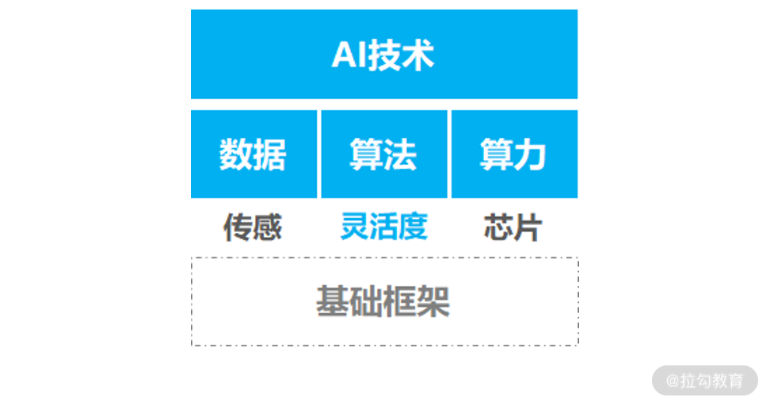
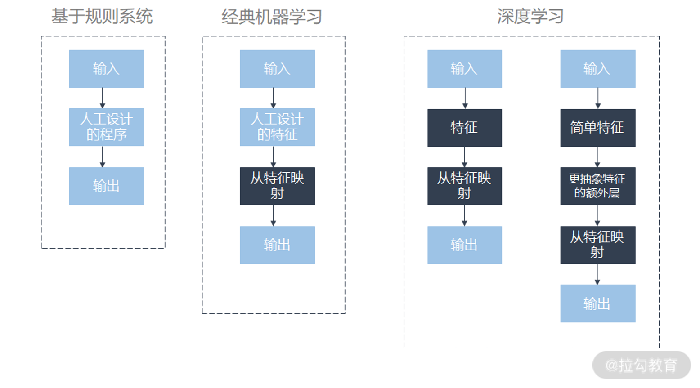
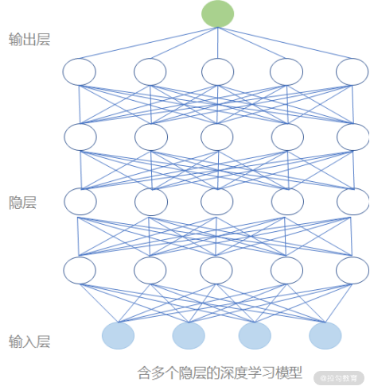
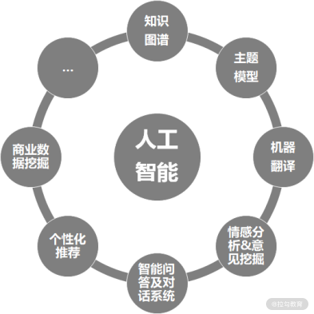

---
date: "2019-06-23"
---  
      
# 彩蛋 4 | AI 的本质：如何利用科技解决成本、效率和体验三大问题？
人工智能发展至今，就像十八世纪的蒸汽机、十九世纪的电力和二十世纪的信息技术一样，已然成为推动社会经济发展的强劲引擎，现已渗透到医疗、交通、金融、农业、工业等各个领域。

普华永道预测，2030 年人工智能会带来 7 万亿美元的 GDP，占总 GDP 的 26.1\%；同时，《人工智能全球格局：未来趋势与中国位势》提到，人工智能还会带来科学研究范式的革命，帮助人类破译生物、天文、物理等领域的奥秘，成为推动人类文明变革的中坚力量。

也就是说，在未来人工智能应用将成为每个产品的标配。因此，任何一位产品经理都非常有必要去学习、前瞻 AI。所以这一课时，我就以最浅显易懂的方式，带你初识 AI 技术及其应用。

> AI 是片大海，今天我只能先站在最宏观的层面带你“浅尝辄止”；如果你想继续深究，可以延续这一课时的知识点，去延伸学习。

### \*AI 技术浅入门

机器要实现智能，本质上要拥有感知和达成目标的能力。因此 AI 技术包含数据、算法、算力这三个关键要素。

#### 1.AI 核心三要素：数据、算法、算力

**算力**代表 AI 能力强度、**算法**代表精度、**数据**则代表广度；从 AI 商业化的视角来看，芯片提供**算力**、传感器提供**数据**，这两者都属于支出成本，**算法**决定 AI 技术的灵活度和可靠性。

因此如何降本提效，仍然是 AI 技术需要攻克的难题。随着人工智能技术的演变，主要出现了以下三个流派。

* 符号主义：基于**专家规则系统**实现智能

* 连接主义：基于**经典机器学习**实现智能

* 行为主义：基于**深度学习**实现智能

不过万变不离其宗，智能的发生核心需要对信息进行加工、处理和沉淀、形成知识和经验，最终指导机器做决策。

如上图所示，最早期“基于专家规则”的实现方式主要通过“人工设计的程序”实现机器决策；随着“机器学习”的发展，逐步过渡到“人工设计特征”来提升机器决策的精准度。

再如下图所示，我们可以看到数据（样本）在 AI 技术实现中的分量，数据（样本）的多样性、精度、广度直接会影响 AI 模型训练的结果，因此我们需要不断通过“新数据集的输入”和“模型参数调优”来提升机器预测/决策的精准度。

#### 2.AI 学习两条路：深度学习 VS 机器学习

深度学习和机器学习原理相似，核心区别在于“机器学习”只有一次特征处理，而“深度学习”会通过“多个隐层”来不断进行“多层特征抽象”，进而达到特征的精准识别。

当我们将一些难以定性表达的事物抽象出来，就可以得到更精准的特征（如画作的风格、音乐的风格、人的情绪等），最终让机器更智能。因此，深度学习在语音识别、人脸识别、无人驾驶等应用中体现了极大的实用价值。

**【 Anything Else？】**

“机器学习与深度学习”是 AI 的根本实现方式，这是我们从顶层维度来看待的。抛开这个维度，AI 还有很多细分技术。

* 比如“知识图谱”：主要将数据源形成多元知识融合，通过实体链指、关系抽取和知识推理等方式构建物理世界的实体关系。

* 再比如“主题模型”：主要通过潜在语义分析、情感模型、动态主题模型和关系分析等方式挖掘高阶知识，获取主要语义信息或机器智能摘要。

它们在搜索引擎、自动问答、智慧城市、交通治理等方向都有广泛应用。

所以接下来，我们谈谈 AI 技术在不同行业的应用场景，以及对人们生活产生的深远影响。

### AI 行业广应用

#### 1.智慧零售

在智慧零售领域，AI 重新定义了线上-线下购物各个环节。

* 通过对人的数字化、商品数据化、场景数据化，可以实现基于用户画像的精准需求洞察，反向推动全链条供应链的优化和降本；

* 通过线上流量（如社交流量、移动内容流量等）与线下（门店自有流量）打通，提升零售商家与潜在客户触点，通过精准的流量转化与运营实现全渠道获客；

* 同时通过线上线下用户行为实时获取，形成以用户体验为中心的数据驱动型消费场景，真正实现零售服务升级和用户价值再造。

#### 2.智慧金融

智慧金融核心经历了三个阶段：**电子金融 \--> 互联网金融 \--> 智能金融**。

* **电子金融：** 通过线上化系统将金融业务数字化、信息化，通过小型机提供金融基础设施保障、满足金融数据存储和流通，通过清算系统、结算系统减少人力成本、提升金融服务质量和效率。

* **互联网金融：** 将金融服务联网化、服务化，通过金融信息服务、移动支付、P2P、理财等产品培养用户使用习惯，提升金融服务体验，由于电商、内容、O2O 等服务的兴起，人们对互联网金融服务的需求也越来越旺盛。

* **智能金融：** 在金融基础设施全面信息化、数字化的基础上，金融产品与物联网、大数据、人工智能、区块链等技术深度结合，通过信贷风险评估、保险个性化定价、智能投顾、智能研报、智能客服等实现智能金融，提升业务效率的同时，满足了多元化用户需求。

当然，智能金融的实现依赖多元数据融合应用（标准大环境数据与个体差异化数据）。

* 标准大环境数据：气象、自然灾害、股市、通胀、原材料价值、市场变化、社会稳定性、国家政策法规、宏观经济调控、政府政策等都属于大环境数据。

* 个体差异化数据：个体的生活状况、身心健康状况、心理变化都属于个体差异化数据。

#### 3.智慧出行

随着 5G、V2X、物联网、人工智能技术的发展，汽车已经从标准化的“出行工具”逐步变成灵活的“智能移动空间”，重新定义人们的生活方式，充满着无限的想象空间。

* **智能驾驶：** 无人驾驶技术核心通过计算机视觉、赋予汽车眼（sensor-感知）、脑（计算大脑-决策）和手脚（控制）等能力，比如低等级无人驾驶（l1-l3）可以释放部分用户注意力，通过自适应巡航、自动泊车、自动变道等功能实现辅助驾驶决策，提升驾驶安全；随着高等级无人驾驶普及（l4-l5），智能汽车赋予智慧交通更多可能性，逐步渗透到智能运输、智能配送、共享出行等场景。

* **智能座舱 + 服务：** 随着无人驾驶能力提升，智能座舱的服务也变得多元化，核心在于重新定义信息交互方式和用户体验。比如通过自然语言识别和处理，实现更人性化的语音交互；通过视觉、听觉、动作、触觉、位置等信息融合，实现用户多意图判断，进而产生多模态交互体验；随着车生态、家生态、校生态、商圈生态的连接，可以为用户提供端到端的全链条服务，进而产生更大的商业价值。

* **智慧交通：** 随着 5G+V2X 的深度应用，智能汽车将成为城市重要的终端载体，与智能路设、城市交通基建、智慧交通管理相互协同，降低交通治理成本，提升出行效率。

#### 4.智慧医疗

自新冠疫情以来，疫情扩散趋势预测、疫情变异分析、新冠药品、疫苗研制等，都与 AI 技术应用息息相关。

AI 技术在智慧医疗领域有很多应用。比如智能医疗系统及临床智能决策，基于病人体征监测的自动预警、临床医学研究等等；再比如手术机器人、康复机器人、辅助及服务机器人等都依赖基础 AI 能力。

同时在家庭医疗领域，通过 AI 远程诊疗、远程监护、健康监测、家庭急救、健康管理等应用，提升家庭健康指数。

当然 AI 在智慧医疗领域的应用同样存在挑战，比如需要长期保存医疗数据。可能存在数据冗余现象，也存在巨大的数据存储成本，同时由于医疗健康数据的特殊性，广泛应用也存在一定的隐私和伦理问题。

### AI 的本质：降本增效 + 创新体验

由此可见，不论是在医疗、出行、零售，还是金融领域，AI 技术都是坚实的技术底座，推动人类社会重新定义生产力和生产关系。通过物理世界与数字世界充分融合，利用科技手段打通“信息 \--> 知识 \--> 判断 \--> 决策”整个链条，最终实现**成本最优、效率最优、体验最优**。

因此，产品经理在推动产业时代 AI 行业应用的过程中，需要铭记以下几个基本原则：

* 找到 AI 技术与行业的连接点，通过单点切入，逐步扩大 AI 技术对行业的影响面，进而提升这个行业运行效率，而非单点运行效率；

* 评估 AI 技术应用的可复制性和影响范围，通过推动“AI 产生的价值收益 \- 投入 AI 技术使用新增成本 > 0”，来评估 AI 技术商业化长期价值；

* 要将 AI 技术产品化，产品经理永远要关注用户核心体验，秉承“宁缺毋滥”的设计原则，避免“智能过度”成为“智障”，将极简主义、人性化、情感化、隐私、安全保护作为基本产品原则，践行始终。

### 小结

这个章节，我们介绍了 AI 技术原理，AI 在零售、金融、出行、医疗等行业的应用，帮助你更好理解 AI 的本质：利用科技解决成本、效率和体验问题。

这里我提个问题：你认为 AI 技术对哪个行业最有价值呢？日常生活中最喜欢使用哪类 AI 产品呢？

欢迎你在留言区互动，如果你觉得课程有价值，欢迎分享给有需要的朋友。