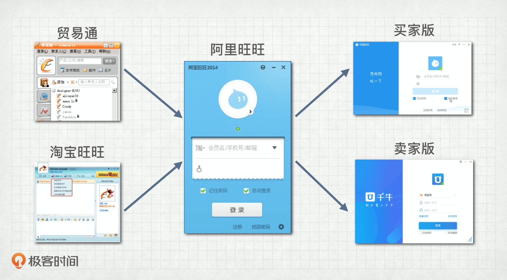
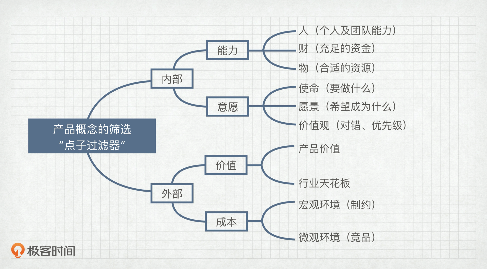

---
date: "2019-06-23"
---  
      
# 05 | 打造属于你的点子过滤器
你好，我是苏杰。

今天让我们一起来打造一个属于你的“点子过滤器”，这是第一轮MVP，Paperwork的第三讲，在了解了用户和竞品之后，我想，你一定产生了不少好点子，跃跃欲试了。

我在做产品创新咨询服务的时候，经常听到有创业者跟我说他想到了一个绝妙的点子，跟我探讨的时候还千叮咛万嘱咐，让我不要告诉别人。

但我经常发现，其实他们想的点子并不靠谱，比如最常见的就是，他们想到的其实是一个已经有很多人在做的“新产品”。而之所以会产生这样的情况，是因为他们缺少了一个“产品概念筛选”的环节。

那么，如何避免这种情况呢，我想每个人和团队都需要一个可以帮助他们做“产品概念筛选”的强力“点子过滤器”。

不仅是创业公司存在这样的问题，大公司也是一样，我们在市面上能看到的产品都是过滤完了的结果，其实每家公司都有很多胎死腹中的产品。

创新者在工作中每天都需要做类似的选择判断——一个产品方案，一个创业方向，到底做不做，多个想法，到底选哪一个。这里面，要考虑很多因素。

## 如何过滤掉不靠谱的点子？

这个点子过滤器，其实就是产品概念筛选的框架。通过点子过滤器，我们可以防止更大的资源浪费，尽早减少对“不靠谱产品”的投入。

现在，让我们来看看如何打造一个点子过滤器。

<!-- [[[read_end]]] -->

> 此四项过滤步骤无先后顺序

首先，我们把要考虑的因素分为内、外两方面，然后，再分别讨论内部、外部的具体内容。我们先来说说内部。

### 过滤点子的内部因素

内部又可以拆分考虑两个方面因素：一是能力、二是意愿。

先说能力，内部能力包括人、财、物三点，即自己和团队的能力、有没有足够的钱、有没有相应的资源等。

比如你要做人工智能方面的创业，技术高手就很关键；你要和竞争对手打补贴大战，充足的资本就是必须；你要给消费者做出精准的商品推荐，就得有足够多的数据积累。我们应该选一个能发挥自己能力的方向。

再说内部意愿，对创新者来说，需要考虑他想做的事情是否符合自己或公司的使命、愿景、价值观。

简单地说，使命是“我们要做什么”，愿景是“我们希望成为什么”，价值观就是“对事情对错、优先级的判断准则”。用通俗的话来说，就是要想清楚自己到底想做什么，这辈子是为什么而活，从而做到“有所为，有所不为”。

每家足够成功的公司，他们的终极目标都不是赚钱，比如阿里要“让天下没有难做的生意”，Google要“整合全球信息，使人人都能访问并从中受益”。

这个世界上没有什么有价值的事情可以随随便便、轻轻松松达成，只有想清楚了这事儿符合自己的意愿，符合自己的起心动念，才能在碰到困难的时候依然坚持走下去。

### 过滤点子的外部因素

接下来是外部因素，依然分成两方面：一是价值高低，二是成本多少。

先说价值，如果是从专业的角度，我们会先看这个方向的天花板高不高、增速快不快。

用风险投资人的话来说，就是“这是不是一条足够宽阔的赛道”。很显然，越多人需要的产品、越频繁用到的产品、用户价值越高的产品，天花板越高。这里用户价值高低的判断，要基于对用户的理解，我们在用户理解那一讲里谈过，后面的课程也会继续聊这个话题。

在一个天花板高的行业里，你做到行业前几名可能就活得很滋润了，而在一个天花板低的行业里，你可能需要保持在第一位才能勉强支撑。当然，好的行业，竞争也会更加激烈，永远没有白给的好处。而增速，要基于你对大趋势的判断，这和下面会提到的外部环境有关。

再说成本，这里面包含了“宏观大环境”和“微观行业环境”。

宏观大环境是不受产品影响的时代大背景，比如政治、经济、文化、社会、技术、环境、法律等方面。对绝大多数产品来说，不要去挑战这些因素，避免踩到地雷就好。

而微观行业环境上你需要考虑的因素就比较多了。微观行业环境主要是说行业里都有哪些玩家，你要考虑产业链的上下游、潜在的进入者、未来的替代者等等。

举个例子，卡片相机越来越不好卖了，一个重要的因素是手机拍照能力的提升。因为可以拍照的手机和非专业的相机也是广义的竞争对手。相关内容[上一讲](https://time.geekbang.org/column/article/156953)竞品分析里我们已经聊过，你可以去回顾一下。

## 今日案例：阿里旺旺

你已经了解完“点子过滤器”的运作流程了，不过我需要在这里先申明一下，过滤器里的每个因素都是一个加分减分的项目，最后还得根据自己的实际情况，把这么多因素综合起来考虑。

那么现在，我们一起来通过一个案例来看看，点子过滤器会如何帮助你分析一个点子。今天我们用到的案例是阿里系的一个产品，叫阿里旺旺。

旺旺的前身是2003年就有的阿里巴巴贸易通，2004年在代码上略做修改做出了淘宝旺旺，后来合并成阿里旺旺，再又逐渐细分为中国站版、淘宝买家版、淘宝卖家版等等。

自始至终，你都能很容易地发现，这个产品的出身，决定了它的“交易工具”属性、“电子商务IM”（IM：instant messaging，即时通讯）定位，这既成了它的优势，也成了它的瓶颈，或者说，成为了它的基因。

故事发生在2007年，当时，QQ的用户数虽然多，但还不足以一统江湖，而QQ的低龄化、娱乐化的特点也远比今天明显。很多公司白领上班时还在用MSN、雅虎通，当时旺旺完全有机会切入通用IM这个市场。

IM工具的潜力巨大，毕竟IM工具满足的是人类的核心需求——沟通。在这一核心需求之下，又有多个主要场景，比如办公、娱乐、日常生活等等。阿里的想法是差异化竞争，提出了口号“上班用旺旺，下班玩QQ”，想去抓一个更有价值的用户群体，定下的目标是先把活跃用户数量做到市场第二。

于是，阿里盘点了一下集团内各个相关产品，淘宝旺旺、贸易通、雅虎通等等，发现这些产品的活跃用户加起来就已经达到市场第二了。你是不是觉得那就好办了？阿里也是这么觉得的，所以投入百人的团队，启动了阿里旺旺项目，把集团内已有的即时通讯工具都统一起来，统一登录，统一产品，尊重用户习惯，保留好友关系。

半年之后，阿里旺旺上线，确实，一下子活跃用户数量就达到第二了。但各种运营动作做下去，却增长缓慢，努力了一阵子，并没有打开通用IM的市场，就只能回归，继续做电商场景下的IM了。

这整个过程中究竟是哪里出现了问题呢？我们用今天文章中提出的点子过滤器的框架来梳理一下这个事情。

其实，这个产品想法有很多能通过过滤器的地方。比如外部价值，商用IM确实是个很大的市场，从今天钉钉的成功你就可以看出；又比如内部意愿，也很契合阿里“让天下没有难做的生意”的使命。

但是，它在内部能力中犯错了，误用了已有的数据积累，即用户关系。

试想一下，如果你是淘宝旺旺的买家用户，用升级后的阿里旺旺，登录进去，看到的好友都是卖家，那你会把阿里旺旺当成工作使用的工具吗？你更有可能去逛淘宝了吧？也因为这个原因，逐渐地有企事业单位因为禁止员工上班时间逛淘宝网，而禁止员工使用旺旺。

问题不仅仅是出在内部能力中，外部成本方面也出现了问题。

我们也低估了用户群体对一个产品的认知能产生的影响，这属于社会文化的大环境，用户对于“旺旺是交易聊天工具”的认知已经根深蒂固，只要你还叫旺旺，就很难扭转，真是“成也萧何，败也萧何”。

所以，后来阿里旺旺退回电商场景，反而有了很多成功的例子，比如子账号体系，这是QQ没有的。因为QQ的用户是个人，而旺旺某些版本的用户的背后其实是一个企业，企业需要一个统一对外的沟通工具。这就像一个企业的热线电话，一个人来接听肯定是忙不过来的。所以，电话有了分机，旺旺有了子账号，并且还延伸出“智能分流”、工作台等工作场景特有的特性。

对一类用户、需求、场景的深入定制，一方面可以成就一个产品，成为对手进入的壁垒，另一方面，这堵墙也有可能成为这个产品的牢笼。

旺旺的故事给我最大的体会就是：做产品要顺势而为——这个势，说大点是行业的浪潮、公司和产品的基因，说小点是用户群体的特质、需求的特性、场景的特点。一个点子只有顺势了，才能通过我们的过滤器。

## 点子过滤器的生活应用

当然了，其实不只是在工作中，日常生活中也可以应用产品概念筛选的模型。每次不一定要思考整个框架，有时候只思考其中的一部分也可以帮助我们做出选择。

比如你要找工作，可以用上外部价值的思考。

对于行业选择，我们不仅要看现状，还要看趋势，简单地说，就是争取进入一个朝阳产业，朝阳产业不仅是将来的机会更多，而且也是正真的牛人愿意去的地方，你每天和什么档次的人在一起工作，决定了你将来会成为什么层次的人。

又比如思考“到底应该去一线大城市还是回家乡县城”，你可以问自己的问题有：

* 在能力方面，是否想借力家人的积累？
* 和父母生活在一起对你而言有多重要？
* 大城小镇两种截然不同的生活，哪种更让你快乐？
* 你希望从事的行业，地域性是否强，即县城里是否存在一个相对独立的本地市场？
* ……

再比如这个周末的吃饭问题，到底应该自己做，还是出去吃，还是叫外卖？你可以思考这样几个问题：

* 我的厨艺怎么样，想不想提升？
* 这个周末的时间值钱么，我有什么重要的事情要做么？
* 是不是应该和朋友们聚聚了？
* 天气好不好？
* 外卖有没有促销活动？
* ……

听了这些生活中的例子，不知道你有没有想到更多的应用？

## 小结

今天我分享给你的是一个做选择的框架，专业的叫法是产品概念的筛选，通俗的叫法就是“点子过滤器”。

在运用点子过滤器的时候，你需要先把考虑的方向分为内部和外部，在内部考虑能力和意愿，外部考虑价值和成本。

## 实践题

希望你在课后可以用这个“点子过滤器”框架，来过滤一下你在工作中正在负责的项目。

你可以在留言区写出自己的答案，与我和其他同学一起讨论，也欢迎你把文章分享给你的朋友。