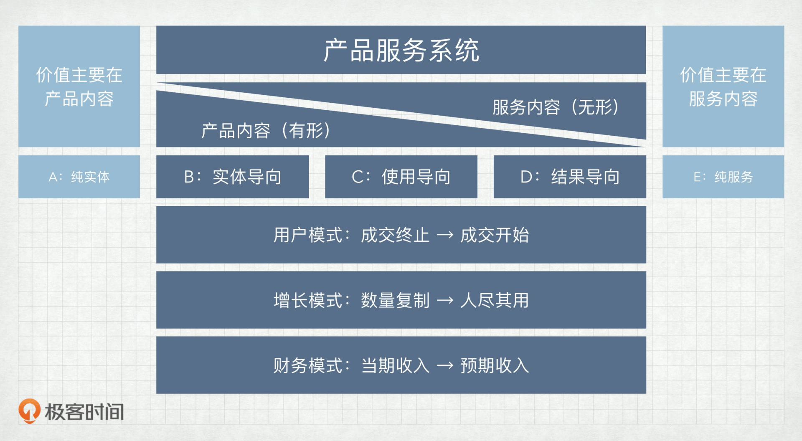
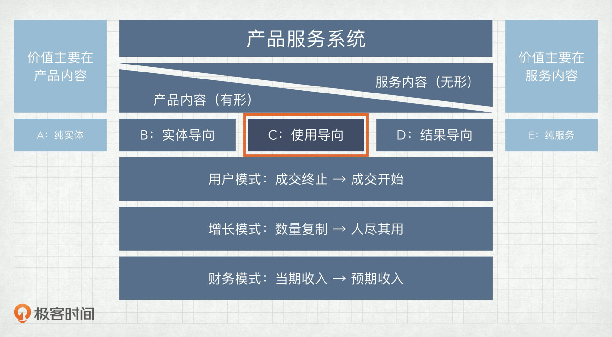
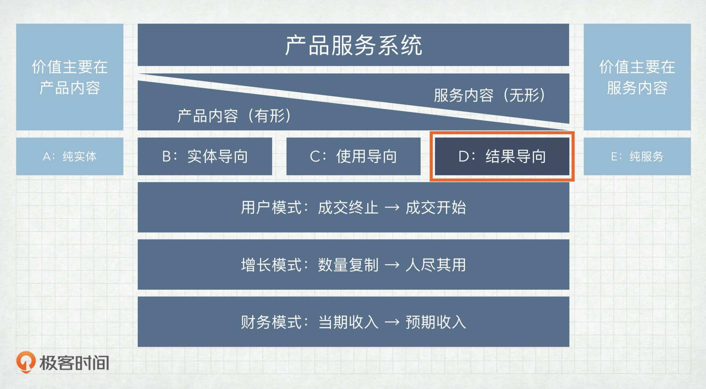
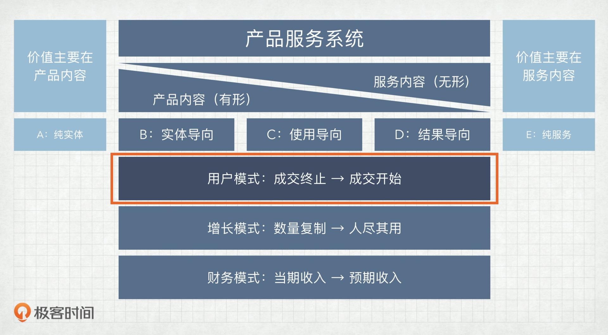
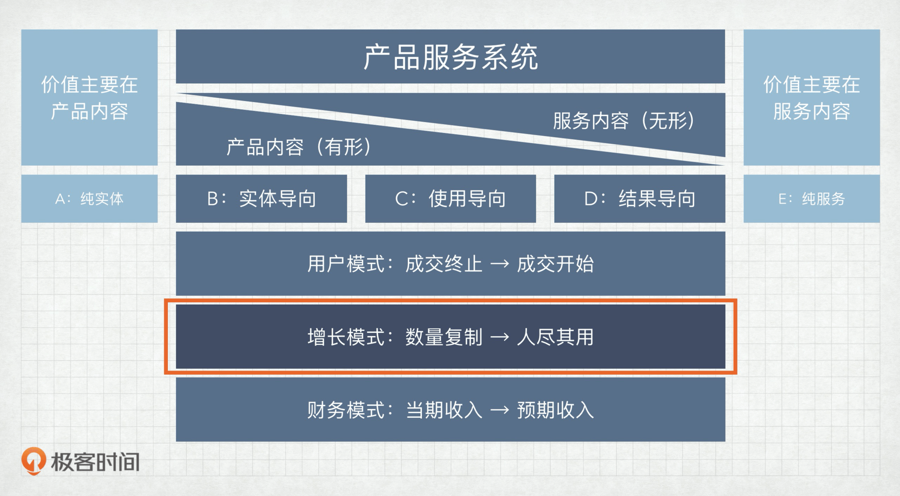
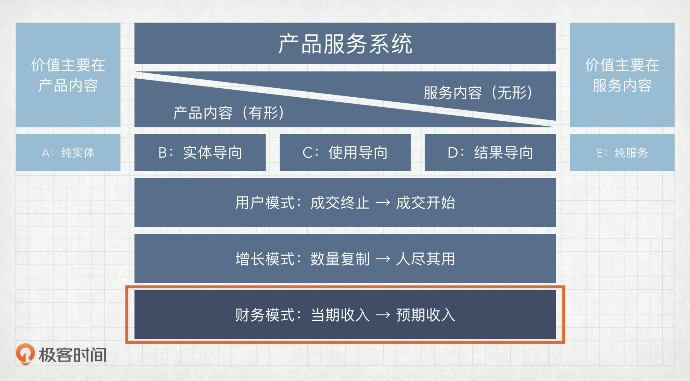

---
date: "2019-06-23"
---  
      
# 09 | 产品服务系统：避免狭隘，再聊什么是产品
你好，我是苏杰。

原型的用户测试通过了，我们就得开始做真正的产品了，所以，今天这一讲是第三轮MVP——Product的第一讲，让我们一起通过一个叫“产品服务系统”的概念，来分析一下各种类型的产品都有什么优缺点，是适用于哪种场景。

提起产品经理，你肯定知道他是“做产品的”，然后，很多人一下子就会想到一个网站、一个App，好像这些是典型的产品，但产品只是这些吗？

一张桌子？一把椅子？貌似也是产品。一辆汽车？一间房子？貌似也是产品。一次培训？一篇文章？是不是产品？一个PPT？一份报告？是不是产品？一次餐饮服务过程？一次旅游中的体验？是不是产品？

我们平时经常把“产品”“产品思维”“产品创新”这些词挂在嘴边，可如果对“产品”的定义都没法统一，那等于是在鸡同鸭讲。所以，按照我的产品创新体系，在MVP的第三轮——Product的一开始，我们就要借助一个概念来再次定义和讨论“产品”这个词。

## 产品服务系统

2004年，荷兰应用科学研究组织（TNO，欧洲最国际化的研究与技术组织之一）的阿诺德·图克（Arnold Tukker，莱顿大学教授）在他的一篇[论文](http://xueshu.baidu.com/usercenter/paper/show?paperid=38fb84a9e4bf78625bbfe588226ac4a1&site=xueshu_se)中提出了一个概念，叫作Product Service System，我们可以称它为“产品服务系统”。

<!-- [[[read_end]]] -->

接下来，我们就用“产品服务系统”这个概念，来为广义的“产品”做分类，看看不同的产品，都适合哪种市场用户类型。

也许你会问，为什么要用“产品服务系统”这个产品分类方法？这是因为**“产品服务系统”能以一种集成的、有针对性的方式进行产品分类，精准地满足用户需求，有助于产品的创新**。

说了这么多，那这个“产品服务系统”到底是个啥呢？

简单来说，图克在论文中提出了三大类导向的产品服务系统，即“**实体导向**”“**使用导向**”“**结果导向**”，也就是我们今天要讲述的重点。

产品服务系统的核心要点是，任何广义的产品都包含有实体部分和服务部分，三大导向，从实体到服务，实体部分越来越少，服务部分越来越多，逐渐过渡。

解释一下，这里说的实体，可以是硬件、也可以是软件，而服务通常指人工的服务。**实体加服务，就是产品服务系统的基础概念**。

接下来我们一一来看这三大导向的产品服务系统。

## 实体导向

第一种，实体导向的产品服务系统。这种类型是以实体为主，包含有少量服务。它的服务目的是让用户可以顺利地使用产品实体，是与实体紧密相关的。

听起来是不是感觉很抽象，但其实实体导向产品的典型例子有很多，也很简单，比如：

* 一瓶可乐和它瓶身上的“客服电话”
* 空调和它的上门安装、保修服务
* 汽车和它的3年10万公里内保修、保养服务
* 苹果产品和苹果门店店员提供的答疑服务
* 公司客户管理系统和系统卖家教你使用该系统的培训咨询服务

## 使用导向

讲完实体导向，我们来讲讲第二种类型，使用导向的产品服务系统。它和实体导向型产品的区别在于，供给方给你的不是所有权，而是长期独占的使用权（Lease），或者是某种条件下，一段时间的使用权（Renting/Sharing），甚至是共享的使用权（Pooling）。

因为使用导向的情况下，用户买的并不是实体，所以相关的配套服务会多一些，以确保用户使用顺利。

用生活中常见的例子来举例解释一下，如果你有骑行需求，那么满足你的产品可以是一辆属于你自己的自行车，也可以是一辆“摩拜单车”的1小时使用权。

你的公司需要打印服务，你可以买一台打印机，然后自己买耗材，这是实体导向的。同时你也可以租一台打印机的长期使用权，加上定期维护、补充耗材的服务，这是使用导向的。如果你是在一个众创空间里办公的话，你甚至可以使用共享的打印机，按照打印了多少张纸来付费。

延续上面提到的“客户管理系统”例子来讲，公司买了一套客户管理系统，卖家选择把所有权完全卖给你，这属于实体导向。可如果卖家是按具体的使用时长卖给你的话，这就是使用导向了。当然卖家也可以按使用人数/使用量收费，这就是下一种模式。

## 结果导向

第三种，结果导向的产品服务系统。

到了结果导向这里，就以服务为主了，你要买的不是一个实体，而是一种“结果”，使用实体只是为了达成结果需要用的一个过程或者一个媒介而已。

比如外包，通常外包合同都包含了对服务质量进行控制的性能指标。典型的例子就是大多数公司都在做的——保洁外包，公司采购的是服务，只要拿到预期的结果（环境整洁干净）就行，而不会去选择购买（也就是招聘）保洁人员。

公司需要一次“提升团队士气的团建”，你是在为“提升士气”这个结果付费，而不是因为供应商提供了一个教练、几组游戏。

再比如网络广告，按点击量、按成交量付费等模式，都是按照某种“结果”在付费。去体检的时候，你做多少项目，给多少钱，也是这个模式。

有时在消费完结果导向的产品后，你可能甚至感知不到实体的存在，比如付费聊天、轻咨询，甚至是寺庙里求签拜佛。

## 三种导向间的演变趋势

以上说完了三种重要的产品服务系统，其实，你可以看出来，它们之间的界限不是非黑即白的，整体上看从左到右是有明确的变化趋势的。

下面，我从用户模式、增长模式、财务模式三个角度来为你解释一下这个趋势。

### 用户模式

首先是用户模式，在**用户模式**下，我把从实体到服务的演变叫作**从“成交终止”到“成交开始”**。

从实体到服务，供应者与用户的关系有越来越紧密的趋势，触点越来越多，用户尝试的成本越来越低。

实体的话，供应者与用户的关系往往终止在销售达成的一刻。你可以回想一下自己家里买的空调，当你再次接触厂家，基本上因为空调坏了。而服务则不同，供应者与用户的关系往往真正开始于销售达成的一刻，比如你在某个旅游景点请了一位导游，交易达成后你才开始接受导游服务。

在这个时代，因为社会供给越来越丰富，所以各种产品的市场会越来越供过于求，这会导致需求驱动而不是生产驱动，用户与供应者的地位此消彼长，用户变得越来越重要。所以，我们要好好思考如何更多地接触用户，给用户创造价值，从而为公司创造更多的商业价值。

所以，从这个角度来看，越是重要的用户，就越要用服务比例高的产品服务系统来完成交付。

就比如我的一个咨询客户，他们在做人工智能客服机器人，这是一种典型的2B企业服务。他们对小客户的交付中，实体比例更多，更偏实体导向，大多数功能让客户自助完成使用。但对VIP大客户的交付中，就是服务比例更多，更偏结果导向，甚至会提供外包的客服人员。因为相对来说，小客户比较容易批量获得，而大客户需要一个个地”啃“，更需要建立长期的关系。这一点，也会体现在下面的增长模式上。

### 增长模式

第二个角度，**增长模式**下的实体到服务，是**从“数量复制”到“人尽其用”**。

不同的卖法，增长的方式不同。实体更容易标准化，从而可以批量地卖给更多的用户，我把这个叫作**数量复制**。而服务的极致体验是个性化，所以增长的模式挖掘每个用户的更多需求，这叫作**人尽其用**。上面提到的企业服务，对于VIP大客户，就得人尽其用。

我们可以举个汽车行业的例子对比一下，不同模式下的增长瓶颈。

卖车的模式，瓶颈有可能在于产能，比如特斯拉的Model3刚出来的那段时间，这是数量复制的增长瓶颈。但如果卖已有车辆的使用权并抽成，增长瓶颈考虑到就会是另外一些事情了，比如如何区分短租和长租的用户，并分别提供不同的服务，这就是如何人尽其用。

再比如一个软件，是使用导向的产品，如果它卖的是软件1年的使用权，就没法向数据量大的用户收更多的钱。这时候如果改为结果导向，根据数据量收费，那么既可以让数据量少的用户几乎免费使用，降低他们尝试的门槛，也可以充分赚取大客户的费用，对方也更愿意为好的结果付费。

这个角度给我们的启发就是，随着产品供给的极大丰富，没有被开发的用户已经越来越少了，所以我们更要思考如何在已有用户身上做文章，精细化运营。

### 财务模式

最后是财务模式，在**财务模式**下，实体到服务的变化是**从“当期收入”变为“预期收入”**。

在图中你可以看到，从上到下实体比例越来越低，会造成的必然结果是短期收入减少，资产投入增加，利润减少，但预期利润增加。

比如房企不卖房，改做长租生意了，那就没有了卖房时那一大笔的即时收入，在一段时间内的资金压力就很大。这表现在财务报表上就很难看，如果是上市公司的老板，你敢不敢做这样的决定？

所以，偏服务的产品服务系统，不确定性更高，更需要我们掌握新的产品创新方法，更需要有长远的眼光。

以上，我们从用户模式、增长模式、财务模式三个角度探讨了产品从实体到服务的演变趋势。如果你对这几种产品服务模式的特点和差异，有什么好的想法或者例子，欢迎你来补充。

## 今日案例：曹操专车

接下来我们说个案例，带你来体会一下，**一家公司是如何通过调整整个产品服务系统，改变对客户的交付，来适应市场变化的**。

吉利集团原来是卖车的，2015年底推出了曹操专车的新业务，这是一个网约车平台，提供新能源专车出行、新能源汽车分时租赁等服务，是中国大陆首个以新能源汽车车型为主的网约车平台。

我们设想一下这个新业务给吉利带来的变化。

一方面，它的C端用户数大大增加。本来只有会花几万块买车的人，才是吉利的用户，对吉利有感知。但现在，每个月有千八百出行预算、某次有几十块花销的人，都有可能成为吉利的用户，这些人在未能拥有吉利汽车之前，就可以先行体验吉利的产品。试想一下，会不会有些人因为早年的这种体验，在将来买车的时候会更多地考虑一下吉利？

而且，按照我的思路，吉利还可以做一些会员积分类的粘性产品，让用了吉利出行服务的用户，买车的时候享受更多的优惠。

另一方面，曹操专车必然造成吉利的财务模式有很大变化。原本卖车资金回来相对快，现在自己造了很多量车，需要靠后面的持续运营来不断收回投资。

可以想象，这样的变化，可能反过来推动吉利团队能力的变化，比如需要更多地去思考如何利用金融工具来缓冲这个变化，比如需要更多擅长互联网产品运营的人才来加入曹操专车的团队，等等。

所以，通过对产品服务系统的分析，我们可以有如下启发：

* 在分析用户的时候，了解对方还能用哪种导向类型的产品服务系统来解决问题，以便在临近的导向类型中寻找产品突破口；
* 在分析竞品的时候，刻意寻找其他导向类型的产品服务系统，以启发思路；
* 细分自己的用户群体，用不同导向类型的产品服务系统来更全面的服务不同用户。

## 小结

为了定义广义上的产品概念，或者说大产品的概念，我引入了一个“产品服务系统”的叫法。因为任何产品，都包含实体部分和服务部分，只是根据比例的不同，可以呈现出不同的特性，对应着不同的做法，需要不同的团队能力。

某些传统彩电企业，就是因为在新的时代下，成交之后和用户的互动太少了，还局限于卖硬件，导致被新兴的各种智能彩电产品超过。通常来说，随着各行各业供给的丰饶，用户越来越重要，我们也越来越倾向于提供某种服务比例高的产品服务系统来完成交付。

## 思考题

* 你可以思考一下，自己负责的产品，到底是怎么组成的？
* 你是否可以做些调整，从而使你的产品服务系统更加合理、更加适应变化趋势？

欢迎你在留言区与我和其他同学一起讨论。