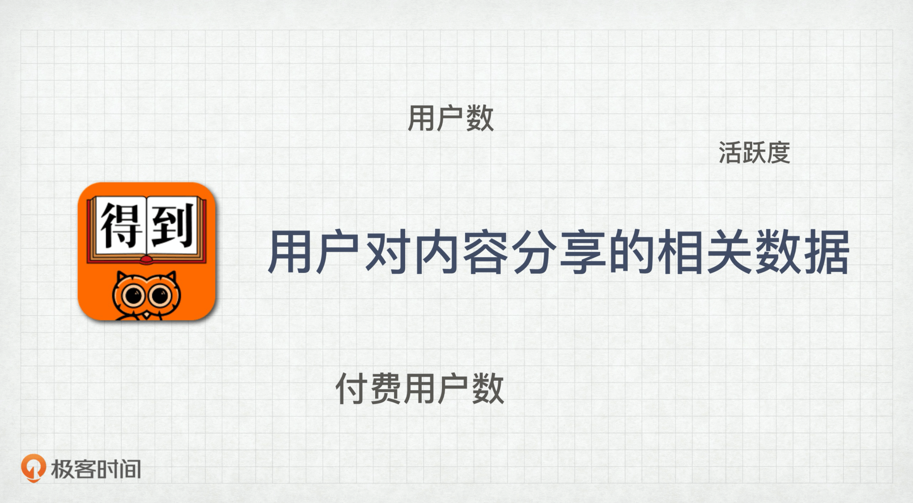
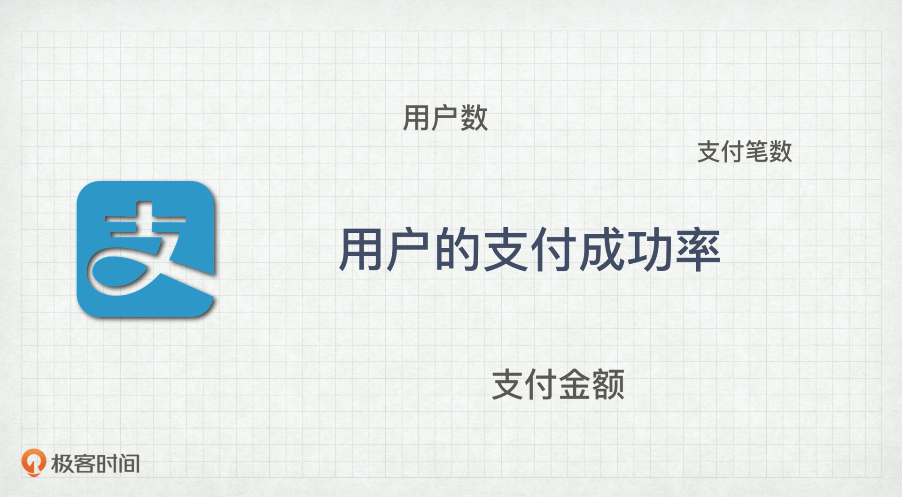
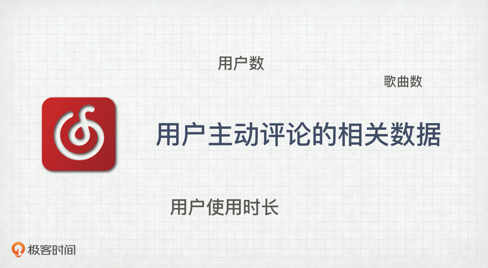
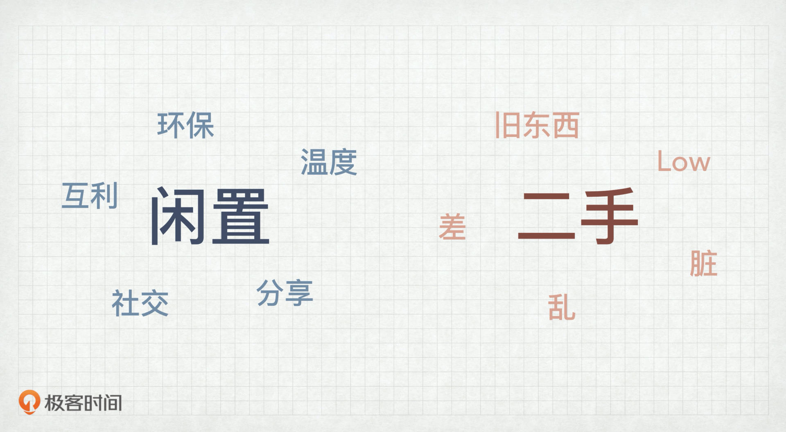

---
date: "2019-06-23"
---  
      
# 13 | 真正的成功指标：用户数、收入等等都不是
你好，我是苏杰。

今天是第四轮MVP——Promotion的第二讲，让我们一起来聊聊如何制订出真正有意义的指标，来衡量产品的成功。

上一讲中，我们为产品加上了时间维度，聊了产品的生命周期。那么这一讲，我们来看一看，如何才能衡量产品在每个阶段成功与否。因为这是决定下一阶段对产品的资源投入应该加大还是缩小的关键。在极端情况下，资源缩小为零，也就意味着要主动终止一个产品的生命周期了。

要知道，正确的主动终止意义非凡，我之前提过，产品快生快死，比半死不活要好太多。

## 指标作弊的泛滥

最近看了一个段子，说某特困县县长只花了几秒钟就搞定了“每个村都要通电”的指标，方法很简单——把某些没通电的村合并进已经通电的村子。

这样的行为虽然荒诞，但却说明，只要团队有经验，在面对各种指标的时候，总能找到作弊的办法，我来给你举一些例子。

* DAU（日活跃用户数）：买垃圾流量，做各种不靠谱的活动。
* 下载量：虚假宣传，夸大产品价值。
* 注册用户数：不考虑留存的注册返现。
* 活跃度：在“分子/分母”的公式上做文章，在分子、分母的定义上玩花样。
* 人均PV：一篇文章分N页，人均停留时间也类似。
* 点击率：软件下载站上，各种花花绿绿的“下载”按钮，点好几次也不一定能点到真的下载链接。
* 使用时长：后台运行，或者故意“迷惑”用户，让用户无法快速完成任务。
* 付费用户数：首单1分钱。
* 复购率：首单9块9，第二单1毛。
* ……

<!-- [[[read_end]]] -->

我相信，不只是制订指标的人，哪怕经常完成指标的你，也一定对上面这些投机取巧的做法深恶痛绝。但人性使然，我们不能去正面挑战它。

那么，怎样才能规避这些“作弊方法”，去制定真正的成功指标呢？接下来我们就谈谈这个话题。

## 真正成功指标的原则

先说几个重要的观点。

第一，衡量指标要在执行开始前制订，而不是过程中根据“做的情况”调整。

如果没有重大变化，不可以不断调整目标。**如果指标最终总能完成，就失去了意义。**开始前制订目标，也就是要提前想清楚退出机制，想清楚终止产品投入的条件。

第二，衡量指标，太虚了很难考核，太实又很容易作弊。

多年前，马云对其下属子公司总裁的考核，就用过“让我满意”这样的虚化指标，可谓是非常残忍了。

而太实的话，我再给两个略显搞笑的作弊例子：第一个考核，希望提升火车的上座率，于是，负责人把车厢数减少了，16变8；第二个考核，要求校车零事故，于是，多所学校决定取消校车接送。

远视者把目的当手段，近视者把手段当目的。我们身边的短视行为实在是太多，原本对考核的具化、量化只是一种实现目的的手段，是为了简化执行、简化管理。但总会被一些 “糊涂蛋”无意曲解，或者被一些“聪明人”有意利用，片面地追求数字，甚至不惜做违背公司大目标的事情……这个话题我想多说也无益，有时候真是有“人在江湖，身不由己”的感觉。这种“应该做什么”的价值判断，好像就只能靠每个人用自己的价值观来指引了。

如果你研究过KPI和OKR的区别，就可以了解到，OKR中强调的O，就是为了解决舍本逐末的问题。当然，KPI和OKR各有其适用场景，不是这一讲的重点，我不做展开。

这里我想做的，就是找出一种不容易作弊且没那么虚的衡量指标，幸运的是，我发现了一些原则。

老生常谈的SMART还是需要的，即指标要具体、可衡量、可达到、和大目标有相关性、有时间限制，这五点，不再多言。

然后，最重要的是什么？我想先用几个比较直观的例子来为你解释：

* 得到如何衡量成功？

用的不是用户数、付费用户数、活跃度等指标，而是用户对内容分享的相关数据。

* 早年的支付宝如何衡量成功？

用的不是用户数、支付笔数、支付金额等指标，而是用户的支付成功率。

* 网易云音乐如何衡量成功？

用的不是用户数、歌曲数、用户使用时长等指标，而是用户主动评论的相关数据。

对比总结一下，我觉得——不那么好的指标（我们在后面把它叫做虚荣指标），通常是对公司有价值的，而好的指标，是对用户有价值的，我们把它叫做成功指标。

所以，我试着下了一个定义：真正的成功指标，是可以反映出用户“非受迫、无诱导的成功行为”的。这里有三个关键词，我来解释一下：

* 非受迫：用户没有被逼着做没价值的事情，比如有些App里的签到才能获得某个价值；
* 无诱导：用户的行为不是“奖励就有，没奖励就没有”，比如有红包才会转发；
* 成功行为：指的是指标考察的行为，本身就为用户创造了价值，而不只对公司有价值。

当然，这里还有一个前提，那就是“真正的成功指标”要与正确的业务目标契合。

再来体会一下上面的几个例子：

* 得到用户对内容的主动分享数据，非受迫、无诱导，用户价值是**让自己有优越感，让朋友们听到了好的内容**；
* 支付宝用户的**支付成功率**，非受迫、无诱导，用户价值显而易见；
* 网易云音乐用户的主动评论数据，非受迫、无诱导，用户价值是**自我表达，互动分享**。

这里我需要提一句，虚荣指标也并不是一无是处的，在某些“对外”的场景下，它们也可以用得上。因为虚荣指标往往比较大而泛，容易给人留下印象，所以**可以用虚荣指标来谋求建立合作关系、赢得一些关注**。

而非虚荣的成功指标，才是真实反映成功和价值的指标，是推动增长的隐形引擎。对于团队内部，还是关注这个比较好。

## 今日案例：闲鱼的成功指标

今天，我们以闲鱼为案例（已去除敏感信息，主要用公网搜得到的信息，写我的分析思路为主），分析一下它的成功指标是如何设置的。

闲鱼是阿里巴巴旗下的闲置商品交易平台，2014年成立，到2018年做到了2亿多的用户，交易量超过了1000亿人民币。你看，我在给你介绍的这个产品的时候，还是用上了一些虚荣指标。那接下来，我们就来看看闲鱼最早的几个月，是如何制订成功指标，来完成从0到1的产品启动的。

首先，一个新的产品要创造使命。

闲鱼特别强调自己是“闲置平台”，而不是“二手”，是为什么？

因为“二手”给人的感觉是旧的东西、是Low的东西，是没钱的时候买的东西。而“闲置”这个词就不一样了，尚未有太多负面的感觉，闲鱼就可以重新定义这个词，给它赋予“资源充分利用”“互利”“环保”这样的情怀。

你可以想一下，一个交易平台的定位如果是二手市场，那给人的感觉就是脏、乱、差，东西质量不高，好坏参差不齐，久而久之，就会劣币驱除良币。而闲置市场则存在经营社区的可能，交易只是媒介，在这里，你可以通过商品，发现你的同好，建立起可能的社交关系。

于是，几个和使命相关的关键词出来了：环保、温度、互利、分享、社交。

然后，我们需要给产品定一些原则来达成使命。

为了让闲鱼有温度，能够热热闹闹地分享社交，我们就需要极低的门槛，让用户随手可用。

所以，先要让用户随时随地有上来的可能，那就是移动优先，做App不做PC；第二，上来以后要方便的启程，就是“新手上路”啊，所以流程要简单，注册、身份认证什么的都省了吧，直接用淘宝或者支付宝登录加认证；第三，交易过程要简单，所以，卖家也不用开店了，随手拍照发布就可以卖，买家看到了感兴趣的商品，要很方便地聊，聊开心了，要能很方便地买……

总结成一句话，就是**各种简单方便**。

接下来，我们就可以在真正动手设计开发之前，定一些成功指标了。我建议你可以在这里暂停一下，想一想，如果你面对这个命题，你会定哪些指标？

最容易想到的，还是用户数、交易额这种，但这些都是达成用户价值的结果。

早期的闲鱼，最终按照产品的逻辑，顺序定了四个指标，都反映出了用户价值。

第一个指标，是关于**卖家商品发布的速度**，要能最简单快速地把商品发出来。这是因为一个交易平台，一切的基础是现有供给，而发布商品的简单方便，是重要的动力，也体现了用户价值。

第二个指标，要**有足够多的发布过商品的卖家**，很显然，第一个指标达到了，第二个指标就相对容易，而这个指标体现的用户价值，更多是在买家端，买家现在有得逛了，更容易发现自己需要的闲置商品。这时候，运营可以做一些推广的事情了。

第三个指标，是关于**聊天互动**。这背后体现的用户价值，是买家找到了自己需要的商品，更容易产生粘性，而卖家有了咨询，也更容易产生粘性。对这个指标的达成，闲鱼的做法是**重兵投入自己做聊天模块**，让互动和交易模块更可控。

第四个指标，才是最容易想到的，关于**成交相关的数据**，最终的成交，反应的是买卖双方的价值交换，双方都拿到了自己想要的结果。刚才我们提到闲鱼自己做聊天模块，这时候，就可以把付款功能集成在聊天界面，大大地促成成交。

以上几个成功指标达成后，闲鱼很快做到了100万DAU（日活用户数），当然，你肯定会觉得这离不开它被后的大树——阿里巴巴，但这个推导过程，很值得我们好好体会。

其实，成功指标的制订，也可以用在非工作领域，对个人来说，读了多少本书，学了多少门课，听了极客时间多少分钟音频，都是虚荣指标，正在听音频的你，是不是哭笑不得？

所以，对于自我成长，你应该定什么样的成功指标呢？这个要留给你自己思考了。

## 小结

对产品是否成功的判断，太虚的指标难以考核，太实的指标又很容易作弊。但为了便于操作，我们还是希望制订SMART一些的指标。所以，你需要分清楚虚荣指标与成功指标。

而**真正的成功指标**可以反映出用户的“非受迫、无诱导的成功行为”。

## 思考题

最后，抛个有趣的问题给你，你还能想到哪些虚荣指标，有什么亲身经历过的对虚荣指标“作弊”的案例么？

欢迎你留言写出自己知道的案例，与我和其他同学一起讨论，也欢迎你把文章分享给你的朋友。