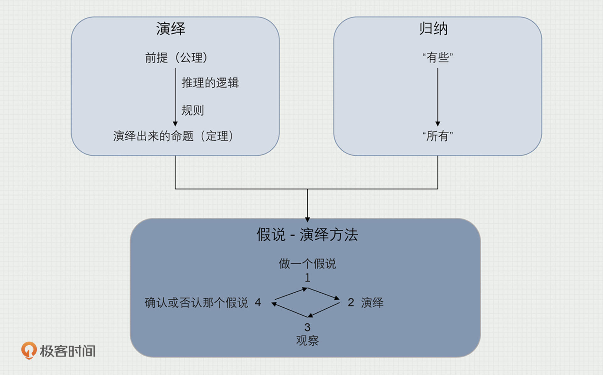
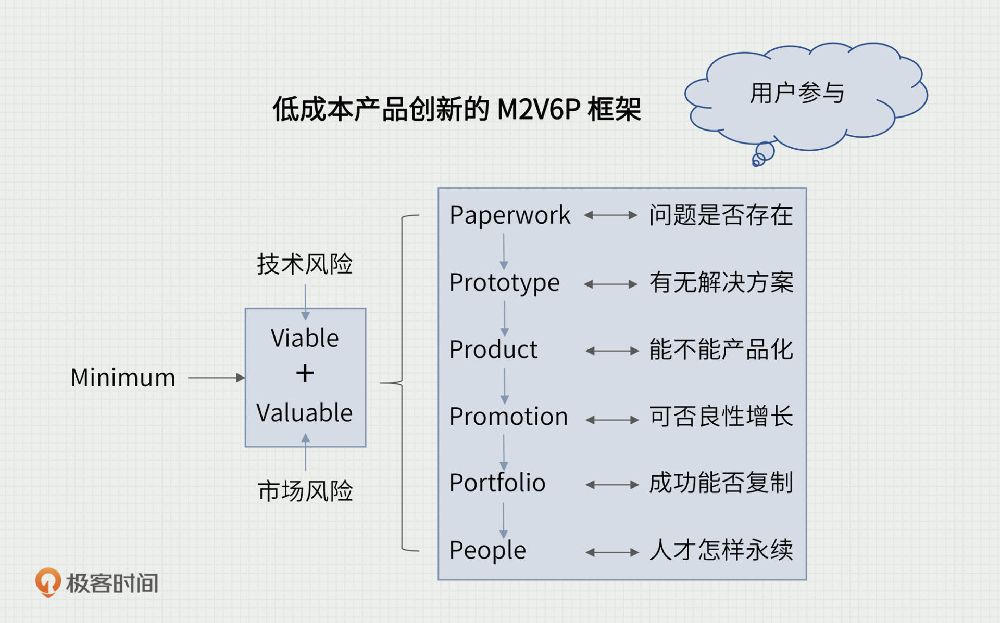
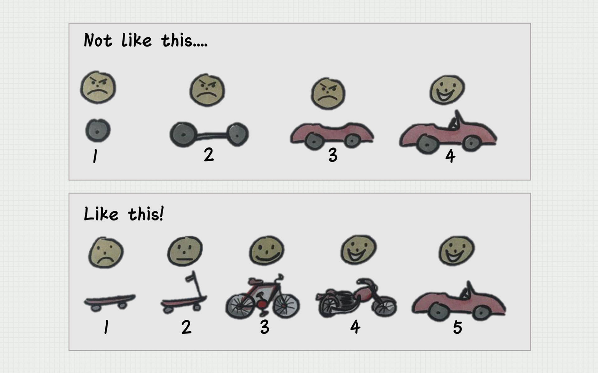

---
date: "2019-06-23"
---  
      
# 21 | 长大以后：从 4 轮到 6 轮 MVP（M2V6P）
你好，我是苏杰。

现在是2022年春天，时隔两年多，我们又相遇了。最近，我会给《苏杰的产品创新课》一次性做不少于8期的加更内容，聊一聊我对产品创新这个课题的新理解。

翻看之前的结束语，还是在2019年底，这两年多，世界和我自己都发生了很多变化。说几件对我、也许对你的影响也很大的事情。

先是新冠疫情，开始的时候谁也想不到居然到现在还没有结束，旅游、餐饮、电影等很多行业损失惨重。然后是2020年与2021年中概股表现的强烈对比，简直是冰火两重天。接下来，各种政策重拳出击，互联网平台、教育、游戏、房地产、金融等行业广受影响。此外，还有中美关系、人口趋势、共同富裕等等热议话题。我想，这些也或多或少让你的生活和工作发生了变化。

我也不例外，2020年，我本想去做大量的咨询，积累案例，但因疫情影响了很多出差，于是，我改变策略，窝在家里写书，具体说，就是在这门课的基础上，增补了一些内容，出版了《人人都是产品经理03：低成本的产品创新》。2021年，我把自己之前写过的几本书都迭代了一遍，出版了一套4本的《人人都是产品经理》套装。2022年初，我又和10位朋友一起合写了一本关于产品人个人成长的书，叫《向上突破：不一样的产品经理》。

<!-- [[[read_end]]] -->

以上这些，都是我2C的引流型产品，它们会给我带来2B的客户。所以，这两年，我也在继续给很多企业做咨询顾问类的服务。诚然，因为疫情的不确定性，很多出差都会临时取消，对咨询业务有不少影响，我们团队也都习惯了，而且已经修炼出一句口诀：不预测、只应对。

回顾我们在[02](https://time.geekbang.org/column/article/154495)那一节里提到的VUCA时代，还真是所言不虚。这个世界的变化速度太快，问题也越来越复杂。如果我们还遵循传统的方法做事，必然会碰得头破血流。产品创新更是如此。

在之前的课程里，我用四轮MVP框架，帮你解决了 VUCA 时代产品创新从无到有的各个环节的问题。但是我们知道，任何一个组织的成功，都不可能靠单一产品实现，每个产品都有它自己的生命周期，都会消失。因此，如何让产品不断进化，从单一产品走向产品矩阵，在VUCA时代做大做强，是我们需要进一步思考的问题。

这也是我此次回归的主要原因。在这次的课程更新中，我给你带来了全新的低成本产品创新框架——6轮MVP框架，它是在原来4轮MVP的基础上增加了2轮。现在你可能心里已经产生了不少疑惑：单一产品如何发展为产品矩阵？会有哪些挑战？这新增的2轮MVP究竟是什么？它真的有用吗？

为了让你深刻理解这些问题，我们先回归MVP的本质，看看它的底层逻辑是什么。

## MVP再理解

MVP的思想源头来自人们对科学研究思维方式的迭代。

早在欧洲中世纪的晚期，人们就在“演绎”和“归纳”这两种方法论的基础上，提出了一种全新的方法论，叫做“假说-演绎”。

“假说-演绎”就是先提出一个假说，注意，这个假说是待验证的“新知识”，然后去演绎它，观察结果。如果结果符合假说，则认为假说暂时有效，即在发现反例之前，先用着，如果结果与假说不符，则否定原有假说，提出新的假说，继续循环。

这样，人类的知识大厦就可以不断演化，添砖加瓦。心态上接受被否定，就可以不断进步，另一方面，也不失实用性。后来的科学革命，实验方法等等，都可以说是这个思想源头的发扬光大。

到了十九世纪，哲学家卡尔·波普尔提出，科学的特征就是“可证伪性”，在我看来，这进一步认可了人类是通过不断否定过去的自己，从而不断进步的事实。在波普尔“科学理论只能被证伪，无法被证实”的观点上，我提出自己的一句话——**产品只能被完善，而无法被完成。**

我认为，这就是十几年前，MVP方法论被提出，背后的思想源头。

通过MVP方法不断完善产品，是一个螺旋上升的过程，每一次产出，既是目的也是手段。它作为目的，创造了用户价值、满足了用户需求。另一方面，它也作为手段，让我们获得反馈，知道了下一次迭代应该做什么。

## 从4轮MVP到6轮MVP，做了哪些升级？

下面，我就和你聊一聊，我的低成本产品创新框架，是怎么从4轮MVP扩展到6轮的。

前4轮的4个P分别是Paperwork案头研究、Prototype原型设计、Product产品开发、Promotion营销推广，我们是在探讨单一产品如何成功。但任何一家公司、甚至一个业务，都不会依赖单一产品，而是靠一个产品矩阵，以及背后的人与团队。所以，新增的Portfolio、People这两个关键词，就是在单一产品的4个P之上做的扩展。

因为每个单一产品都有它自己的生命周期，都会消失。所以第五个P，用了Portfolio这个词，借用了投资组合的意思，意味着产品组合。随着单一产品的“长大”，必然会进入产品矩阵阶段，那么我们就需要实现从单一产品的成功到可持续的成功。而对于产品创新者来说，随着你的成长，承担的责任越来越大，也不会只局限于负责某一个产品、满足某一类用户。这时你就会碰到一些新问题，比如对平台和生态的思考，又如对收入和盈利的探索。

第六个P是People，进入产品矩阵阶段，为了一个又一个产品的持续成功，除了用上之前产品的积累以外，人的因素也没法避而不谈。对公司和个人都是这样，当产品矩阵足够复杂以后，就必须要投入足够多的关注在团队和组织建设上，不是靠一个英雄，而是靠可以持续不断培养出新英雄，来推进产品矩阵的发展。

在我的方法论工具包里，这方面也有不少。比如，如何定义特定组织里的产品岗位模型、如何分级别、如何确定成长路径、如何做产品经理的选育用留、如何培养可持续发展的产品团队、如何建立产品创新的文化和机制等等。

有了后两个P的跃迁，就意味着你不会再只想着给手头的唯一产品续命，而是更宏观地去想，哪些产品该加大投入，哪些产品该减少投入，减少到极致就是哪些产品该去死……而背后的团队，又应该如何与产品互相成就。

讲到这，我想你应该明白了这次框架升级的重要意义，这里我按照更常见的缩写习惯，把整个框架的命名也做个迭代，我称它为M2V6P：

* M是最小化，minimum的意思，意味着每一步都要尽量小的投入；
* 2V是可行的Viable，加上有价值的Valuable，分别对抗创新的技术和市场风险；
* 前两个P，Paperwork+Prototype对应着前产品阶段；
* 接下来两个P，Product+Promotion对应着单一产品阶段；
* 最后两个P，Portfolio+People对应着产品矩阵阶段。

随着产品不断进化，你会发现，我们碰到的挑战也会越来越大。有一句话说得好，“**技术的尽头是产品，产品的尽头是商业，商业的尽头是组织**”，很多下层解决不了的问题，往往要到上层去解决。所以，按照这个逻辑，在后面的几节课中，我会基于升级后的M2V6P，和你聊聊这些话题：

* 产品从小到大的几个阶段，特别是突破单一产品到产品矩阵阶段以后的新问题；
* 产品大了，用户自然多样起来，聊聊对用户生态的更多思考；
* 产品和用户都复杂了，团队自然也要扩张，所以接着聊产品经理的选育用留，如何与产品达人做朋友，更好地助力产品成功；
* 团队变大花钱变多，必须有收入有盈利，于是聊有关商业模式的一个简单理解；
* 行业都有兴衰，背后可持续成功的是团队和组织的能力，所以再聊聊组织效率的话题；
* 各种“空间”上变大，所以需要“时间”上拉长，最后谈我对长期主义的理解，不只是对产品，也可以应用在职场、甚至人生上。

如果你有什么新的需求，也欢迎反馈给我，我会视情况进一步完善这个专栏。

## 延伸话题：方法论真的包治百病吗？

在这节的最后，我想和你再聊聊方法论的局限性。

因为我的整个课里，很多节都是给出了一个具体的方法论。作为行事的依据，方法论必不可少。但我也希望你不要忽视方法论的局限性。

如果你碰到一个人，和你说了一个适用于所有场景的方法论，那我会觉得，要么他是个骗子，要么这个方法论是一个没法落地的废话。任何方法论，都一定有它的适用场景，比如我的M2V6P框架，在开始就能确定需求、且需求不变的场景下，并无必要。就像文章里的配图，如果一开始我们就知道用户要的是什么样的跑车，那显然不用一步步做滑板车、自行车、摩托车。

而方法论另一个很容易被忽视的要点，是我最近意识到的，即方法论只能用来提高下限，却无法提升上限。在探索产品改进方向、新业务的时候，不少公司都希望有一套方法论来严格推导出最优选择，经过多年的尝试，我基本已经放弃了这个不切实际的幻想。

方法论只能告诉我们哪些方向是大概率要失败的，即方法论可以帮助我们避开天坑、做减法。具体一点，M2V6P的方法论可以帮助我们更早发现错误，从而减少时间、人员、金钱的损失。这有点像很多伟大的球星，通过日常的刻苦训练，做好每一个基本动作，然后成功的概率就自然提升了。

这一点，我在知名脱口秀公司笑果文化那里也得到过印证。2021年，我和一些企业家朋友去拜访笑果文化的CEO贺晓曦。我本以为对于文创行业，手里有一堆“孙悟空”笑果，他们会有打磨爆款的方法论。但聊下来发现，他们也是去努力提高下限的，通过海选、交叉读稿会、开放麦等等一系列的基本动作，让每一个出现在大众面前的段子和演员都不会太差，然后通过概率，自然会出现爆款。

所以，我会说我做的产品创新顾问有点像职业杀手，任务是根据M2V6P，把明显不靠谱的产品杀死在摇篮之中，而且是“早死早超生”。我的任务完成后，产生的结果就是资源被释放，并且能够自然流向成功概率更高的地方。

提高下限可以利用方法论，那突破上限的事情怎么做？

貌似运气、灵感、情怀这些更重要。举个最简单的例子，我在做咨询的时候，很关注现场讨论的气氛，大家的情绪也很重要。在聊到某些方向的时候，如果多数人眼里无光、心中没火，只关注数字计算，那估计也是成不了的。

好了，2022加更的第一讲就到这里，我迭代更新了方法论，也说了它的局限性，如果你还有什么关于方法论局限性的思考、或者有什么提升上限、保持激情、做出爆款的法门，欢迎提出来讨论。