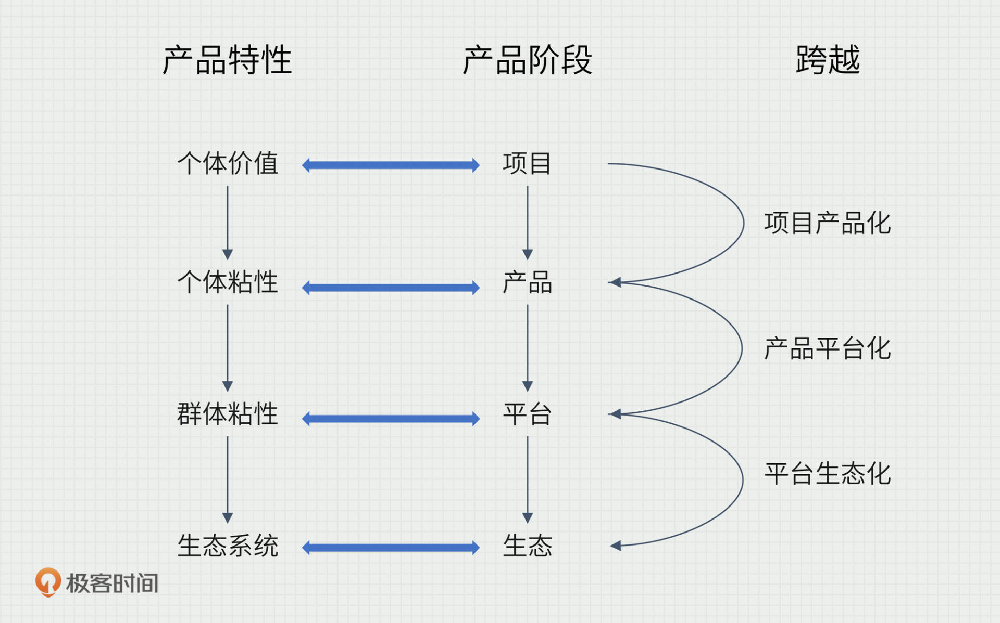

---
date: "2019-06-23"
---  
      
# 22 | 步步为营：项目、产品、平台、生态
你好，我是苏杰。

我在升级后的M2V6P框架中说过，单一产品的成功并不可持续，今天让我们一起来思考一下在一个产品从小到大的过程中，是怎么变成复杂的产品组合，或者说产品矩阵，都有哪几个关键阶段，每个阶段要站稳和跨越的要点又是什么。

有了这个认识，相当于在你的头脑里建立起产品通关的攻略，知道这一关的Boss是什么，下一关的挑战又是什么，从而让你未雨绸缪。

当你开始负责一个完整产品以后，就会发现每个产品都很让人头疼，甚至有一种千疮百孔的感觉。然后，就会发现想做的事情非常多，资源总是不够用。

有的公司觉得，自己做了很多事，疲于奔命，但似乎每件事都是一个项目，彼此没什么关系，一直没有自己的产品；有的公司什么都靠自己做，会羡慕没车没司机的滴滴、没酒店的携程、不开店的美团……这类的平台模式；有的公司会觉得生态只是行业龙头的事情，自己做不到也不用管……我认为，这都是产品处于不同阶段的问题，你首先要搞清楚现在的阶段，是一件多大的事情，就可以自然明确目前的要点在哪里，如何稳住当前的阶段，又如何跨入下一个阶段。

也许你听过好几种说法，什么点线面体、草根腰部头部顶级，等等，都是描述产品的阶段，今天，我按照自己的理解，用项目、产品、平台、生态这四个词来定义产品的四大阶段，当然，和其他几种说法也有千丝万缕的联系，你可以通过查阅更多资料来对比理解。

<!-- [[[read_end]]] -->

在开始之前，我们可以先回顾一下之前讲过的[第10节](https://time.geekbang.org/column/article/163396)，我说一个好产品随着时间的演变，会依次展现出如下特性：**个体价值、个体粘性、群体粘性、生态系统**。

这些特性，其实就对应着项目、产品、平台、生态四个阶段，第10节的时候，我们更多在讲判断产品好坏的特征，这一节更多说每个阶段，要达到的难点、要突破的难点。而产品成长的三次跨越，也就是**项目产品化，产品平台化，平台生态化**。

在最开始的阶段，项目要想成功，靠的是抓机会的能力，敏锐地发现了一个需求、满足了需求，创造了价值，就成功了。但项目有明确的开始结束，通常相对短期，无法持续，这就迎来了第一次跨越——项目产品化。

## **项目产品化**

这是从抓零散的单次机会，转变为打一眼可以持续出水的井。对用户来说，就是要从提供“个体价值”到产生“个体粘性”，一方面是可以持续供给，另一方面是用户持续有需求。类比一下，有点像从采集到农耕、从打猎到游牧的变化，是从打了一只野猪饱餐一顿，跨越到驯化野猪为家猪，大猪生小猪，顿顿有肉吃。

一家软件外包公司，做了N多相似的项目后，总结共性，推出了一个可以服务很多用户的产品，并且还能让用户每年续费，就是这个跨越；一家知识服务公司，做了一门又一门的在线课程，总结出了一套可复制的“做课手册”，用户认可课程质量，持续买单，也是这个跨越。这种类似“批处理”的项目产品化，还可以用在很多场景下。

比如在工作中，经常有同事或合作伙伴翻来覆去问你同样的问题，那么，你就可以把它们做成一个常见问题的文档。以后再有人来问，你就让他先看看文档。而且，你还可以根据大家的问题来不断更新维护这个文档。

我自己在参加各种活动的时候，经常有同行来加微信。遇到这种情况，普通的操作是打开微信，点好几下找到自己的二维码，然后展示给对方。后来，我把自己的二维码截了个图，做成了手机屏保。这样再有人要加微信的时候，我只要举起手机，屏幕亮了就可以让对方扫码了。

项目产品化，靠的是总结提炼，把服务某个用户的能力，泛化到服务一类用户身上。

项目产品化以后，我们就更容易与用户建立长期关系了，只不过这时候，我们与用户的关系是很简单的。用户的所有需求都由我们自己来满足，单枪匹马应对千军万马，很累，而且我们要持续做供给，不断满足层出不穷的用户需求，没有借助其他力量，也没有用上杠杆，很难做大。如果想再进一步，就是下一个跨越——产品平台化。

## **产品平台化**

这个跨越最关键的变化就是用户出现了多样性，有些用户在满足另一些用户的需求。既然要有平台，就至少有供需双方，比如老师与学生、卖家与买家、司机与乘客、作者与读者……有时候甚至有多方，比如外卖平台上的商家、买家和骑手。这个阶段，产品和用户的关系要从“个体粘性”发展到“群体粘性”，我们可以借助群体中多种用户间的关联，建立平台的增强回路。

比如电商平台的增强回路，是通过良好的体验，带来更多的流量与买家，进而吸引更多的卖家加入平台，买家有了更丰富的商品选择，促进了更好的体验，形成闭环。

又如在线教育平台的增强回路，是用优质的知识内容，吸引更多的学员，给平台带来更多的收入，从而可以用更多的名（学员多）利（课酬高）回报来吸引更好的老师，老师再产出更优质的内容，形成闭环。

平台化以后，产品就产生了一种自运营的感觉，我们搭台，用户自己唱戏。从自营到平台，随着供给者的上限打破，自然能满足更多需求，产品的天花板也就提升了很多。

大不一定好，做产品的目的，可以小而美，也可以大而全，只要你想的和做的一致，不纠结就好。如果想小而美，也需要理解生态，这样才能在生态中找到相对好的位置，不至于被市场淘汰。如果你还想做大，那就要把自己融入生态，而某个行业，或者说垂直市场，就是生态本身，你想一统天下，就必须思考下一个跨越——平台生态化。

## **平台生态化**

这是积淀长期的基本盘，要面向整个行业，优化效率，甚至重塑生态。这一阶段，产品与用户的关系要从“群体粘性”到“生态粘性”。

生态与平台的最大区别，在于用户是否离得开这家公司，公司和用户的耦合深浅。举个某外卖平台的例子，如果商户是堂食为主，只是通过你这里营销，获得一点线上的增量客户，那你就只是平台。如果商户还用你来管理客户、财务、采购，后来又把临街的门店退租，放弃堂食生意，去租了一个更便宜的厨房专做外卖订单，那你就趋近于生态了。

打个比方，如果产品某天挂了，商家也得歇业一天，那就是生态，如果商家只是少了一些订单，那就只是平台。

从服务个体到服务生态，开始的破局靠理解需求，后面的做大靠掌握供给。“需求侧”是对狭义用户的深刻洞察，“供给侧”也是洞察用户，不过要更清楚地理解用户生态里各种各样的角色。理解“需求侧”，是思考赚谁的钱，理解“供给侧”，是思考和谁一起分钱，找到“共生者”，只有分钱的人足够多，才能做得足够大。比如华为是和高科技人才一起分钱，阿里是和广大中小企业分钱，B站是和有才华的up主一起分钱。

换一个角度，如果你就想小而美，那么就去成为生态里不可替代的“共生者”吧。

## 一次“从小到大”的实践

我想再和你分享一个自己服务过的互联网医疗公司的案例，看这家公司是如何从项目、产品、平台再到生态的。当然，他们现在还在路上。

这家公司原来是做医疗器械销售的，机缘巧合拿到了某个海外品牌在国内的代理权，这是很典型的项目式成功。代理做得好了以后，就开始介入医疗器械的生产制造过程，加一点适合中国市场的研发。在这个过程中，2C呢，铺起了药店的渠道去卖家用仪器；2B呢，和很多医院建立起了良好的关系。注意这些铺垫，为后来的发展打下了很好的基础。

这家企业的设备，和慢性病（主要是高血压和糖尿病）相关。我不知道你有没有看过数据，我国有高血压的人大概 4 亿，有糖尿病的人大概 1 亿。你看，这是一个非常大的市场，但是这家公司原来只是卖设备，尽管市场很大，但单靠卖设备，需求量还是有限，难以实现业务的持续发展。所以他们就在想怎么去转型，怎么去创造更大的价值。

接下来他们做了这么几件事。首先把他们的家用硬件给联网，本来卖出去的只是单机版的终端，在联网了以后，数据就能收集上来了，然后再结合它的软件端（小程序、App），把本来的硬件变成了一个慢病管理的服务，和用户建立起长期关系，这就实现了项目产品化。原来只是卖设备那一次能创造价值，现在可以通过服务持续创造价值。

但他们并没有止步于此，接下来，又尝试把慢病服务变成了慢病社区。患者的家人、社区医生、患者定期就医的医院，把这些用户生态网络里面的节点都结合在一起，就做出了一个慢病服务的社区形态的产品。让产品里的其他用户来服务患者，这就是产品平台化。

有了这个社区产品，他们想象的空间就非常大了，后面还可以做很多增值服务，比如引进一些健康餐的供应商、辅助用品的卖家、家门口的药店等等，还可以收年费、服务费，引入各种角色，探索各种商业模式，打造慢病服务的生态型产品。如果他们能走完整个过程，跟原来只是卖硬件就很不一样了。

相信你已经感受到，当企业自身参与了行业的更多环节，可以获得的商业模式自然更有想象力。对于行业，通过这样的平台、甚至生态型的服务，迭代了行业的价值网络，提升了效率，所有的网络节点都可以分享收益。

## 小结

这一节，我们讲了一个产品的动态成长过程，随着阶段的演进，产品也变成了产品矩阵，我们再来回顾一下产品不同阶段各自的侧重点，以及我们在对应阶段可以做哪些关键动作。

* 项目：关注**单点的即时价值**，可以做的事情是识别机会，优化产品，降低用户的使用阻力，减少用户流失，先活下来，对应短期动作；
* 产品：关注**特定用户的价值积累**，提升单种用户的粘性，让用户来了还想来、越用越爽，增强用户的积极性……对应中短期动作；
* 平台：关注**多种用户之间的关系**，考虑供需双方的平衡，做出正向的网络效应，推动增长飞轮……对应中长期动作；
* 生态：把某些**用户转化为共生者**，一起优化价值网络，沉淀组织的基本盘，占据优势生态位……对应长期动作。

最后，我想再提一句。就算我们做到了生态阶段，也逃不过“生态”的生命周期，当整个价值网不行了，你还得面对“跨周期”的更大问题。这时候，在产品和业务以外，组织和文化的重要性就逐渐凸显，我们将在后面的内容中进一步讨论。

## 思考题

你的产品，现在在什么阶段？目前有没有站稳？如果要站稳、跨越到下一个阶段，你有什么想法？打算怎么做？

欢迎你分享出来，与我和其他同学一起讨论。

## 补充阅读

[我对平台和生态的理解](https://mp.weixin.qq.com/s?__biz=MjM5MzE3MDQ3Mw==&mid=2650406790&idx=1&sn=75ba6ed7e07d786659fa479f98a89faa&chksm=be964ac089e1c3d6acd75127672e39332cc44e815ae40c87edcaf65cc47b1cf6fae4db71af9a&token=1289982982&lang=zh_CN#rd)