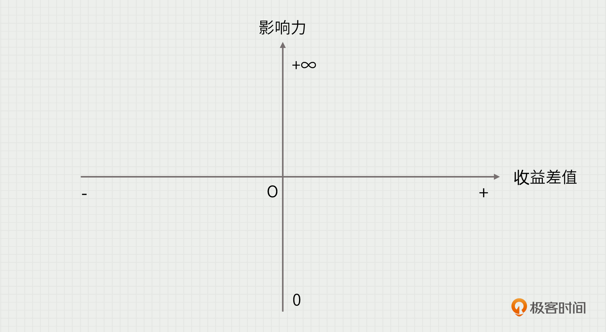
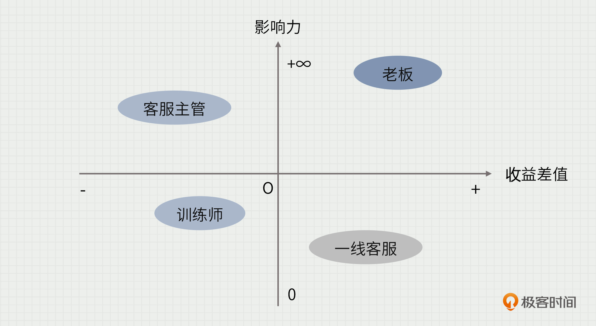
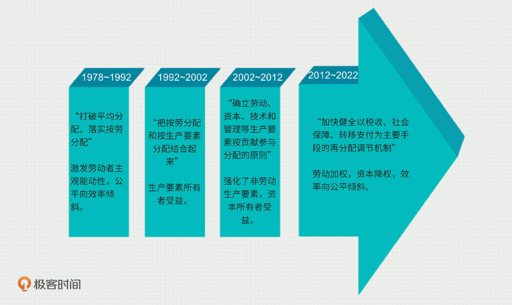

---
date: "2019-06-23"
---  
      
# 23 | 痛苦抉择：从满足用户到“伤害”用户
你好，我是苏杰。今天我们再来聊聊对用户的理解。

当产品长大以后，用户自然也越来越多，这个“多”说的不只是数量，还有种类。我们会遇到各种各样利益不一致的用户。

我曾经在一本名叫《故事》的书里，看到过一个编剧的技巧。书里说，如果你要塑造一个超人，需要两颗核弹。大魔王丢了一颗核弹，如果你是超人，去不去救？当然救。这里没有选择，一点都不难，超人这个角色也就很平淡。但，如果大魔王同时丢了两颗核弹，一颗去炸人口众多的大城市，另一颗去炸超人的亲人居住的小镇，而时间紧迫，超人只能救一个地方。这时候，超人就要选择了，我相信你也能感受到这里内心的纠结，人物也就鲜活了起来。

随着产品的长大、变复杂，成为产品矩阵，我们面对的局面其实也像超人一样。 有时候，你要满足一种用户，很可能就要伤害另一种用户。比如，一个办公软件需要平衡老板和员工的需求，有的人希望消息有已读提示，有的人不希望，你该如何处理？

就算用户之间没有利益冲突，我们的资源也一直有限，满足一部分用户，就难免会厚此薄彼，冷落了另一部分用户。

任何一个系统，经过长时间的演化，其中的各种用户角色的权力、责任、利益结构都达到了相对平衡的状态。**我们应该尽量通过创造增量来提升某种用户的价值，而不是通过重新分配利益来实现**，这一状态达到极限情况时，就叫做“帕累托最优”。

<!-- [[[read_end]]] -->

所以，我们作为产品经理，在理解用户的时候，就不能只代入某一种用户的身份来思考，得从用户生态的角度来看。我将在这一节介绍一个用户生态分析工具，掌握了这个模型的要点，你就可以基于自己的产品，有的放矢地分析多种用户的权责利关系，从痛苦地解决一个个单点问题，转变为用全局视角来设计产品策略。

## 用户生态分析工具：影响力收益矩阵

之前的第03讲[《从理解用户开始》](https://time.geekbang.org/column/article/155079)，我提炼了4个关键词：故事、生态、画像、旅程。其中，对用户生态的理解，主要是通过海量的用户故事，提炼出具体的用户角色，并描述了用户角色提炼的方法，然后，需要分析角色之间的关系，从而理解用户生态。

但，那一讲里我并没有给出用户生态分析的具体方法，所以我将在这一讲做点补充。并且，我把用户理解的过程从4步拆分为5步，这样会更加清晰，即“故事、角色、生态、画像、旅程”。

**分析用户生态的关键，在于理清用户角色之间的关系**。接下来我就为你介绍一个简单易用的方法——影响力收益矩阵。

首先，我们在平面上画一条横轴和一条纵轴。

纵轴代表影响力，是指某个角色在整个用户生态所有角色中的影响力，即他的话语权大小。纵轴的最下方为 0，最上方为正无穷。横轴代表收益，是一个“收益差值”，是产品从无到有，用户的收益变化。横轴的左边为负，右边为正。

这个矩阵说明了产品已经给，或者将会给各种角色带来收益还是损失，由此我们可以通过它得知，**某角色会成为产品成功的动力还是阻力，并制定相应的对策**。

下面我和你分享一个案例，看看我们在真实场景下是如何使用影响力收益矩阵的。

## 案例分析：SaaS类产品基于用户生态的抉择

我的客户S公司是一家做 AI 客服机器人的公司，靠既有的产品和销售拿下了一些电商企业用户，但眼下增长碰到了瓶颈。

我们前面说过，用户生态分析的前提是清楚用户故事和用户角色。S公司其实很重视他们的用户，有专门的“客户成功” 团队，所以已经有了海量的用户故事。接下来，我们就要从用户故事中抽象用户角色。

一个2B的SaaS类产品，通常可以划分出两种关键的用户角色：一是老板，负责做是否购买的决策；二是一线客服，他们是最终使用产品的人。在梳理用户故事时，我们要注意重点探讨有没有被忽视的用户角色。经过初步的用户角色分析，我们在S公司的案例中发现了两类新角色。

首先是客服主管/总监。老板在做AI客服系统的购买决策时，会参考他们的意见，因为平时他们要管理一线客服，并且每隔一段时间，他们就要对一线客服进行考核。对于这种隐藏的用户角色，我们可以从已经识别的用户角色出发，探索他们在一天、一周、一个月甚至更长时间的工作生活中与其他哪些角色发生了互动，以此发现更多容易被忽视的隐藏用户。

除了客服主管/总监以外，还有一种崭新的角色：AI训练师。AI客服服务效果的提升离不开训练及配置的更新。对卖家来说，为了满足日常上线新品以及做活动的需求，AI客服机器人需要不断地进行训练和提升。训练师这个原来没有的角色，大多数公司会让客服主管或者比较资深的一线客服来担任。

既然这样，那训练师的角色为什么还要单列出来呢？因为AI客服机器人的需求场景太过独特，所以，它的需求不能作为普遍客服人员的需求。将不同角色的需求分列出来就是为了把自然人的角色分离。比如顺风车这样的产品，同一个自然人，有时候是司机，有时候是乘客，在做产品的视角下，就要把他当作两个角色来对待。

接着，到了关键的一步：用“影响力收益矩阵”来分析关键角色。当然，S公司分析出了十几个角色，我们这里只讨论上面列出的最重要的4个。

**老板**：影响力最大。因为产品提升了客服团队的效率，用人需求降低，为老板省了钱，所以老板的收益是最大的。他在右上角。

**客服主管**：影响力也不小。他可以影响老板对 AI 客服机器人的评价，但目前的产品并没有给他带来收益。在购入了AI客服机器人这个产品之后，原客服团队的人数可能要下降，他在公司里的地位和话语权也会随之下降，此外，原来对人工客服的考核模式在新的情况下也不适用了，因此他的收益为负。他在左上角。

**训练师**：影响力不够。因为暂时没有建立起考核机制，而AI客服机器人的服务效果又严重依赖于训练师的工作，所以对于兼任训练师的员工来说，经常会有吃力不讨好的感觉。AI客服机器人这一产品对他而言，收益为负。他在左下角。

**一线客服**：这里仅指购入AI客服机器人后，留下来的优秀客服人员，他们的影响力很小。但和 AI 客服机器人配合良好的客服人员，职业竞争力会提升。故对他们而言，AI客服机器人带来的收益为正。他在右下角。

分析完毕后，我们可以发现目前产品存在的问题。通常来讲，想让某个用户生态里的所有人都因我们的产品而获益，这种可能性是极小的。我们要**特别关注收益为负****但****影响力大的重要角色**，因为他们会成为产品成功的阻力，必须要重视。因此，接下来我们可以做的事情就是调整产品，使得某些角色转移到对我们更有利的位置上去。这个案例中，我们可以这么做：

对于客服主管，我们可以把他们往图的右侧移，这需要提升他们的收益，让他们成为产品成功的助力。比如我们可以提供新常态下的考核模板、提供团队绩效仪表盘、让他们可以在老板面前展示价值，等等。而这些，在原先的产品里是被忽视的。

对于训练师，我们要把他们往图的右上方移，即提升他的收益和影响力。从销售过程开始，我们就要让老板知道这个角色的重要性。在日常工作中，我们也要让他们的管理者明白，应该如何考核、奖惩训练师。作为“AI 客服机器人”这个产品服务系统的一部分，训练师需要得到更多培训服务类的帮助，这可以大大提升产品的使用效果。更进一步，我们还可以提升他们的职业荣誉感，让其体会到在人工智能时代，这是抓住时代红利的职业选择。

分析完毕后，S公司调整了产品的迭代计划，数据有了进一步的增长，并在疫情期间连续完成了B+轮和C轮两轮融资。

我们在[09节](https://time.geekbang.org/column/article/162862)里说过，产品其实是一个产品服务系统。所以在这个案例中，我们也不能把产品狭义地理解为IT系统，还应该有各种赋能服务，他们都可以帮助产品和用户成功。

整体而言，对于影响力收益矩阵，我们会通过接下来的产品策略，把重要的角色往右上方转移。而被我们“伤害”的角色，就只好把他留在左下角，比如这个例子中，那些被淘汰掉的人类客服。

随着时间推移和产品的升级、优化，影响力收益矩阵也会不断改变。所以，我们要做到“常画常新”，这样才能更多地理解用户生态。

## 延伸：历史进程中的用户生态演化

只要一个群体的人数足够多、类型足够多，我们都可以试着用分析用户生态的视角来思考。比如我们自己生活的这个社会，改革开放40多年以来，不同群体潮起潮落，背后对应着什么政策变化，这个和我们每个人的利益都切身相关。大体上看，主要分为四个阶段。

这是一种超大时空尺度的用户生态演化，我相信你可以感受到其中不同的社会角色在不同阶段的影响力变化，以及收益变化，然后政策又是如何来调整的，有兴趣的话，你也可以用这一讲提到的影响力收益矩阵来分析一番。

如果我们用生命周期的视角来看改革开放40多年，任何广义的产品，都会有如下两个阶段：

* 先是高速增长期，让一部人先富，效率优先，做大蛋糕；
* 然后进入平台期，先富带后富，公平优先，分好蛋糕。

## 小结

这节课，我们再次理解了“用户生态”这个词，特别强调了不同用户的利益不一致问题。我为你介绍了一个叫“影响力收益矩阵”的分析工具，希望你能带入不同用户角色的视角，来重新审视自己的产品，不断分析产品的优化方向。

比如，对于右上角影响力和收益都不小的用户，我们如何设计产品向他们借力；对于左上角影响力很大，但收益为负的用户，如何提升他们的收益，或者降低他们的影响力，从而减少产品成功的阻力。总而言之，产品不只是满足一种用户，它最好可以增加各种用户的总体收益。

就算我们从全局视角制定了产品策略，回到这节课的标题，依然可能有一些用户被你“伤害”，就像案例里那些被淘汰的人类客服一样。我想，只要问心无愧了，也就不必再介怀。

## 思考题

你手头的产品，目前有面临多种用户利益不一致，很难取舍的问题么？有碰到过某种角色巨大的阻力，无法推进的情况么？你可以试着用这一节提到的影响力收益矩阵来分析，看看有没有启发。如果有什么困惑，欢迎在评论区和大家交流。

## **扩展内容**

具体的用户生态分析的工具，《人人都是产品经理03（创新版）——低成本的产品创新方法》的45页到53页还讲了几个，如果你感兴趣，可以进一步学习了解。