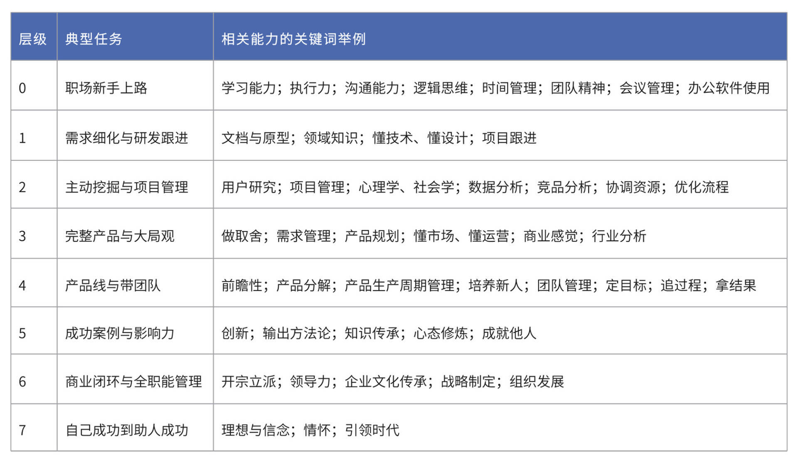

---
date: "2019-06-23"
---  
      
# 24 | 众里寻他：怎么找到合适的产品达人？
你好，我是苏杰。今天我们来聊聊有关人和团队的话题。随着产品长大、用户多样，对应的团队里，单个产品经理也就独木难支，必须组建团队了。

另一方面，当你在职场打拼几年之后，随着负责的事情越来越大、越来越多，总会面临要找帮手、招人的问题，在这门课的主题下，我们把它具象化为招聘产品经理的问题。这里的招聘，可以泛化理解为：工作中需要和产品经理合作，应该如何判断对方是否靠谱？如何合作愉快？

先讲个故事，在2018年，我遇到了一个初创公司，他们想找一个产品负责人来做整个产品的设计、规划和一些业务判断。这个CEO没有大公司的工作经历，对大厂有点盲目信任，于是，他花了很多钱，招了一个很薪水很高的某厂产品总监。

这个产品总监虽然人很靠谱，在大厂时的绩效也不错，但来到初创公司之后完全水土不服。他在大公司是产品专家，做的是某一个成熟业务的迭代优化，从没做过新业务。而初创团队需要的从0到1的业务能力，他并不具备。于是过了几个月，双方不欢而散了。

这个找错人的故事很典型。那么知道要找哪种产品经理了，还会碰到什么问题？比如找不到、不知道怎么面试、不知道如何说服产品经理加入团队、或者入职之后用不好等等。

接下来我将用“**析、找、面、 用**”四个字来破解这些难题，今天，我们先讲前两个字。

<!-- [[[read_end]]] -->

## **析：分析自己需要哪种产品经理**

经常有人问我，自己需不需要找一个产品合伙人，应该找一个产品总监、高级产品经理，还是产品新人？这显然没有统一的答案，我们应该实事求是，分析清楚自己的需求，再匹配市场上已有的产品经理种类。

首先是分析自己的业务需求。我们要意识到对于不同的业务，产品的重要性差异很大。像社交产品、直播 App、效率工具等产品，产品设计的好坏直接决定了项目的成败。而如自媒体、餐馆的管理后台等产品（这里指狭义的 IT 系统），在整个产品系统中只起到辅助的作用，相对没那么重要，也就不必聘请高级的产品经理负责。因此，**业务需求决定了核心团队是否应该有一个产品合伙人**。

然后，我们要根据当前要解决的问题来匹配不同的产品经理。这些问题需要从团队整体状况到具体产品经理岗位的状况，自上而下地进行思考。它们包括但不限于：团队是否无法对产品方向进行判断？团队中有没有人能独立承担产品设计、需求管理？团队是否缺少把成熟想法开发上线的骨干？团队是否需要有人跟进细节、负责落地执行？这些问题都需要我们认真思考一下。

分析完了自己的需求，接下来就要看供给侧了。市场上有大量的产品经理，他们都有哪些种类呢？

最简单的方法是，看看成熟的大公司是如何定义产品经理层级的。我研究过不少公司的定义方法，发现了两套看起来不同但本质相似的定义思路。

**第一类，按照“能力”来划分**。它把产品经理的能力划分为六部分，即需求把握、方案设计、推动能力、决策能力、业务/技术理解以及领导力。然后对产品经理的每种能力进行打分，综合得分越高，产品经理的层级也就越高。你可以试着按照产品经理能力模型给团队打个分，这样就可以看出团队的短板在哪里了。

**第二类，按照“结果”来划分**，也就是按产品经理能负责多大的事情来划分。低层级的产品经理，只能优化模块和功能；高级一些的可以独立负责完整的产品；再高级一些的可以负责新业务，做战略决策；顶级的产品经理，可以“无中生有”地创造出下一代产品。

这两种截然不同的层级体系，背后的逻辑其实是相通的，因为产品经理“能力”多大，就可以负责多大的事情。

如果你的团队管理成熟度还不高，那我的建议是采用第二类层级划分方法。因为业务相对还没成熟，岗位也没定型，很难清晰定义究竟需要什么样的能力。我们需要的是能帮团队“扛事”的人，所以，需要扛多大的事，就去找对应的什么级别的人。

那么，按照这个思路，产品经理具体可以划分为多少个层级呢？我在《人人都是产品经理（思维版）》里，把产品经理分为 8 个层级，我把表格放在了文档里。我们应该重点关注第 1\~5 层的产品经理。

第1\~5层产品经理分别对应负责着：做功能、管项目、背目标、带业务、探方向。

对应这张表，再结合上文所分析的业务需求，我们基本就可以判断自己究竟想要一个什么样的产品经理了。

除了参考其他公司产品经理层级划分的分类方式，对于很重要的产品经理，我们还有一种分类方式：**“防守型”和“进攻型”的产品经理**。当一个产品经理成长到能负责一个完整产品之后，就会产生这种分化。

防守型产品经理常见于大公司里。这些大公司家大业大，这类产品经理往往负责某个成熟业务的某一部分，他可能是某方面的专才，比如电商供应链系统、营销系统，等等，他可以把负责的产品不断优化。

进攻型产品经理在大公司的占比很少，毕竟大公司中全新的内部业务本来就少。这种业务复杂度不高，但难度很大，需要在开放的市场里做调研、选择机会、制定策略，用最低的成本完成验证和冷启动。

这两种产品经理的差异，也类似于“渐进式创新”和“颠覆式创新”的区别。前者更偏向于沟通、管理，对某个领域有长期积累；后者更全能，更需要快速学习和独立思考的能力，因为他需要在复杂的市场里摸索出一个可行的商业模式。

现在，请你再回顾一下这一节开始讲的故事：那位 CEO 花了很多钱，招了一位产品总监，最后发现完全水土不服。背后的原因就是上面提到的，他需要的其实是一个能够实现产品从0到1突破的进攻型产品经理，但实际却招了一个防守专家，结果就可想而知了。

想清楚要什么人以后，下一步就是“找”。

## **找：通过什么渠道找到候选人**

**第一类：公共平台，最大的特点是适合找初级岗位。**

我们可以在招聘网站发布信息，如拉勾、Boss 直聘、猎聘、智联、前程无忧等，这些网站的好处是只要付费，就能拿到一堆简历，但缺点是简历质量未必高，所以更适合招聘初级岗位，而高级岗位通常在没有进入公开市场里就被消化掉了。

除了招聘平台以外，还有一些公共创作平台能为我们提供线索。我们可以通过自己认可的专业内容，寻找背后的作者。比如知乎的好答案、36氪或者产品经理专业网站的优秀文章，这种做法的好处是能特别精准地找到需要的人才，但缺点是对方未必搭理我们。

**第二类：社交关系，最大的好处是基本上都能见着面聊一聊。**

在职场社交平台里，可以通过关系、搜索等方式定向寻找，如脉脉、LinkedIn等；在通用社交平台里，可以通过自己的人脉，求助圈子内的 KOL 定向寻找，如微信、微博等。这类方式会有熟人做背书，通常候选人都愿意和你聊一聊。

我们还可以通过线下求助、求推荐的方式寻找，比如打电话给认识的大咖、让员工全员内推等。

如果你有一定的预算，还可以委托猎头推荐人选（和在公共招聘网站付费发布招聘信息的方式相比，猎头推荐的方式更接近通过社交关系内部寻找）。更好的做法是和一些靠谱的猎头建立起长期的良好互动。

还有一个渠道，你之前可能没有尝试过。其实你也可以让候选人推荐其他候选人。任何一个靠谱的候选人一定认识不少可能合适的人，即使他没有加入我们，我们也可以通过他的关系网寻找到其他候选人。

这几种方式的好处是有了人际关系、同事同学的背书，候选人信息更加真实可靠，但难点是招聘者需要较长时间经营关系，把自己塑造成一个靠谱的人。

**第三类：另类渠道，要用好这个渠道，需要随机应变。**

第一个另类渠道有个前提，那就是你有不拘一格的意识：“我要的候选人，何必是一个产品经理？”或许你可以在产品的核心用户中寻找潜力股。任何产品，总有一些愿意提意见、积极互动的用户，不妨试试他们有没有可能入职变成产品经理。这样的用户往往有热情，上手也比较快。

我们还可以招募靠谱的合作伙伴、供应商、客户等这些经常合作的人。由于双方有了信任基础，我们也可以考虑说服他们加入，但要注意综合评估对合作关系的伤害。挖竞争对手墙脚这个方式，除了让自己的实力增强，还可以让对手的实力降低，可谓一石二鸟。当然，我们也要提防对手用这招。挖墙脚的做法虽然听上去不够磊落，但在竞争激烈的商场中是普遍存在的。至于是否采用，我们要根据自己的切身情况来判断。

以上是我基于自身理解和经验做的整理。它并不是一个完整的渠道清单，而是为你提供一些启发性的参考。具体操作时，还是需要你灵活地进行选择。比如你想招产品合伙人，那么通过发布招聘信息是很难找到的，更靠谱的方式可能是请朋友或者猎头推荐。

总之，不管你怎么灵活地去找人，一定别忘了多回头看看、并不断修正第一步“析”的结论，时刻明确自己想要什么，多分析他们会出现在哪里，才能最终找到对的人。

找到合适的产品经理之后，接下来就是“面”和“用”。也就是如何面试产品经理，以及如何与产品经理更好地配合。为了保证你能更好地吸收这些内容，我会在下一讲再展开说它们。

## 小结

这一节，我们讲解了如何为团队招聘产品经理，我总结为“析找面用”四个字，并展开聊了前两个字。其中，“析”就是我们要分析自己的业务需求、需要什么层级的产品经理，以及需要防守型还是进攻型的候选人。“找”就是对于三大类招聘渠道——公共平台、社交关系、另类渠道，我们得注意灵活应用，接触更多的候选人。

其实，我们今天讲到的析、找，以及下节课要讲的面、用，不仅仅适用于产品经理的团队搭建。对于已经担负起团队管理职责的人，或者只是在某个项目中承担沟通协调任务的人来说，你在搭建团队的时候，不论是什么岗位，都可以用这四个字来步步为营，借助团队的力量，取得事情的成功。这是一个产品经理晋升到高阶岗位后，必须具备的能力，更是所有组织想要打好持久战的根本所在。

## 思考题

分析盘点一下你的团队现在是否缺产品经理，如果缺，你认为现在缺的是一个什么样的产品经理呢，又可以通过什么方式来找到合适的候选人\?

欢迎你分享出来，与我和其他同学一起讨论。