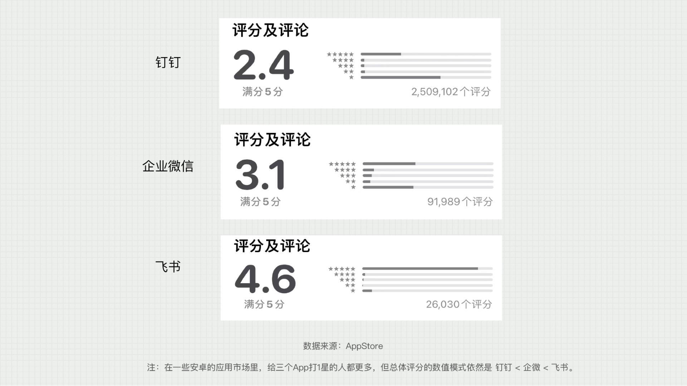
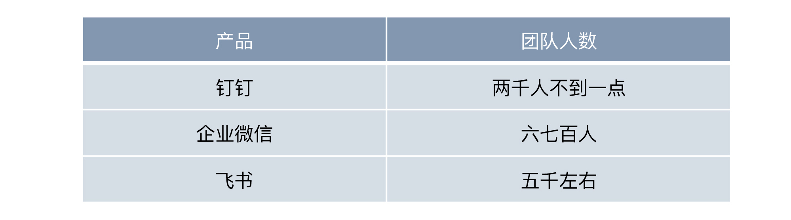
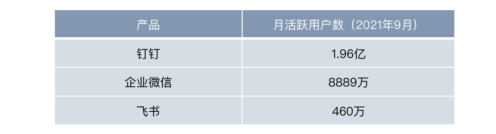

---
date: "2019-06-23"
---  
      
# 27 | 群策群力：组织效率，管理？沟通？协作？
你好，我是苏杰。今天让我们一起聊聊组织效率的话题。

团队大了，也能够自我造血以后，如何可持续发展就会成为我们关注的焦点。产品会衰退、行业有生命周期，但人的成长，以及人构成的组织，可以帮我们不断成功。

所以，组织效率是每一个想做事的人，不管是老板还是员工，都很关心的事情。如果组织效率不高，那难免会要去肥增瘦，做减法，到了需要砍业务、人员优化的地步，那就不好了。特别是最近两年，疫情、经济环节、国际关系的各种变数，我想每个人都不希望走到那一步。

社会学里有一个观点——语言会影响人的思维，在我看来，类似的道理，**一个组织使用的软件工具，也会影响组织的文化，进而塑造组织行为，决定组织效率。**我不是组织的专家，但对产品还比较熟悉，所以这一讲，我想从软件工具的角度，来聊聊几种常见的组织，以及各自的特点，你可以根据实际情况，判断一下自己的团队更像哪种组织，如果你是组织负责人，就可以针对性地优化组织效率。

同时，这一讲也是一个关于企业级软件的案例，我会谈谈我的理解，当然，这也是一个产品分析的示例，作为产品创新者，你需要经常做这种练习。

## 从企业级产品看组织效率

接下来，让我们先去看一下各大应用商店里，排名最前的，企业日常使用的软件，你会发现新一代BAT（这里的B是bytedance字节跳动，A是阿里，T是腾讯），各有一款，分别是飞书、钉钉和企业微信。这从一个侧面说明了，**互联网大厂的竞争已经进入深水区，大家都开始看重企业级的软件和服务了。**

<!-- [[[read_end]]] -->

简单看一下它们的评分，你就会发现很有趣的现象，我们按照这三个产品的用户量从大到小说：

* 钉钉的评分是很明显的两极分化。打5分的有，但很少，而打1分的很多；
* 企业微信，打分也是两极分化，但评分中打5星的更多，打1星的相对少；
* 那么飞书呢？绝大多数的使用者都打了5分；
* 从总分数看的话，由低到高依次为钉钉、企业微信、飞书。  
  

其实，这体现了不同产品的定位、更适用的组织类型，以及优先满足的用户角色。你可以先由此思考一下三者评分差异背后的原因，一会儿我慢慢跟你说。

记得2021年底前后，我正好和好几位钉钉、飞书的高管都有交流，按照我的理解，用三句话总结就是：

* **三款产品体现了三家公司的基因，分别适合三种组织，对应的关键词分别是：管理、沟通、协作****；**
* **高水平的竞争，优势即劣势，所以只能把它看做自己的特点，并找到独特的定位，再等对手犯错****；**
* **不同类型的组织，也没有优劣，只是要与对应业务类型匹配。**

怎么理解呢？下面我们先来做一些信息输入，然后深入分析。首先是截至2021年底，三款产品的团队人数对比：  

关于飞书，我有三个信源（包括飞书内部），分别说四千多、五千多、八千不到，也许哪些部门算飞书的统计口径不同，但**五千**左右肯定是有的。

然后，对比一下2021年9月QuestMobile（月活跃用户数）的数据：  

有了这两类数据做为支撑，我们就可以进一步来拆解这三款产品背后的组织特点了。

## 钉钉：管理

钉钉的关键词是“管理”，它的优劣势都是抓住了老板的心。

优势是靠服务老板，强管控的功能起家，签到、已读、Ding、考勤机等，在早期获得了海量客户。但因此形成的品牌认知，会让不少年轻人，包括年轻的老板，不认同，认为理念不够先进。我身边就有不少“先进生产力的代表”，形成了一种推飞书踩钉钉的“政治正确”。

当然，钉钉肯定也能意识到这点，随着通过“讨好老板”让用户数达到5、6亿之后，显然也从“规模做大”的高速扩张期进入了“价值做深”的平台发展期，比如新推出的3个重要模块——钉钉文档、钉钉会议、钉钉项目，能显著感知到钉钉在努力提升协作效率，给员工（而不只是老板）更多价值，而这正是飞书占据的用户心智。

一个领域的头部产品在做大以后，功能层面可以无限接近，但用户心智是另外一个问题，需要很多时间来改变。

钉钉把团队刻意限制在两千人，显然就没法啥都自己做了，于是倒逼自己用更开放的平台化打法，和生态里的海量玩家一起，把钉钉打造成（传统）企业数字化转型的入口，比如提供了企业二次开发的低代码平台，提供了接入用友、金蝶等垂类SaaS产品的能力，提供了各种解决方案的定制能力，甚至单方面提供了直接给微信发消息的能力。

这就继续回到了阿里擅长的路径上，即做平台。当然这少不了阿里云背后的支撑，才能有“云钉一体”。“从’霸道’到’有事好商量’，是一年来最显著的变化。”这是一些钉钉的合作伙伴给我的反馈。

从上面的分析你会发现，钉钉适合中心化组织，自上而下管理，强执行团队（如大规模的销售/服务团队）。这里面的潜台词是，很多传统的中小企业也是阿里的基本盘，而对于中小企业，老板很重要。于是，开始就有Ding、打卡一类的强压迫性功能。要知道，在国内对于很多中小企业，单单是给老板一个强力的管理工具，就可以提效很多了。

所以你会看到，老板给了钉钉5星，而更多的员工给了钉钉1星。

## 企业微信：沟通

企业微信的关键词是“沟通”，它的优劣势都是和微信无缝对接。

正是靠与微信的无缝互通，企业微信成为需要与大量外部客户沟通的岗位的首选，比如销售、客服、家校互动等。依托微信这个老少咸宜的超级App，企微占据了巨大的入口优势，企业想经营私域的时候，加个微信最自然。

但问题是，企微主要被用来和用户沟通交流，所以在企业用户的心智中，它就会变成一个营销服务的工具，在满足的需求上就切得比较薄，很难深入企业业务流。虽然在解决方案深度上，企微暂时介于钉钉和飞书之间，但还是有很多企业只把它当作与客户的沟通工具。

目前看，似乎企微选择了守住腾讯最擅长的沟通，做个好用的工具，再伺机而动。投入小，易守难攻，ROI很高，但从目前团队人数来看，企微的野心好像也不是很大。

所以，企业微信适合组织内外沟通，特别是边界松散的组织，比如各种工作室形态，经常出现新的、跨公司的项目组，又如客服人员，要与大量客户加微信。这样一来，基于微信建立连接最方便。而这里的潜台词是未来的组织，想成事，内外沟通很重要，而沟通链接是腾讯的基本盘。于是，大量需要对外沟通的普通员工，因为切实被赋能了，从而给了企微5星。

## 飞书：协作

飞书的关键词是“协作”，它的优劣势都是代表了先进生产力。

飞书的理念先进，至少对外宣传造成的感知是这样，“下一代工作方式”，现在虽然体量小，但有未来。

它的另一大优势是产品精致，定位明确，但这注定只能先打动一小批特殊的用户，也就是数字化程度已经很高的企业。当然，这也是生产力很高的一批人，他们被飞书内部定义为“知识工作者”，比如造车新势力的“蔚小理”，都用飞书，他们的号召力不容小觑。我和一群朋友众包翻译的时候，也选了飞书，用上飞书，就有一种“妈妈，我代表了先进生产力”的优越感。

飞书从员工个人出发，更偏向效率工具，简单易用，而钉钉作为管理工具，使用前是要组织培训、使用中是要随时服务的。从团队人数上看，五千人左右，飞书野心不小，应该是打算自己做一个精致的闭环，我先就封闭了，啥时候开放再说，有点像早期的iPhone（与Android的对比）。

不过，飞书的优势也会成为它最大的问题：将来要想做大、破圈会碰到巨大挑战。要知道，飞书诞生于字节极其先进的生产力情境，但破圈以后就不一样了，比如到了制造业，似乎要向下兼容，把生产力降速以匹配传统企业的生产关系，这不容易。

不过，字节果然还是喜欢“大力出奇迹”，迅速组建的庞大团队，给人一种饱和式攻击的感觉。上一次有这种感受还是华为下定决心要做手机的时候，大几千人的投入，对公司的耐心是一个挑战，但对行业来说是好事，可以快点看到结果。

所以，飞书适合创新型组织、强个体、自下而上的小而精创业团队，潜台词是未来的社会是少量精英“统治”大量普通人的社会：精英写算法，算法“统治”普通人，而算法是字节的基本盘。对于精英团队，每个人都很重要，所以在飞书看来，信息要透明共享，即“协作”。

由于飞书目前的用户体量还不大，可以聚焦在少数的精准人群，大多数都打5星也就容易理解了。

有不少企业，会根据业务需要，同时用两个，甚至三个工具，比如用钉钉的行业解决方案、用企微和客户沟通、用飞书文档与OKR。回顾一下它们各自的优势，这倒也容易理解。

在企业组织内，“信息即权利”，我们还可以从这个角度来对比三款产品与过去的明显差异：**钉钉——上下同欲、微信——内外互联、飞书——左右共振**。这背后，甚至有一些管理学、组织行为学理念的差异。

岔开说几句，这是新一代BAT的精彩对局，值得长期关注，观战就已经很开心。**深度优先的2B领域，必然不会如广度优先的2C般一家独大**，此外，结合最近一年来各种政策导向，国家也不希望一家独大，所以每一个头部玩家，也不会把对手赶尽杀绝，大家打打闹闹，战战谈谈，甚至会有点合作。这是我的预测。

## 小结

对我们每个从业者来说，看看自己所在的组织用什么工具软件，也可以倒推出一些组织的理念，进而判断自己是否适合这个环境。

回到创新的话题，组织文化是否支撑，其实也是很重要的一点。创新到底从哪里来，我一直在探究源头，以下是不完备的思考，至少有四种可能的视角：

* **第一个是用户视角**，去研究用户、洞察市场，找到痛点，寻求突破，这个视角我们在早先的课程里说了很多；
* **第二个是技术视角**，就是用各种硬科技来创造全新的解决方案，在极客时间的各位技术大牛面前，我就不班门弄斧了；
* **第三个是产业视角**，这需要基于对产业的理解，优化整个价值网络，创造价值增量，这次加更，我们聊聊不少平台、行业生态、用户生态的话题。
* **第四个就是这一讲说的组织视角**，组织如何通过软的文化和硬的机制去促进产品创新。

## 思考题

请你结合你们公司日常使用的办公协作类软件，分析一下你所在的组织有什么样的特点？思考一下自己如何在这种组织中获得更好的发展？欢迎你在留言区与我和其他同学一起交流讨论！