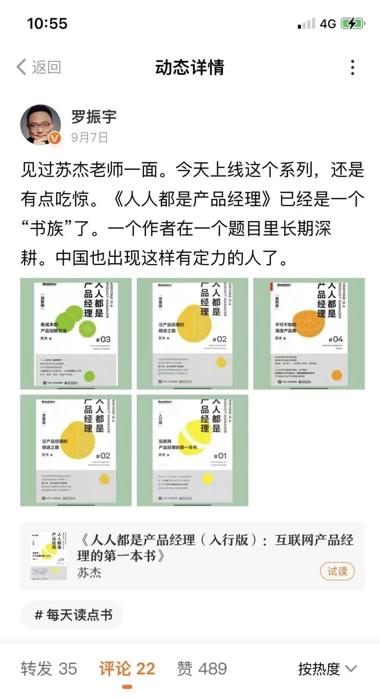
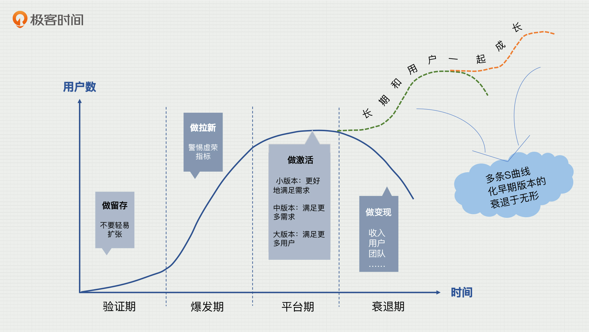

---
date: "2019-06-23"
---  
      
# 28 | 长期主义：从产品到职场、人生
你好，我是苏杰。最后这节课，让我们一起聊聊长期主义这个话题。

整个加更的内容，主题是“长大以后”。产品长大了、用户变多变复杂了、团队扩张了，我们必须考虑赚钱养家的问题，并且思索怎么通过组织能力让基业长青。

总的来说，能力越大、责任越大，而我说过一句话：**每个产品经理最终的产品其实是自己**。所以，这背后我们更需要思考的是自己的成长，把自己的视野扩展，在空间上看得更大，时间上看得更长。

接下来，我们就跳出日常工作，来聊聊“长期主义”，因为当拉长时间后，我们会自然地关注到一些非工作、甚至非产品业务的事情。毕竟工作、职场并不是我们人生的全部，甚至，连主干都算不上。

所以，在加更的最后一节里，我会感性一些，和你一起跳出具体的产品和业务，和你一起用更宏观的视角重新审视一下自己的职业生涯，乃至人生。从大了说，我希望可以让你重新思考人活一世的意义，从小了说，我希望能帮你减轻日常的焦虑，不再计较一城一池的得失。

## **日拱一卒，不期速成**

在我2021年看过的书里，《最好的告别》绝对可以排进前三，这是一本讲衰老和死亡的书（改天写个书评），其中有一句话让我印象深刻：**我们如何使用时间，可能取决于我们觉得自己还有多少时间。**

而我对长期主义的理解，就是在做事之前，用一个更大的时间尺度去思考，也就是“认为自己还有很长时间”，也许，有些原来不存在的选项就会浮现。

<!-- [[[read_end]]] -->

极端一点，就像有些宗教里“轮回”的概念，相当于给了教徒永续的时间，给了他们慢下来、停下来的信心，所以，我们会感觉那些教徒很从容。反之，在“时间就是金钱，效率就是生命”的价值观下，其实我们很难和长期主义共处，和时间做朋友。

比如在企业里，各级职业经理人都有任期的问题，而很多事从短期看是负收益，但长期有利；或者是局部负收益而全局有利。所以，职业经理人为什么要长期主义呢？只有创始人，这种和企业同生共死的人，才会是真正的长期主义者。

那如何让更多人可以长期主义？是靠规则？还是靠价值观？我也不知道。知乎上有个热门问题：既然所有的生命都要死亡，那么生命的意义是什么？我的回答是：**换个视角，个体的死亡是对种群的最后一次贡献，释放资源。**

所以，**个体的视角不管怎样都是“短视”的，毕竟我们最多活百八十年，要想把视角拉得更长，就必然要摆脱自我中心，站在更大的群体利益的视角去思考**，这当然很难。

说具体一点的，怎么长期主义一些呢？其实可以尝试在思考的时候，除了个体视角，再加上群体视角，多做些传承的事情，把好的东西给后辈、给团队、给你认为值得的他人和组织，等等。这样，我们会减少对短期得失的关注。举个例子，当组织把培养人看得比具体某个业务的成败更重的时候，就相对长期主义了；当父母愿意承担一定损失，让孩子自己尝试而不是代劳的时候，就相对长期主义了。

事的得失，都是相对短期的，人的成长，才是真正长期的。

我有一个2060计划，是在疫情期间列的一个表格。在表格中，从2020到2060年，每年一行，一直到我80岁；而每一列则写了对我很重要的人的年龄，还有那一年可能发生的大事。比如，2030到2035年期间，儿子大概率会离家去读书，这对我们“老两口”的生活会带来巨大改变。那会儿，工作应该不是生活的重心了，那我们应该住在哪里？需要住什么样的房子？每天做什么？简单想想都觉得会和现在很不一样。

时间尺度不一样了，对一周一月一年的得失就不是很在意了，对这一生重要的事情也可以慢慢浮现出来，而仅仅把表格列出来，你就会发现有新的思考。

以上这些思考，也许让我很难在大组织里长期待得住。毕竟我的能力也做不了创始人，所以很难获得一片净土，让我一门心思几十年做一件小事。而我想做的，也只是一些小事而已，就如下面这个得到里的截图，罗振宇老师所言。

“**日拱一卒，不期速成**”在一个往前冲的组织里，显得挺讨厌的吧？不过我更在意的是目标和方向，然后设置一个永远完不成的使命。使命就是要是没法完成的才好，然后，不在意短时间尺度的结果。这有点理想化，所以我创造条件，只是为了让自己选择的自由度更大一些。

## 从产品生命周期看人生

接下来，我想用课里提到过的产品生命周期概念来理解人的一生，并且说说我对每个人生阶段的应对之策。人的一生也可以像产品一样分为四个阶段：

* **未成年直到大学阶段，是探索期/验证期；**
* **刚工作开始那三五年，长一点到十几年，是爆发期/成长期；**
* **中年危机是增长放缓，甚至停滞，进入平台期；**
* **老年就是平台阶段无法维系，进入衰退期。**  
  

在**验证期**，我们应该充分尝试各种职业、各种人生，交各种朋友，风险偏好大一点，这时候没什么可失去的。

**爆发期**是初入职场的阶段，正在学习这门课的你，可能已经有至少三五年的工作经历了。这时候，你应该尽力去做“吃青春饭”的事情，努力积累，为了自己“996”，而不是为了公司。同时，你需要意识到没有永续的爆发期，每个人总会进入平台期，要做好心理和行动上的准备。

**平台期**应该在进入职场10年左右出现，少数很强的人可以把平台期推后，但总会碰到。这时候也就是我们常说的中年危机时期，人生没了剧本，不再被关注，又承担着最大的责任。我们需要花10年以上的时间去转型，从吃青春饭的环境转到一个有“老师傅”的环境。我自己做法，就是前几年吃互联网的青春饭，之后转做咨询顾问。

而**衰退期**，虽然对我们来说还比较遥远，但我们的长辈可能已经在面对了，而我们也终将面对，所以我反而想“以终为始”，和你深入地聊一聊。

## 改变面对衰退期的态度

在衰退期的职场，我们会面对“退休”这个课题，你是否对这个词很渴望？如果是的话，那就要想一下，这是不是意味着现在的你，每天都在做不想做的事情？而经典的退休模式，好像是一个突变，前一天还在工作，后一天就啥也不用干了，这真的妥当吗？自由是一种责任，一个原来不用规划自己时间的人，忽然有了大笔的空闲时间，你真的能处理好吗？类比一下，就有点像没什么钱的人突然中了巨额彩票，但好像很少有人能把它处理好的。

所以，我有一个设想，用几十年的时间来践行渐变式的退休方式，学习如何退休。具体地说，就是**随着年龄的增长，让自己每周（相对而言是为了赚钱的、没那么喜欢的）工作时间越来越短**，平滑过渡，比如二十多岁是all in工作的，三十多岁每周工作50小时，四十多岁每周工作40小时，五十多岁每周工作20小时，六十多岁每周工作几个小时……

当非工作时间越来越多以后，也是需要练习如何使用的。我最近也问了好几位更年长一些的朋友，他们给了我一些经验：

* **对世界不冷漠；**
* **对他人不迎合；**
* **对自己不放纵。**

不冷漠意味着好奇心；不迎合则可以用平等的心态与各种人交流；而不放纵意味着做每件事之前“想清楚”利弊得失，想清楚以后，玩游戏、刷剧也不算放纵，做过又后悔才算放纵。当然，这三点同样适用于我们的工作，并且会让我们变得越来越开心，这也是一个努力方向。

在衰退期的最后一段时间，每个人都必将进入那个医学也无能为力的阶段，“老年是一系列连续不断的丧失”且不可逆。目前大多数做法是花费巨大的时间、精力、金钱（不只是自己，还包括家人朋友的），来换取一个无可避免的结局，并且邻近结局的那一段时间体验极差。

我们都知道**服务设计里有一个“峰终体验”的概念，**从人的一生来看，峰值体验很可能是在爆发期**，是每个人在老了之后都会无数次回忆，讲给后辈听的东西，而**终值体验就是死亡前的一段时间\*\*，如果我们面对死亡如上述所言，那这辈子的终值体验一定是很糟糕的。

但其实我们可以选择**是采取姑息疗法，还是医学抢救治疗**。两者的优先顺序正好相反，医学抢救治疗以治病为先，以延长寿命为先；而姑息治疗则以病人的舒适度为先，根据病人身心情况来调整治疗手段。插一句，对于产品的衰退期，也是如此，延长寿命并不是唯一目标。

**我们终将有一个转折点，从努力医治，转换为放弃治疗而追求“更开心的终值体验”**，比如是为了“止痛、和亲友开心的聚一次”而服药，而不是为了治好病而服药……我似乎被说服了，平静的接受衰退期似乎是一个更好的态度，将来我可以很平静地和后辈沟通这件事。但，如何与长辈沟通这件事，似乎非常难。

## 小结

好了，最后的最后，让我们回到当下，我想用爱因斯坦的《我的世界观》一书中的一句话来结束：**观察和理解的乐趣是大自然最美丽的馈赠。**

希望这节课能让你对自己的整个职业生涯、甚至这一生应该怎么过这样的话题，产生一点重新思考的冲动。还是那句话，作为产品经理，或者说产品创新者，以真正长期主义的视角来看，最终的产品其实是自己。

共勉，希望以后还有机会相遇。