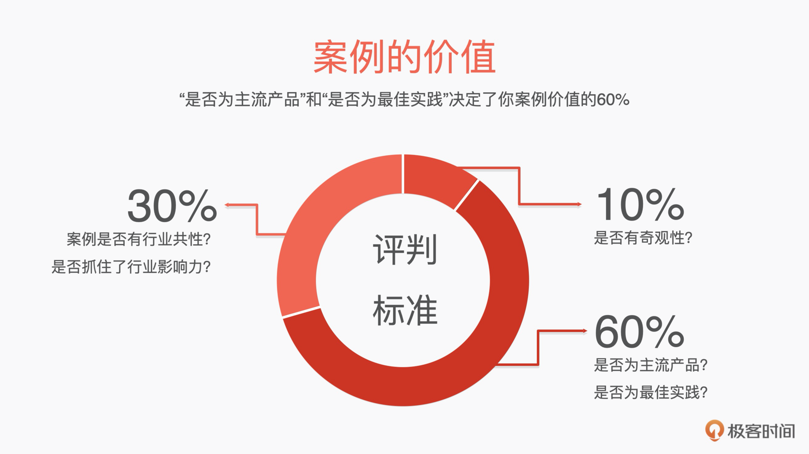
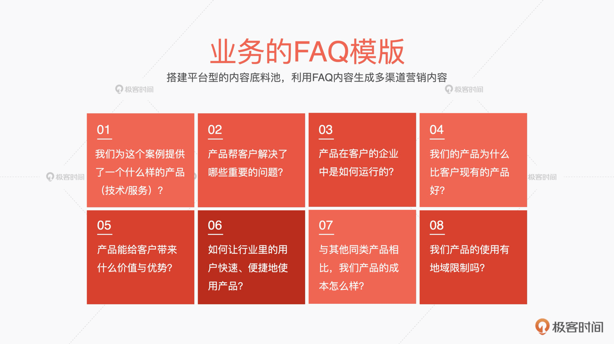
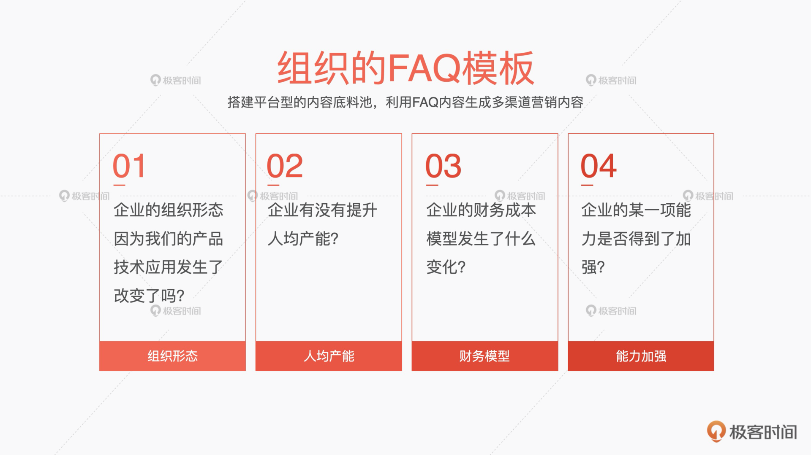
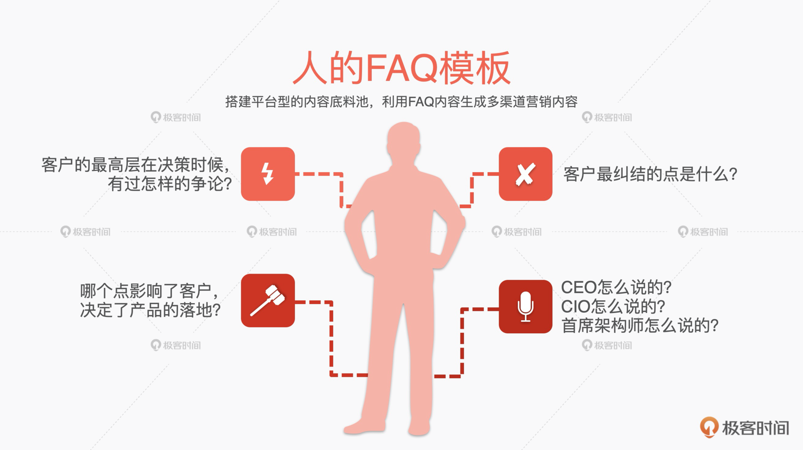
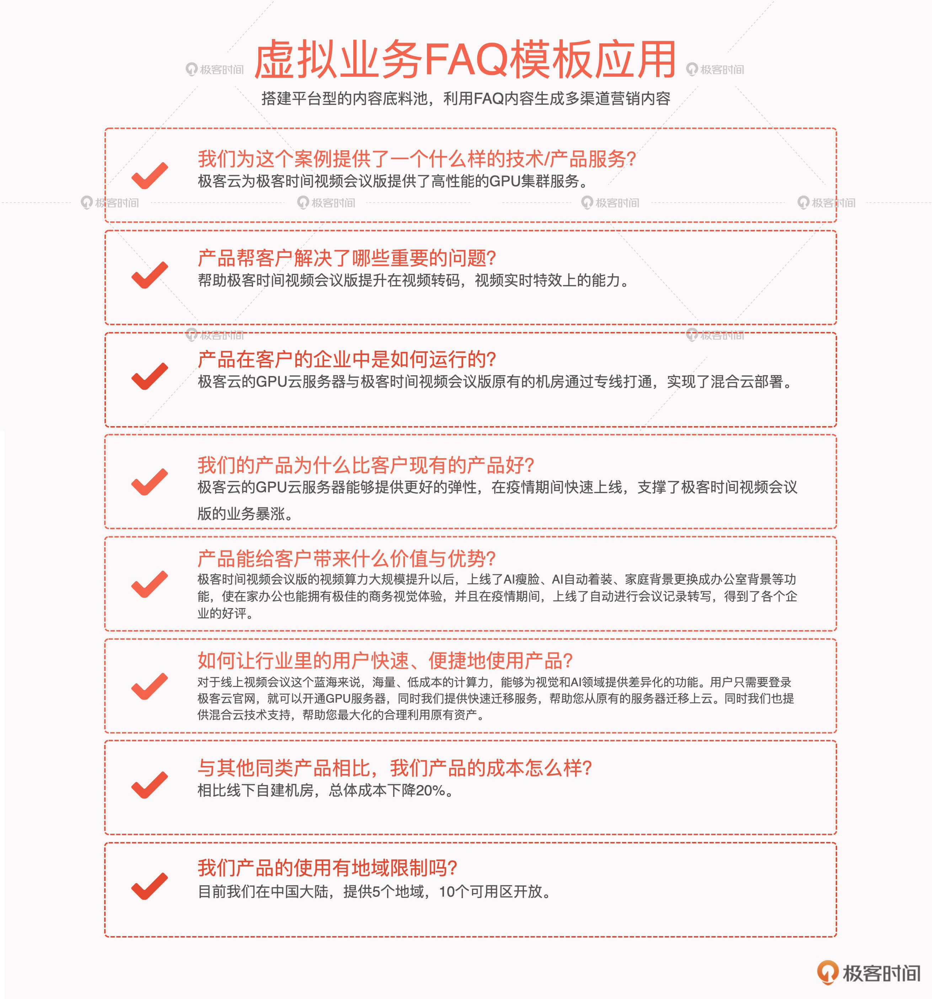

---
date: "2019-06-23"
---  
      
# 11 | 打造案例（上）：如何做优质客户案例的选型和内容构造？
你好，我是曹林。今天开始，我想用连续的3节课和你聊聊如何打造一个优秀的客户案例。

通过案例来进行推广是To B营销里最日常的打法。一个好的案例能够让企业看到产品价值，顺利买单。所以我认为，做案例应该是一个市场人的基本修养。但是，在做的过程中，我们也经常会遇到一些困惑：

* 如何从众多业务案例里选择一个好的客户案例？标准是什么？
* 花了大钱，拍了一堆广告，结果业内人士看了一笑了之，到底哪里有问题？
* 为什么精心选的案例无法吸引PR团队的兴趣，努力做出来的案例最后成了无用功？
* 为啥做的案例商业效果不佳，雷声大，雨点小，叫好不叫座？

你看，这些都是真实的问题，但是这些问题背后的本质，其实是一场联动的战役没有打好，或者是一些关键的战役根本就没有打。一个优质客户的案例，要包括四场仗，打完了才能形成一个完整的闭环：**案例的选型、案例的内容体系搭建、案例的PR、营销战役。**缺少任何一环，案例都会变成一个“空炮”。所以，接下来我会围绕这四个方向一一拆解，带你探讨如何塑造一个优秀案例。

## 如何进行案例选型？

说到选案例，绝大部分人都会想到“要找一个知名的企业来做案例”。这点很容易理解，行业里头部企业的示范效应是非常好的。但是，我们要明白一个道理，选案例就像选女朋友，最漂亮的人人都喜欢，但是未必适合你，合适才是最重要的。

<!-- [[[read_end]]] -->

那怎么判断案例是否合适呢？我们首先要有一套自己的评判标准。我就以我常做的云计算行业里的一些简单事例，跟你谈谈如何做案例的选型。

我在做案例选型的时候，一般会先通过一个简单的标准划线来进行筛选。下面我来具体介绍一下我的五条标准划线，你可以对照你自己的情况来跟着我一起看一看。

**第一条线：看用户采购的是不是我们主流（或者未来主流）产品（产品组合/解决方案）。**

举个例子，假设我们极客云是一家做公共云的厂商，但如果我们大力传播的案例里用的是专有云的客户，这就不能给公共云带来很好的引流，反而会造成定位模糊的困扰。

因此，这条线背后的逻辑是，我们打造案例的初心一定是**证明主营业务的优秀**。如果案例最后没有佐证这点，那么你就要重新考虑一下了。

**第二条线：看用户的使用场景是不是我们产品的最佳实践。**

这条线决定了我们的客户是不是会为这个案例买单。这个“最佳实践”的标准是：在特定的业务里，选用了特定的产品优势（这个优势也包括成本）。

例如，我们极客云有个产品叫做智能接入网关（Smart Access Gateway）。这个产品的特征比较复杂。如果非要简单地说呢，它其实就是一个VPN盒子，把这个盒子插上电源，客户就可以直接连到云上了。

那么这个盒子的最佳实践在哪里呢？在新零售，在小超市。为什么呢？第一，因为它满足了“不需要运维”的需求——“咔哒”一下，就连上了。第二，它部署迅速，适合小超市这种快速开店的场景。

过去，找运营商拉一根网络专线是非常费劲的，起码10天起，而且价格还比较高。而智能接入网关很好地解决了这个问题，这就是一个典型的最佳实践：老头老太太都能上云，而且不需要10天拉专线。

我们刚刚讲的这两条线决定了一个案例60\%的价值：是不是证明了我们主营业务好，是不是打到了客户的痛点。

但是接下来，我们还要知道，我们的案例业务实践有没有行业影响力？能不能从一个企业推而广之，打穿一个行业？有没有震撼人心的能力？这些是一个优秀案例必须具备的另外的40\%。

**第三条线：“拆解”用户在这个行业里面的影响力。**

对于To B的企业来说，我们一定要知道**传播影响力**和**行业影响力**是两回事。如果把传播影响力和行业影响力做对比，是要过错年的。

如果你想用某个行业头部企业做案例，你得先知道它的行业影响力到底意味着什么。头部企业代表了**行业里最先进的生产力**；代表了**对行业未来的判断**；代表了在**行业里最严苛的要求**。所以，我们在借用头部企业的影响力时，也要把力气用在这三点上。

举个最简单的例子，阿里在业内最大的客户案例就是“双11”，为什么？

1.  因为“双11”代表了业内应对最大峰值的架构，代表了行业里最先进的生产力。
2.  “双11”中的新技术（千人千面等）成为了未来企业的标配，代表了对行业未来的判断。
3.  “双11”要求不能挂，代表了业内最严苛的要求。

只有把这三点打穿打透，你才是真正借用到了头部企业的行业影响力，可以在CEO层面进行的有效的心智传播。

**第四条线：能不能从案例里提炼出行业共性。**

我们要通过客户的商业案例，讲清楚我们的产品、我们的技术领先性，最终证明我们产品的技术领先性是这个行业所需要的、所看重的、能够帮助这个行业实现价值的，否则客户很难与你的产品或者方案产生连接。

所以，我们要在案例中把技术特点和行业场景结合，提取出全行业的“商业+技术”共性。

例如，国家监管要求整个直播行业的所有数据要存储90天，这个存储成本是很高的，虽然冷热数据区分存储会节省成本（冷备份空间价格很低），但手工将热数据转成冷数据也是很麻烦的。而我们的存储产品有一个自动转存冷备份的功能，一旦检测到这个数据在一定时间内没有人用过，就把这个数据转存到冷备份的地方，完全自动化。所以，很多做直播的企业都会选择我们的对象存储产品。

这个故事就非常有行业特性，“自动转存冷热数据”只是个技术，但是它遇上直播行业“商业+合规”的需求，就变成了一个极好的应用场景和故事。

**第五条线：是可遇不可求的，但又要努力去寻找的奇观性。**

你可能会对**奇观性**这个说法比较疑惑，其实它就是你站在长城脚下时产生的震撼感，它并不常见，却是一个好的市场案例应该追逐的效果。

To B的企业，也是由一个个鲜活的人构成的。而人天生有个习惯，就是好奇。一个平淡无奇的案例摆在面前，相信绝大多数人会将其视为一种宣传，最终视而不见。但是如果你有一个好的奇观，让案例变得出奇、少见，一切就不同了。

我举一个不恰当的例子，华为手机的摄像头特别好，拥有1英寸的传感器，可大家对这样的数据是无感的。但稍作修改之后，表述就变成了这样：华为手机居然可以拍到清晰的月亮，效果跟望远镜一模一样。

你是不是很想看华为手机如何做到的？这就是奇观的力量。

所以，你会看到IBM、GE都喜欢讲这样一些故事：极端恶劣的自然环境、有社会责任或者社会价值意义的实践、寻求生命的奥义或者是对未知的探索……这些都是奇观。

这种方法并不新奇，但是却一直有效，在此就不一一枚举了。同时，奇观又有破圈的能力，一旦破圈几乎就等于免费的流量，香吗？

## 如何构建案例内容？

选定好案例以后，我们一定要把案例吃精吃透，做一个平台型的内容底料池。

我搭内容底料池的方法，是在以前做记者时候留下的，那就是**写一个自问自答的FAQ**。这种方式可以定义用户场景，描述用户体验、产品价值和主要功能。同时，我们也可以直接利用FAQ内容生成多渠道营销内容。

那怎么做FAQ呢？我通常会围绕“业务、组织、人”三条线来。为什么要这么分呢？简单地说，在经典管理理论中，这三条线代表了一个完整的组织，这是一个完全的企业经营者视角。**业务**是企业的生命活动，**组织**是企业的骨骼与脏器，**人**是企业的灵魂，所以围绕这三个剖面，基本上能够打穿一个企业从当下业务到未来战略背后的技术/产品选型链路。

这里，我结合自己这么多年做客户案例的经验，为你总结了三个FAQ模版。

  
  

搭建好这样一个FAQ，我们的所有“底料”就都在了。

## 如何使用FAQ模板？

接下来，我们就以一个虚构的业务“极客时间视频会议版”为示例，看看如何生成一个优秀的案例，虚拟背景就是：极客时间视频会议版是极客云的客户在新冠期间上线的一个视频会议App。

很多企业会发一篇通稿，类似于广而告之，这是案例宣传最简单的方式，是一种短平快的打法。通常通稿里会写双方如何合作、在哪些方面合作、未来的期待等。大致是“极客时间视频会议版和极客云合作，合力打造国内最大的视频会议系统”之类的，对于市场作用主要是战略卡位（表明地位）和建立认知。

但是如果我们把这样的通稿稍加变形，加入一些FAQ内容，它的内容就会变得非常“实”。

经过FAQ梳理后，我们的通稿文本就变成了这样：

> 极客云为极客时间视频会议版提供了高性能的GPU集群服务，帮助极客时间视频会议版提升在视频转码、视频实时特效上的能力，极客云的GPU云服务器与极客时间视频会议版原有的机房通过专线打通，实现了混合云部署。  
> 极客云的GPU云服务器提供了更好的弹性，在疫情期间快速上线，支撑了极客时间视频会议版的业务暴涨。  
> 极客时间视频会议版的视频算力大规模提升以后，上线了AI瘦脸、AI自动着装、家庭背景更换成办公室背景等功能，让在家办公也能拥有极佳的商务视觉体验。并且在疫情期间，上线了自动进行会议记录转写，得到了各个企业的好评。对于线上视频会议这个蓝海来说，海量、低成本的计算力能够带来视觉和AI领域提供差异化的功能。  
> 用户只需要登录极客云官网，就可以开通GPU服务器。同时，我们还提供快速迁移服务，帮助您从原有的服务器迁移上云。  
> 同时我们也提供混合云技术支持，帮助您最大化地合理利用原有资产。相比线下自建机房，总体成本下降20\%。目前我们在中国大陆，提供5个地域、10个可用区开放。

这，就是FAQ的魔力。FAQ这个方法既实用又简单，因为当客户和你接触的时候，一定是带着问题来的，你用问题的方法沉淀思路，本身就是一个“真情景”——你能够感受到客户的所思所想，感受到客户要什么。

这种体感的建立，能够帮助你有效地把握市场方向，抛去很多看似精彩，实则无用的东西，更精确地洞察到客户的需求。

## 总结

这一节课，其实我们讲的是从案例的选型和如何搭建案例底料。假如这是一场真实的toB市场案例建设，上面我们已经完成了前半部分工作，这保障了两个点：

* 我们的案例选型是正确的，公司不会为一个毫无意义的案例花钱。
* 我们有充分翔实的“底料”，公司不会为一个有价值但浮于表面的营销方案花钱。

正因方有正果，上面的工作，就是“正因”的过程。下一节课中，我们就来讨论，如何拿到这个“果”，我会针对案例的PR、营销战役展开讲解。

## 场景练习

结合你们公司的实际情况，选择一个产品，按照我们的“选型→底料FAQ”的逻辑，完成一个产品通稿。

我建议你在做这个练习之前，先真实地跟销售线人员进行一次选型讨论，与产品/技术线进行一次技术优势与行业结合的讨论，并与客户进行一次对焦，把所有内容都记录下来。你很可能会发现以往忽略掉的东西。

欢迎在留言区分享你的简易通稿，与其他同学相互讨论学习。如果你觉得有所收获，也欢迎你把这一讲分享给你的朋友。